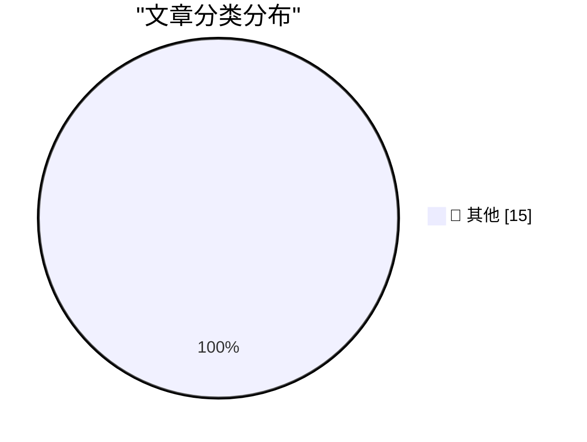

# 📰 AI 博客每日精选 — 2026-06-10

> 来自 Karpathy 推荐的 92 个顶级技术博客，AI 精选 Top 15

## 🏆 今日必读

🥇 **If Claude Fable stops helping you, you'll never know**

[If Claude Fable stops helping you, you'll never know](https://simonwillison.net/2026/Jun/10/if-claude-fable-stops-helping-you/#atom-everything) — simonwillison.net · 1 小时前 · 📝 其他

> If Claude Fable stops helping you, you'll never know

🥈 **Initial impressions of Claude Fable 5**

[Initial impressions of Claude Fable 5](https://simonwillison.net/2026/Jun/9/claude-fable-5/#atom-everything) — simonwillison.net · 2 小时前 · 📝 其他

> Initial impressions of Claude Fable 5

🥉 **llm 0.32a3**

[llm 0.32a3](https://simonwillison.net/2026/Jun/9/llm/#atom-everything) — simonwillison.net · 3 小时前 · 📝 其他

> llm 0.32a3

---

## 📊 数据概览

| 扫描源 | 抓取文章 | 时间范围 | 精选 |
|:---:|:---:|:---:|:---:|
| 82/92 | 2465 篇 → 35 篇 | 48h | **15 篇** |

### 分类分布

---

## 📝 其他

### 1. If Claude Fable stops helping you, you'll never know

[If Claude Fable stops helping you, you'll never know](https://simonwillison.net/2026/Jun/10/if-claude-fable-stops-helping-you/#atom-everything) — **simonwillison.net** · 1 小时前 · ⭐ 15/30

> If Claude Fable stops helping you, you'll never know

---

### 2. Initial impressions of Claude Fable 5

[Initial impressions of Claude Fable 5](https://simonwillison.net/2026/Jun/9/claude-fable-5/#atom-everything) — **simonwillison.net** · 2 小时前 · ⭐ 15/30

> Initial impressions of Claude Fable 5

---

### 3. llm 0.32a3

[llm 0.32a3](https://simonwillison.net/2026/Jun/9/llm/#atom-everything) — **simonwillison.net** · 3 小时前 · ⭐ 15/30

> llm 0.32a3

---

### 4. Setting a custom price for a model in AgentsView

[Setting a custom price for a model in AgentsView](https://simonwillison.net/2026/Jun/9/agentsview-custom-model-price/#atom-everything) — **simonwillison.net** · 4 小时前 · ⭐ 15/30

> Setting a custom price for a model in AgentsView

---

### 5. Quoting Andrej Karpathy

[Quoting Andrej Karpathy](https://simonwillison.net/2026/Jun/9/andrej-karpathy/#atom-everything) — **simonwillison.net** · 7 小时前 · ⭐ 15/30

> Quoting Andrej Karpathy

---

### 6. Siri AI at WWDC 2026

[Siri AI at WWDC 2026](https://simonwillison.net/2026/Jun/8/wwdc/#atom-everything) — **simonwillison.net** · 1 天前 · ⭐ 15/30

> Siri AI at WWDC 2026

---

### 7. A Record-Breaking Patch Tuesday for June 2026

[A Record-Breaking Patch Tuesday for June 2026](https://krebsonsecurity.com/2026/06/a-record-breaking-patch-tuesday-for-june-2026/) — **krebsonsecurity.com** · 4 小时前 · ⭐ 15/30

> A Record-Breaking Patch Tuesday for June 2026

---

### 8. Apple OS 27: The Small Things

[Apple OS 27: The Small Things](https://blog.oneberri.com/posts/wwdc26-the-small-things) — **daringfireball.net** · 4 小时前 · ⭐ 15/30

> Apple OS 27: The Small Things

---

### 9. The Talk Show Live From WWDC: Tonight, In-Person and Streaming

[The Talk Show Live From WWDC: Tonight, In-Person and Streaming](https://ti.to/daringfireball/the-talk-show-live-from-wwdc-2026) — **daringfireball.net** · 7 小时前 · ⭐ 15/30

> The Talk Show Live From WWDC: Tonight, In-Person and Streaming

---

### 10. Apple WWDC 2026 Keynote

[Apple WWDC 2026 Keynote](https://www.youtube.com/watch?v=hF8swzNR1-o) — **daringfireball.net** · 8 小时前 · ⭐ 15/30

> Apple WWDC 2026 Keynote

---

### 11. Apple’s WWDC AI Demos Were Real and in Real Time

[Apple’s WWDC AI Demos Were Real and in Real Time](https://techcrunch.com/2026/06/08/apples-wwdc-ai-demos-looked-more-real-after-250m-false-ad-settlement/) — **daringfireball.net** · 8 小时前 · ⭐ 15/30

> Apple’s WWDC AI Demos Were Real and in Real Time

---

### 12. Apple Introduces Siri AI

[Apple Introduces Siri AI](https://www.apple.com/newsroom/2026/06/apple-introduces-siri-ai-a-profoundly-more-capable-and-personal-assistant/) — **daringfireball.net** · 8 小时前 · ⭐ 15/30

> Apple Introduces Siri AI

---

### 13. Apple’s WWDC Announcement of the New Apple Intelligence System

[Apple’s WWDC Announcement of the New Apple Intelligence System](https://www.apple.com/newsroom/2026/06/apple-intelligence-brings-powerful-ai-capabilities-into-everyday-experiences/) — **daringfireball.net** · 9 小时前 · ⭐ 15/30

> Apple’s WWDC Announcement of the New Apple Intelligence System

---

### 14. [Sponsor] WorkOS Launches auth.md — an Open Protocol for Agent Registration

[[Sponsor] WorkOS Launches auth.md — an Open Protocol for Agent Registration](https://youtu.be/Dqp_b8GHLXU?t=1074) — **daringfireball.net** · 21 小时前 · ⭐ 15/30

> [Sponsor] WorkOS Launches auth.md — an Open Protocol for Agent Registration

---

### 15. From the Annals of People Having Knowledge of the Matter, Siri AI Extensions Edition

[From the Annals of People Having Knowledge of the Matter, Siri AI Extensions Edition](https://www.bloomberg.com/news/articles/2026-03-26/apple-plans-to-open-up-siri-to-rival-ai-assistants-beyond-chatgpt-in-ios-27) — **daringfireball.net** · 1 天前 · ⭐ 15/30

> From the Annals of People Having Knowledge of the Matter, Siri AI Extensions Edition

---

*生成于 2026-06-10 02:12 | 扫描 82 源 → 获取 2465 篇 → 精选 15 篇*
*基于 [Hacker News Popularity Contest 2025](https://refactoringenglish.com/tools/hn-popularity/) RSS 源列表，由 [Andrej Karpathy](https://x.com/karpathy) 推荐*
*由「懂点儿AI」制作，欢迎关注同名微信公众号获取更多 AI 实用技巧 💡*
