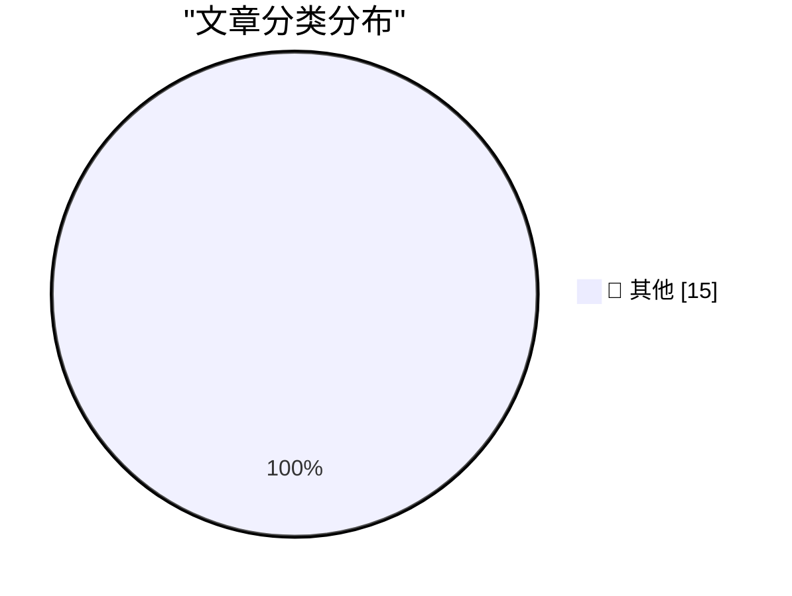

# 📰 AI 博客每日精选 — 2026-06-12

> 来自 Karpathy 推荐的 92 个顶级技术博客，AI 精选 Top 15

## 🏆 今日必读

🥇 **Claude Fable is relentlessly proactive**

[Claude Fable is relentlessly proactive](https://simonwillison.net/2026/Jun/11/fable-is-relentlessly-proactive/#atom-everything) — simonwillison.net · 2 小时前 · 📝 其他

> Claude Fable is relentlessly proactive

🥈 **datasette 1.0a33**

[datasette 1.0a33](https://simonwillison.net/2026/Jun/11/datasette/#atom-everything) — simonwillison.net · 11 小时前 · 📝 其他

> datasette 1.0a33

🥉 **asyncinject 0.7**

[asyncinject 0.7](https://simonwillison.net/2026/Jun/11/asyncinject/#atom-everything) — simonwillison.net · 20 小时前 · 📝 其他

> asyncinject 0.7

---

## 📊 数据概览

| 扫描源 | 抓取文章 | 时间范围 | 精选 |
|:---:|:---:|:---:|:---:|
| 82/92 | 2466 篇 → 29 篇 | 48h | **15 篇** |

### 分类分布

---

## 📝 其他

### 1. Claude Fable is relentlessly proactive

[Claude Fable is relentlessly proactive](https://simonwillison.net/2026/Jun/11/fable-is-relentlessly-proactive/#atom-everything) — **simonwillison.net** · 2 小时前 · ⭐ 15/30

> Claude Fable is relentlessly proactive

---

### 2. datasette 1.0a33

[datasette 1.0a33](https://simonwillison.net/2026/Jun/11/datasette/#atom-everything) — **simonwillison.net** · 11 小时前 · ⭐ 15/30

> datasette 1.0a33

---

### 3. asyncinject 0.7

[asyncinject 0.7](https://simonwillison.net/2026/Jun/11/asyncinject/#atom-everything) — **simonwillison.net** · 20 小时前 · ⭐ 15/30

> asyncinject 0.7

---

### 4. Anthropic Walks Back Policy That Could Have ‘Sabotaged’ AI Researchers Using Claude

[Anthropic Walks Back Policy That Could Have ‘Sabotaged’ AI Researchers Using Claude](https://simonwillison.net/2026/Jun/11/anthropic-walks-back-policy/#atom-everything) — **simonwillison.net** · 22 小时前 · ⭐ 15/30

> Anthropic Walks Back Policy That Could Have ‘Sabotaged’ AI Researchers Using Claude

---

### 5. datasette-agent 0.2a0

[datasette-agent 0.2a0](https://simonwillison.net/2026/Jun/10/datasette-agent/#atom-everything) — **simonwillison.net** · 1 天前 · ⭐ 15/30

> datasette-agent 0.2a0

---

### 6. DiffusionGemma

[DiffusionGemma](https://simonwillison.net/2026/Jun/10/diffusiongemma/#atom-everything) — **simonwillison.net** · 1 天前 · ⭐ 15/30

> DiffusionGemma

---

### 7. Quoting Jeremy Howard

[Quoting Jeremy Howard](https://simonwillison.net/2026/Jun/10/jeremy-howard/#atom-everything) — **simonwillison.net** · 1 天前 · ⭐ 15/30

> Quoting Jeremy Howard

---

### 8. Who Runs the Ransomware Group ‘The Gentlemen?’

[Who Runs the Ransomware Group ‘The Gentlemen?’](https://krebsonsecurity.com/2026/06/who-runs-the-ransomware-group-the-gentlemen/) — **krebsonsecurity.com** · 1 天前 · ⭐ 15/30

> Who Runs the Ransomware Group ‘The Gentlemen?’

---

### 9. Apple: ‘Due to DMA, Siri AI Delayed in EU for iOS 27 and iPadOS 27’

[Apple: ‘Due to DMA, Siri AI Delayed in EU for iOS 27 and iPadOS 27’](https://www.apple.com/newsroom/2026/06/due-to-dma-siri-ai-delayed-in-eu-for-ios-27-and-ipados-27/) — **daringfireball.net** · 4 小时前 · ⭐ 15/30

> Apple: ‘Due to DMA, Siri AI Delayed in EU for iOS 27 and iPadOS 27’

---

### 10. Spielberg on Being Repeatedly Turned Down to Direct a James Bond Film

[Spielberg on Being Repeatedly Turned Down to Direct a James Bond Film](https://www.youtube.com/watch?v=iEho3brGB64) — **daringfireball.net** · 5 小时前 · ⭐ 15/30

> Spielberg on Being Repeatedly Turned Down to Direct a James Bond Film

---

### 11. Craig Federighi Details Apple’s Collaboration With Google for Siri AI — Live, on Stage

[Craig Federighi Details Apple’s Collaboration With Google for Siri AI — Live, on Stage](https://9to5mac.com/2026/06/08/craig-federighi-details-apples-collaboration-with-google-for-siri-ai-in-ios-27/) — **daringfireball.net** · 1 天前 · ⭐ 15/30

> Craig Federighi Details Apple’s Collaboration With Google for Siri AI — Live, on Stage

---

### 12. ★ Sweet Jeebus, MacOS 27 Golden Gate Removes the Dumb Icons From Menu Items

[★ Sweet Jeebus, MacOS 27 Golden Gate Removes the Dumb Icons From Menu Items](https://daringfireball.net/2026/06/macos_27_golden_gate_removes_the_dumb_icons_from_menu_items) — **daringfireball.net** · 1 天前 · ⭐ 15/30

> ★ Sweet Jeebus, MacOS 27 Golden Gate Removes the Dumb Icons From Menu Items

---

### 13. Please, use a link!

[Please, use a link!](https://idiallo.com/blog/use-a-link-please) — **idiallo.com** · 1 天前 · ⭐ 15/30

> Please, use a link!

---

### 14. Pluralistic: The world has moved on (11 Jun 2026)

[Pluralistic: The world has moved on (11 Jun 2026)](https://pluralistic.net/2026/06/11/lapsarianism/) — **pluralistic.net** · 11 小时前 · ⭐ 15/30

> Pluralistic: The world has moved on (11 Jun 2026)

---

### 15. Book Review: The Husbands by Holly Gramazio ★★★★★

[Book Review: The Husbands by Holly Gramazio ★★★★★](https://shkspr.mobi/blog/2026/06/book-review-the-husbands-by-holly-gramazio/) — **shkspr.mobi** · 1 天前 · ⭐ 15/30

> Book Review: The Husbands by Holly Gramazio ★★★★★

---

*生成于 2026-06-12 02:30 | 扫描 82 源 → 获取 2466 篇 → 精选 15 篇*
*基于 [Hacker News Popularity Contest 2025](https://refactoringenglish.com/tools/hn-popularity/) RSS 源列表，由 [Andrej Karpathy](https://x.com/karpathy) 推荐*
*由「懂点儿AI」制作，欢迎关注同名微信公众号获取更多 AI 实用技巧 💡*
