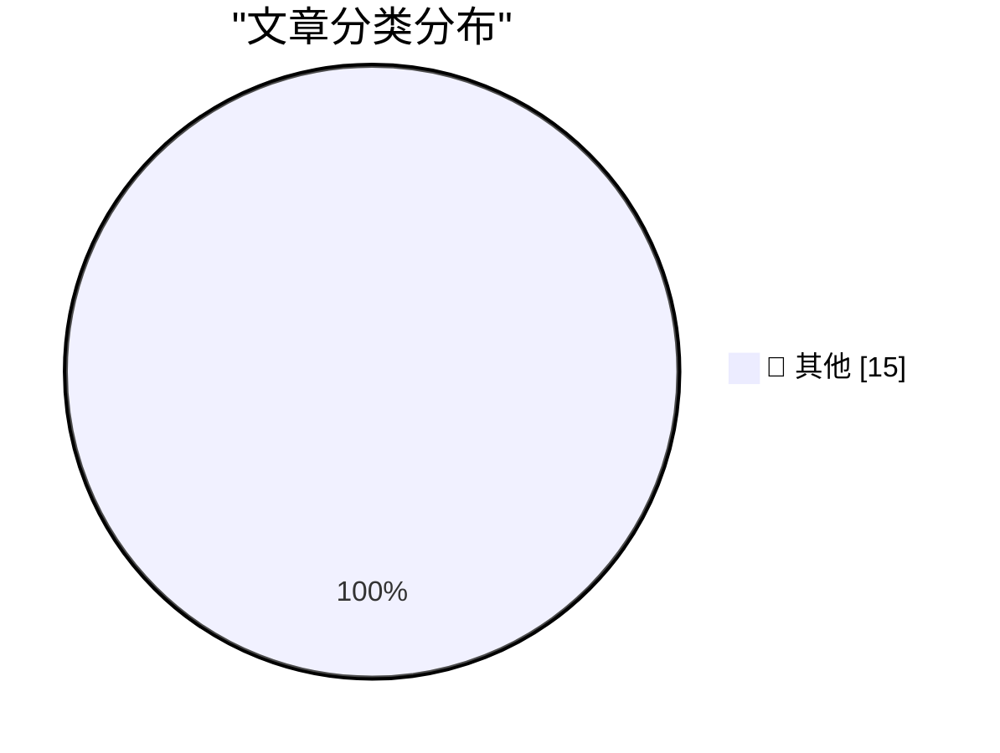

# 📰 AI 博客每日精选 — 2026-06-13

> 来自 Karpathy 推荐的 92 个顶级技术博客，AI 精选 Top 15

## 🏆 今日必读

🥇 **Statement on the US government directive to suspend access to Fable 5 and Mythos 5**

[Statement on the US government directive to suspend access to Fable 5 and Mythos 5](https://simonwillison.net/2026/Jun/13/us-government-directive-to-suspend-access/#atom-everything) — simonwillison.net · 1 小时前 · 📝 其他

> Statement on the US government directive to suspend access to Fable 5 and Mythos 5

🥈 **OpenAI WebRTC Audio Session, now with document context**

[OpenAI WebRTC Audio Session, now with document context](https://simonwillison.net/2026/Jun/12/openai-webrtc/#atom-everything) — simonwillison.net · 2 小时前 · 📝 其他

> OpenAI WebRTC Audio Session, now with document context

🥉 **Quoting Andrew Singleton**

[Quoting Andrew Singleton](https://simonwillison.net/2026/Jun/12/andrew-singleton/#atom-everything) — simonwillison.net · 8 小时前 · 📝 其他

> Quoting Andrew Singleton

---

## 📊 数据概览

| 扫描源 | 抓取文章 | 时间范围 | 精选 |
|:---:|:---:|:---:|:---:|
| 80/92 | 2425 篇 → 30 篇 | 48h | **15 篇** |

### 分类分布

---

## 📝 其他

### 1. Statement on the US government directive to suspend access to Fable 5 and Mythos 5

[Statement on the US government directive to suspend access to Fable 5 and Mythos 5](https://simonwillison.net/2026/Jun/13/us-government-directive-to-suspend-access/#atom-everything) — **simonwillison.net** · 1 小时前 · ⭐ 15/30

> Statement on the US government directive to suspend access to Fable 5 and Mythos 5

---

### 2. OpenAI WebRTC Audio Session, now with document context

[OpenAI WebRTC Audio Session, now with document context](https://simonwillison.net/2026/Jun/12/openai-webrtc/#atom-everything) — **simonwillison.net** · 2 小时前 · ⭐ 15/30

> OpenAI WebRTC Audio Session, now with document context

---

### 3. Quoting Andrew Singleton

[Quoting Andrew Singleton](https://simonwillison.net/2026/Jun/12/andrew-singleton/#atom-everything) — **simonwillison.net** · 8 小时前 · ⭐ 15/30

> Quoting Andrew Singleton

---

### 4. Claude Fable is relentlessly proactive

[Claude Fable is relentlessly proactive](https://simonwillison.net/2026/Jun/11/fable-is-relentlessly-proactive/#atom-everything) — **simonwillison.net** · 1 天前 · ⭐ 15/30

> Claude Fable is relentlessly proactive

---

### 5. datasette 1.0a33

[datasette 1.0a33](https://simonwillison.net/2026/Jun/11/datasette/#atom-everything) — **simonwillison.net** · 1 天前 · ⭐ 15/30

> datasette 1.0a33

---

### 6. asyncinject 0.7

[asyncinject 0.7](https://simonwillison.net/2026/Jun/11/asyncinject/#atom-everything) — **simonwillison.net** · 1 天前 · ⭐ 15/30

> asyncinject 0.7

---

### 7. Anthropic Walks Back Policy That Could Have ‘Sabotaged’ AI Researchers Using Claude

[Anthropic Walks Back Policy That Could Have ‘Sabotaged’ AI Researchers Using Claude](https://simonwillison.net/2026/Jun/11/anthropic-walks-back-policy/#atom-everything) — **simonwillison.net** · 1 天前 · ⭐ 15/30

> Anthropic Walks Back Policy That Could Have ‘Sabotaged’ AI Researchers Using Claude

---

### 8. You can finally power on a Mac remotely

[You can finally power on a Mac remotely](https://www.jeffgeerling.com/blog/2026/power-on-your-mac-remotely/) — **jeffgeerling.com** · 12 小时前 · ⭐ 15/30

> You can finally power on a Mac remotely

---

### 9. ★ The Talk Show: Live From WWDC 2026

[★ The Talk Show: Live From WWDC 2026](https://daringfireball.net/2026/06/the_talk_show_live_from_wwdc_2026) — **daringfireball.net** · 2 小时前 · ⭐ 15/30

> ★ The Talk Show: Live From WWDC 2026

---

### 10. The WWDC 2026 Keynote and State of the Union on YouTube

[The WWDC 2026 Keynote and State of the Union on YouTube](https://www.youtube.com/watch?v=hF8swzNR1-o) — **daringfireball.net** · 8 小时前 · ⭐ 15/30

> The WWDC 2026 Keynote and State of the Union on YouTube

---

### 11. The European Commission Response to Siri AI and the DMA

[The European Commission Response to Siri AI and the DMA](https://www.linkedin.com/posts/thomas-regnier-24a05810b_what-is-the-true-story-behind-apples-decision-activity-7470439874664280064-TuEt) — **daringfireball.net** · 9 小时前 · ⭐ 15/30

> The European Commission Response to Siri AI and the DMA

---

### 12. Apple: ‘Due to DMA, Siri AI Delayed in EU for iOS 27 and iPadOS 27’

[Apple: ‘Due to DMA, Siri AI Delayed in EU for iOS 27 and iPadOS 27’](https://www.apple.com/newsroom/2026/06/due-to-dma-siri-ai-delayed-in-eu-for-ios-27-and-ipados-27/) — **daringfireball.net** · 1 天前 · ⭐ 15/30

> Apple: ‘Due to DMA, Siri AI Delayed in EU for iOS 27 and iPadOS 27’

---

### 13. Spielberg on Being Repeatedly Turned Down to Direct a James Bond Film

[Spielberg on Being Repeatedly Turned Down to Direct a James Bond Film](https://www.youtube.com/watch?v=iEho3brGB64) — **daringfireball.net** · 1 天前 · ⭐ 15/30

> Spielberg on Being Repeatedly Turned Down to Direct a James Bond Film

---

### 14. I can never fully embrace LLMs for code

[I can never fully embrace LLMs for code](https://idiallo.com/blog/i-can-never-embrace-llms-to-write-code) — **idiallo.com** · 14 小时前 · ⭐ 15/30

> I can never fully embrace LLMs for code

---

### 15. Pluralistic: Google's new remote attestation scheme is every bit as terrible as its old remote attestation scheme (12 Jun 2026)

[Pluralistic: Google's new remote attestation scheme is every bit as terrible as its old remote attestation scheme (12 Jun 2026)](https://pluralistic.net/2026/06/12/compelled-speech/) — **pluralistic.net** · 5 小时前 · ⭐ 15/30

> Pluralistic: Google's new remote attestation scheme is every bit as terrible as its old remote attestation scheme (12 Jun 2026)

---

*生成于 2026-06-13 02:11 | 扫描 80 源 → 获取 2425 篇 → 精选 15 篇*
*基于 [Hacker News Popularity Contest 2025](https://refactoringenglish.com/tools/hn-popularity/) RSS 源列表，由 [Andrej Karpathy](https://x.com/karpathy) 推荐*
*由「懂点儿AI」制作，欢迎关注同名微信公众号获取更多 AI 实用技巧 💡*
