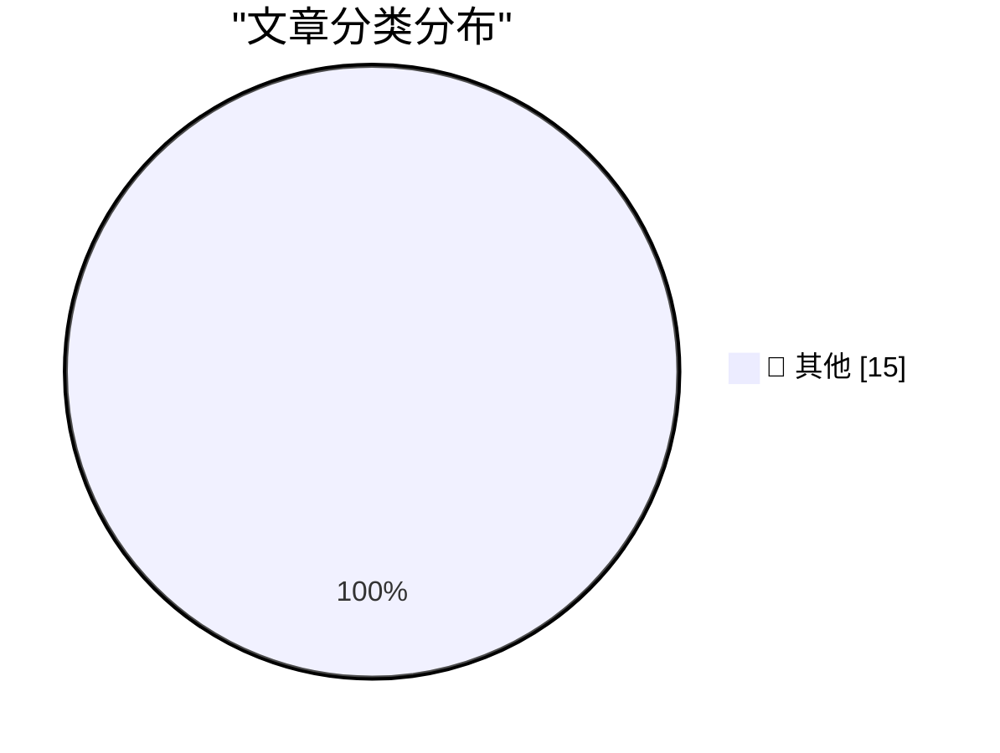

# 📰 AI 博客每日精选 — 2026-06-14

> 来自 Karpathy 推荐的 92 个顶级技术博客，AI 精选 Top 15

## 🏆 今日必读

🥇 **Publishing WASM wheels to PyPI for use with Pyodide**

[Publishing WASM wheels to PyPI for use with Pyodide](https://simonwillison.net/2026/Jun/13/publishing-wasm-wheels/#atom-everything) — simonwillison.net · 2 小时前 · 📝 其他

> Publishing WASM wheels to PyPI for use with Pyodide

🥈 **luau-wasm 0.1a0**

[luau-wasm 0.1a0](https://simonwillison.net/2026/Jun/13/luau-wasm/#atom-everything) — simonwillison.net · 3 小时前 · 📝 其他

> luau-wasm 0.1a0

🥉 **Mapping SQLite result columns back to their source `table.column`**

[Mapping SQLite result columns back to their source `table.column`](https://simonwillison.net/2026/Jun/13/sqlite-column-provenance/#atom-everything) — simonwillison.net · 3 小时前 · 📝 其他

> Mapping SQLite result columns back to their source `table.column`

---

## 📊 数据概览

| 扫描源 | 抓取文章 | 时间范围 | 精选 |
|:---:|:---:|:---:|:---:|
| 80/92 | 2305 篇 → 28 篇 | 48h | **15 篇** |

### 分类分布

---

## 📝 其他

### 1. Publishing WASM wheels to PyPI for use with Pyodide

[Publishing WASM wheels to PyPI for use with Pyodide](https://simonwillison.net/2026/Jun/13/publishing-wasm-wheels/#atom-everything) — **simonwillison.net** · 2 小时前 · ⭐ 15/30

> Publishing WASM wheels to PyPI for use with Pyodide

---

### 2. luau-wasm 0.1a0

[luau-wasm 0.1a0](https://simonwillison.net/2026/Jun/13/luau-wasm/#atom-everything) — **simonwillison.net** · 3 小时前 · ⭐ 15/30

> luau-wasm 0.1a0

---

### 3. Mapping SQLite result columns back to their source `table.column`

[Mapping SQLite result columns back to their source `table.column`](https://simonwillison.net/2026/Jun/13/sqlite-column-provenance/#atom-everything) — **simonwillison.net** · 3 小时前 · ⭐ 15/30

> Mapping SQLite result columns back to their source `table.column`

---

### 4. Statement on the US government directive to suspend access to Fable 5 and Mythos 5

[Statement on the US government directive to suspend access to Fable 5 and Mythos 5](https://simonwillison.net/2026/Jun/13/us-government-directive-to-suspend-access/#atom-everything) — **simonwillison.net** · 1 天前 · ⭐ 15/30

> Statement on the US government directive to suspend access to Fable 5 and Mythos 5

---

### 5. OpenAI WebRTC Audio Session, now with document context

[OpenAI WebRTC Audio Session, now with document context](https://simonwillison.net/2026/Jun/12/openai-webrtc/#atom-everything) — **simonwillison.net** · 1 天前 · ⭐ 15/30

> OpenAI WebRTC Audio Session, now with document context

---

### 6. Quoting Andrew Singleton

[Quoting Andrew Singleton](https://simonwillison.net/2026/Jun/12/andrew-singleton/#atom-everything) — **simonwillison.net** · 1 天前 · ⭐ 15/30

> Quoting Andrew Singleton

---

### 7. You can finally power on a Mac remotely

[You can finally power on a Mac remotely](https://www.jeffgeerling.com/blog/2026/power-on-your-mac-remotely/) — **jeffgeerling.com** · 1 天前 · ⭐ 15/30

> You can finally power on a Mac remotely

---

### 8. Trump’s Name (Set in the Wrong Font, of Course) Has Been Removed From the Kennedy Center

[Trump’s Name (Set in the Wrong Font, of Course) Has Been Removed From the Kennedy Center](https://apple.news/ANLNtQOeuSkiJ35tzkYw9oA) — **daringfireball.net** · 9 小时前 · ⭐ 15/30

> Trump’s Name (Set in the Wrong Font, of Course) Has Been Removed From the Kennedy Center

---

### 9. Apple’s Private Cloud Compute Is Severely Limited for Third-Party Developers

[Apple’s Private Cloud Compute Is Severely Limited for Third-Party Developers](https://developer.apple.com/private-cloud-compute/) — **daringfireball.net** · 9 小时前 · ⭐ 15/30

> Apple’s Private Cloud Compute Is Severely Limited for Third-Party Developers

---

### 10. U.S. Government Directs Anthropic to Shut Down Fable 5 and Mythos 5 Models on National Security Grounds

[U.S. Government Directs Anthropic to Shut Down Fable 5 and Mythos 5 Models on National Security Grounds](https://www.anthropic.com/news/fable-mythos-access) — **daringfireball.net** · 9 小时前 · ⭐ 15/30

> U.S. Government Directs Anthropic to Shut Down Fable 5 and Mythos 5 Models on National Security Grounds

---

### 11. ★ The Talk Show: Live From WWDC 2026

[★ The Talk Show: Live From WWDC 2026](https://daringfireball.net/2026/06/the_talk_show_live_from_wwdc_2026) — **daringfireball.net** · 1 天前 · ⭐ 15/30

> ★ The Talk Show: Live From WWDC 2026

---

### 12. The WWDC 2026 Keynote and State of the Union on YouTube

[The WWDC 2026 Keynote and State of the Union on YouTube](https://www.youtube.com/watch?v=hF8swzNR1-o) — **daringfireball.net** · 1 天前 · ⭐ 15/30

> The WWDC 2026 Keynote and State of the Union on YouTube

---

### 13. The European Commission Response to Siri AI and the DMA

[The European Commission Response to Siri AI and the DMA](https://www.linkedin.com/posts/thomas-regnier-24a05810b_what-is-the-true-story-behind-apples-decision-activity-7470439874664280064-TuEt) — **daringfireball.net** · 1 天前 · ⭐ 15/30

> The European Commission Response to Siri AI and the DMA

---

### 14. I can never fully embrace LLMs for code

[I can never fully embrace LLMs for code](https://idiallo.com/blog/i-can-never-embrace-llms-to-write-code) — **idiallo.com** · 1 天前 · ⭐ 15/30

> I can never fully embrace LLMs for code

---

### 15. Pluralistic: Shareholder supremacy and the precog CEO (13 Jun 2026)

[Pluralistic: Shareholder supremacy and the precog CEO (13 Jun 2026)](https://pluralistic.net/2026/06/13/minority-shareholder-report/) — **pluralistic.net** · 8 小时前 · ⭐ 15/30

> Pluralistic: Shareholder supremacy and the precog CEO (13 Jun 2026)

---

*生成于 2026-06-14 02:34 | 扫描 80 源 → 获取 2305 篇 → 精选 15 篇*
*基于 [Hacker News Popularity Contest 2025](https://refactoringenglish.com/tools/hn-popularity/) RSS 源列表，由 [Andrej Karpathy](https://x.com/karpathy) 推荐*
*由「懂点儿AI」制作，欢迎关注同名微信公众号获取更多 AI 实用技巧 💡*
