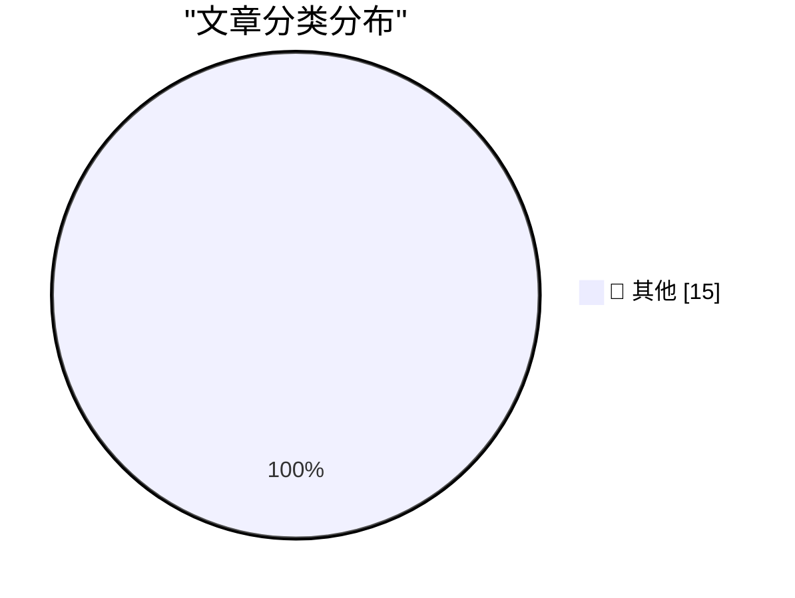

# 📰 AI 博客每日精选 — 2026-06-15

> 来自 Karpathy 推荐的 92 个顶级技术博客，AI 精选 Top 15

## 🏆 今日必读

🥇 **Quoting Julia Evans**

[Quoting Julia Evans](https://simonwillison.net/2026/Jun/15/julia-evans/#atom-everything) — simonwillison.net · 34 分钟前 · 📝 其他

> Quoting Julia Evans

🥈 **Why AI hasn’t replaced software engineers, and won’t**

[Why AI hasn’t replaced software engineers, and won’t](https://simonwillison.net/2026/Jun/14/why-ai-hasnt-replaced-software-engineers/#atom-everything) — simonwillison.net · 2 小时前 · 📝 其他

> Why AI hasn’t replaced software engineers, and won’t

🥉 **Publishing WASM wheels to PyPI for use with Pyodide**

[Publishing WASM wheels to PyPI for use with Pyodide](https://simonwillison.net/2026/Jun/13/publishing-wasm-wheels/#atom-everything) — simonwillison.net · 1 天前 · 📝 其他

> Publishing WASM wheels to PyPI for use with Pyodide

---

## 📊 数据概览

| 扫描源 | 抓取文章 | 时间范围 | 精选 |
|:---:|:---:|:---:|:---:|
| 81/92 | 2436 篇 → 17 篇 | 48h | **15 篇** |

### 分类分布

---

## 📝 其他

### 1. Quoting Julia Evans

[Quoting Julia Evans](https://simonwillison.net/2026/Jun/15/julia-evans/#atom-everything) — **simonwillison.net** · 34 分钟前 · ⭐ 15/30

> Quoting Julia Evans

---

### 2. Why AI hasn’t replaced software engineers, and won’t

[Why AI hasn’t replaced software engineers, and won’t](https://simonwillison.net/2026/Jun/14/why-ai-hasnt-replaced-software-engineers/#atom-everything) — **simonwillison.net** · 2 小时前 · ⭐ 15/30

> Why AI hasn’t replaced software engineers, and won’t

---

### 3. Publishing WASM wheels to PyPI for use with Pyodide

[Publishing WASM wheels to PyPI for use with Pyodide](https://simonwillison.net/2026/Jun/13/publishing-wasm-wheels/#atom-everything) — **simonwillison.net** · 1 天前 · ⭐ 15/30

> Publishing WASM wheels to PyPI for use with Pyodide

---

### 4. luau-wasm 0.1a0

[luau-wasm 0.1a0](https://simonwillison.net/2026/Jun/13/luau-wasm/#atom-everything) — **simonwillison.net** · 1 天前 · ⭐ 15/30

> luau-wasm 0.1a0

---

### 5. Mapping SQLite result columns back to their source `table.column`

[Mapping SQLite result columns back to their source `table.column`](https://simonwillison.net/2026/Jun/13/sqlite-column-provenance/#atom-everything) — **simonwillison.net** · 1 天前 · ⭐ 15/30

> Mapping SQLite result columns back to their source `table.column`

---

### 6. Trump’s Name (Set in the Wrong Font, of Course) Has Been Removed From the Kennedy Center

[Trump’s Name (Set in the Wrong Font, of Course) Has Been Removed From the Kennedy Center](https://apple.news/ANLNtQOeuSkiJ35tzkYw9oA) — **daringfireball.net** · 1 天前 · ⭐ 15/30

> Trump’s Name (Set in the Wrong Font, of Course) Has Been Removed From the Kennedy Center

---

### 7. Apple’s Private Cloud Compute Is Severely Limited for Third-Party Developers

[Apple’s Private Cloud Compute Is Severely Limited for Third-Party Developers](https://developer.apple.com/private-cloud-compute/) — **daringfireball.net** · 1 天前 · ⭐ 15/30

> Apple’s Private Cloud Compute Is Severely Limited for Third-Party Developers

---

### 8. U.S. Government Directs Anthropic to Shut Down Fable 5 and Mythos 5 Models on National Security Grounds

[U.S. Government Directs Anthropic to Shut Down Fable 5 and Mythos 5 Models on National Security Grounds](https://www.anthropic.com/news/fable-mythos-access) — **daringfireball.net** · 1 天前 · ⭐ 15/30

> U.S. Government Directs Anthropic to Shut Down Fable 5 and Mythos 5 Models on National Security Grounds

---

### 9. Pluralistic: Shareholder supremacy and the precog CEO (13 Jun 2026)

[Pluralistic: Shareholder supremacy and the precog CEO (13 Jun 2026)](https://pluralistic.net/2026/06/13/minority-shareholder-report/) — **pluralistic.net** · 1 天前 · ⭐ 15/30

> Pluralistic: Shareholder supremacy and the precog CEO (13 Jun 2026)

---

### 10. Did Frank Sinatra really think "Something" was a Lennon/McCartney song?

[Did Frank Sinatra really think "Something" was a Lennon/McCartney song?](https://shkspr.mobi/blog/2026/06/did-frank-sinatra-really-think-something-was-a-lennon-mccartney-song/) — **shkspr.mobi** · 15 小时前 · ⭐ 15/30

> Did Frank Sinatra really think "Something" was a Lennon/McCartney song?

---

### 11. The adder at the heart of Intel's 8087 floating-point chip

[The adder at the heart of Intel's 8087 floating-point chip](http://www.righto.com/feeds/3050107772739337632/comments/default) — **righto.com** · 1 天前 · ⭐ 15/30

> The adder at the heart of Intel's 8087 floating-point chip

---

### 12. RSA munitions T-shirt

[RSA munitions T-shirt](https://www.johndcook.com/blog/2026/06/13/rsa-munitions-t-shirt/) — **johndcook.com** · 1 天前 · ⭐ 15/30

> RSA munitions T-shirt

---

### 13. This Week in Package Management: 13 June 2026

[This Week in Package Management: 13 June 2026](https://nesbitt.io/2026/06/13/this-week-in-package-management.html) — **nesbitt.io** · 1 天前 · ⭐ 15/30

> This Week in Package Management: 13 June 2026

---

### 14. Reading List 06/13/2026

[Reading List 06/13/2026](https://www.construction-physics.com/p/reading-list-06132026) — **construction-physics.com** · 1 天前 · ⭐ 15/30

> Reading List 06/13/2026

---

### 15. Plugins case study: Pluggy

[Plugins case study: Pluggy](https://eli.thegreenplace.net/2026/plugins-case-study-pluggy/) — **eli.thegreenplace.net** · 23 小时前 · ⭐ 15/30

> Plugins case study: Pluggy

---

*生成于 2026-06-15 02:39 | 扫描 81 源 → 获取 2436 篇 → 精选 15 篇*
*基于 [Hacker News Popularity Contest 2025](https://refactoringenglish.com/tools/hn-popularity/) RSS 源列表，由 [Andrej Karpathy](https://x.com/karpathy) 推荐*
*由「懂点儿AI」制作，欢迎关注同名微信公众号获取更多 AI 实用技巧 💡*
