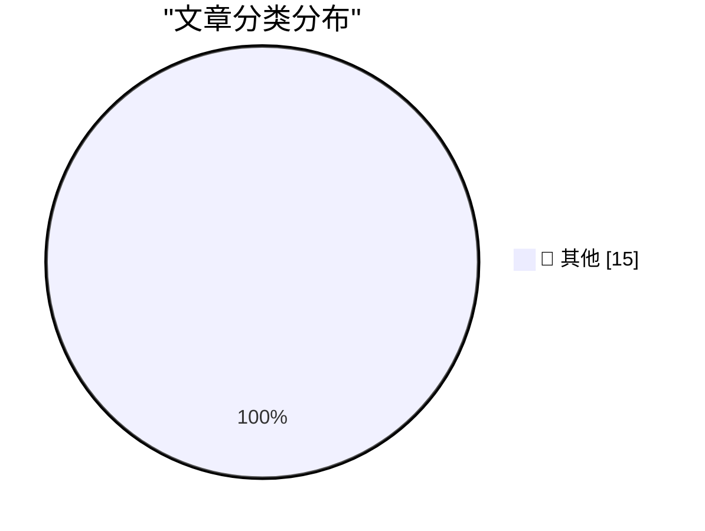

# 📰 AI 博客每日精选 — 2026-06-20

> 来自 Karpathy 推荐的 92 个顶级技术博客，AI 精选 Top 15

## 🏆 今日必读

🥇 **Quoting Sean Lynch**

[Quoting Sean Lynch](https://simonwillison.net/2026/Jun/19/sean-lynch/#atom-everything) — simonwillison.net · 3 小时前 · 📝 其他

> Quoting Sean Lynch

🥈 **Datasette Apps: Host custom HTML applications inside Datasette**

[Datasette Apps: Host custom HTML applications inside Datasette](https://simonwillison.net/2026/Jun/18/datasette-apps/#atom-everything) — simonwillison.net · 1 天前 · 📝 其他

> Datasette Apps: Host custom HTML applications inside Datasette

🥉 **datasette-acl 0.6a0**

[datasette-acl 0.6a0](https://simonwillison.net/2026/Jun/18/datasette-acl/#atom-everything) — simonwillison.net · 1 天前 · 📝 其他

> datasette-acl 0.6a0

---

## 📊 数据概览

| 扫描源 | 抓取文章 | 时间范围 | 精选 |
|:---:|:---:|:---:|:---:|
| 82/92 | 2475 篇 → 34 篇 | 48h | **15 篇** |

### 分类分布

---

## 📝 其他

### 1. Quoting Sean Lynch

[Quoting Sean Lynch](https://simonwillison.net/2026/Jun/19/sean-lynch/#atom-everything) — **simonwillison.net** · 3 小时前 · ⭐ 15/30

> Quoting Sean Lynch

---

### 2. Datasette Apps: Host custom HTML applications inside Datasette

[Datasette Apps: Host custom HTML applications inside Datasette](https://simonwillison.net/2026/Jun/18/datasette-apps/#atom-everything) — **simonwillison.net** · 1 天前 · ⭐ 15/30

> Datasette Apps: Host custom HTML applications inside Datasette

---

### 3. datasette-acl 0.6a0

[datasette-acl 0.6a0](https://simonwillison.net/2026/Jun/18/datasette-acl/#atom-everything) — **simonwillison.net** · 1 天前 · ⭐ 15/30

> datasette-acl 0.6a0

---

### 4. ‘Popa’ Botnet Linked to Publicly-Traded Israeli Firm

[‘Popa’ Botnet Linked to Publicly-Traded Israeli Firm](https://krebsonsecurity.com/2026/06/popa-botnet-linked-to-publicly-traded-israeli-firm/) — **krebsonsecurity.com** · 1 天前 · ⭐ 15/30

> ‘Popa’ Botnet Linked to Publicly-Traded Israeli Firm

---

### 5. Another One for the ‘Sorry, We Used to Be Crap’ Truth-in-Advertising File: Carlsberg Beer

[Another One for the ‘Sorry, We Used to Be Crap’ Truth-in-Advertising File: Carlsberg Beer](https://www.independent.co.uk/news/business/news/carlsberg-probably-not-best-beer-in-world-lager-brewer-a8874016.html) — **daringfireball.net** · 43 分钟前 · ⭐ 15/30

> Another One for the ‘Sorry, We Used to Be Crap’ Truth-in-Advertising File: Carlsberg Beer

---

### 6. ‘What’s the Deal With Old Guys and Giant Glasses?’

[‘What’s the Deal With Old Guys and Giant Glasses?’](https://www.youtube.com/watch?v=8DYGxn6Xvt0) — **daringfireball.net** · 51 分钟前 · ⭐ 15/30

> ‘What’s the Deal With Old Guys and Giant Glasses?’

---

### 7. Trump Mobile T1 Phone Is a Gold-Painted Two-Year-Old HTC U24 Pro

[Trump Mobile T1 Phone Is a Gold-Painted Two-Year-Old HTC U24 Pro](https://www.nbcnews.com/tech/gadgets/trump-mobile-t1-phone-nearly-identical-htc-device-analysis-rcna349293) — **daringfireball.net** · 7 小时前 · ⭐ 15/30

> Trump Mobile T1 Phone Is a Gold-Painted Two-Year-Old HTC U24 Pro

---

### 8. Fox to Buy Roku Streaming Service in $25 Billion Deal

[Fox to Buy Roku Streaming Service in $25 Billion Deal](https://www.wsj.com/business/deals/fox-roku-deal-f6e564f9?st=mKdQwC&amp;reflink=desktopwebshare_permalink) — **daringfireball.net** · 7 小时前 · ⭐ 15/30

> Fox to Buy Roku Streaming Service in $25 Billion Deal

---

### 9. Snap Launches Ad Campaign for Specs Starring Michael Caine

[Snap Launches Ad Campaign for Specs Starring Michael Caine](https://www.reddit.com/r/funny/comments/1jk6onr/bloody_large_glasses_by_michael_caine/) — **daringfireball.net** · 9 小时前 · ⭐ 15/30

> Snap Launches Ad Campaign for Specs Starring Michael Caine

---

### 10. Jerry Seinfeld Tries Out Snap’s Specs

[Jerry Seinfeld Tries Out Snap’s Specs](https://youtu.be/siM8NW24QPs?t=217) — **daringfireball.net** · 9 小时前 · ⭐ 15/30

> Jerry Seinfeld Tries Out Snap’s Specs

---

### 11. Domino’s Admitted Their Pizza Tasted Like Cardboard

[Domino’s Admitted Their Pizza Tasted Like Cardboard](https://www.inc.com/jeff-haden/10-years-ago-cardboard-pizza-almost-killed-dominos-then-dominos-did-something-brilliant.html) — **daringfireball.net** · 10 小时前 · ⭐ 15/30

> Domino’s Admitted Their Pizza Tasted Like Cardboard

---

### 12. Verizon, Formerly Menace Mobile

[Verizon, Formerly Menace Mobile](https://www.youtube.com/watch?v=lzmntndEXWo) — **daringfireball.net** · 1 天前 · ⭐ 15/30

> Verizon, Formerly Menace Mobile

---

### 13. Cotypist – Smart Autocomplete Utility for Mac

[Cotypist – Smart Autocomplete Utility for Mac](https://cotypist.app/) — **daringfireball.net** · 1 天前 · ⭐ 15/30

> Cotypist – Smart Autocomplete Utility for Mac

---

### 14. New Domain for Sign In With Apple and iCloud+ Hide My Email

[New Domain for Sign In With Apple and iCloud+ Hide My Email](https://developer.apple.com/news/?id=sus6t6ab) — **daringfireball.net** · 1 天前 · ⭐ 15/30

> New Domain for Sign In With Apple and iCloud+ Hide My Email

---

### 15. NetNewsWire Status

[NetNewsWire Status](https://inessential.com/2026/06/15/netnewswire-status.html) — **daringfireball.net** · 1 天前 · ⭐ 15/30

> NetNewsWire Status

---

*生成于 2026-06-20 02:13 | 扫描 82 源 → 获取 2475 篇 → 精选 15 篇*
*基于 [Hacker News Popularity Contest 2025](https://refactoringenglish.com/tools/hn-popularity/) RSS 源列表，由 [Andrej Karpathy](https://x.com/karpathy) 推荐*
*由「懂点儿AI」制作，欢迎关注同名微信公众号获取更多 AI 实用技巧 💡*
