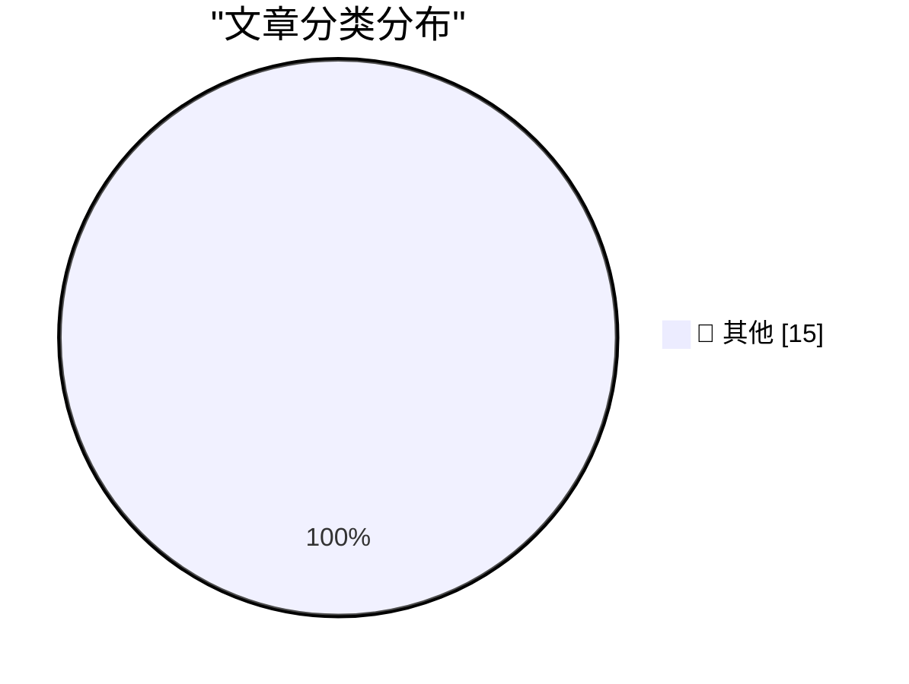

# 📰 AI 博客每日精选 — 2026-06-21

> 来自 Karpathy 推荐的 92 个顶级技术博客，AI 精选 Top 15

## 🏆 今日必读

🥇 **Quoting Sean Lynch**

[Quoting Sean Lynch](https://simonwillison.net/2026/Jun/19/sean-lynch/#atom-everything) — simonwillison.net · 1 天前 · 📝 其他

> Quoting Sean Lynch

🥈 **Another One for the ‘Sorry, We Used to Be Crap’ Truth-in-Advertising File: Carlsberg Beer**

[Another One for the ‘Sorry, We Used to Be Crap’ Truth-in-Advertising File: Carlsberg Beer](https://www.independent.co.uk/news/business/news/carlsberg-probably-not-best-beer-in-world-lager-brewer-a8874016.html) — daringfireball.net · 1 天前 · 📝 其他

> Another One for the ‘Sorry, We Used to Be Crap’ Truth-in-Advertising File: Carlsberg Beer

🥉 **‘What’s the Deal With Old Guys and Giant Glasses?’**

[‘What’s the Deal With Old Guys and Giant Glasses?’](https://www.youtube.com/watch?v=8DYGxn6Xvt0) — daringfireball.net · 1 天前 · 📝 其他

> ‘What’s the Deal With Old Guys and Giant Glasses?’

---

## 📊 数据概览

| 扫描源 | 抓取文章 | 时间范围 | 精选 |
|:---:|:---:|:---:|:---:|
| 83/92 | 2492 篇 → 24 篇 | 48h | **15 篇** |

### 分类分布

---

## 📝 其他

### 1. Quoting Sean Lynch

[Quoting Sean Lynch](https://simonwillison.net/2026/Jun/19/sean-lynch/#atom-everything) — **simonwillison.net** · 1 天前 · ⭐ 15/30

> Quoting Sean Lynch

---

### 2. Another One for the ‘Sorry, We Used to Be Crap’ Truth-in-Advertising File: Carlsberg Beer

[Another One for the ‘Sorry, We Used to Be Crap’ Truth-in-Advertising File: Carlsberg Beer](https://www.independent.co.uk/news/business/news/carlsberg-probably-not-best-beer-in-world-lager-brewer-a8874016.html) — **daringfireball.net** · 1 天前 · ⭐ 15/30

> Another One for the ‘Sorry, We Used to Be Crap’ Truth-in-Advertising File: Carlsberg Beer

---

### 3. ‘What’s the Deal With Old Guys and Giant Glasses?’

[‘What’s the Deal With Old Guys and Giant Glasses?’](https://www.youtube.com/watch?v=8DYGxn6Xvt0) — **daringfireball.net** · 1 天前 · ⭐ 15/30

> ‘What’s the Deal With Old Guys and Giant Glasses?’

---

### 4. Trump Mobile T1 Phone Is a Gold-Painted Two-Year-Old HTC U24 Pro

[Trump Mobile T1 Phone Is a Gold-Painted Two-Year-Old HTC U24 Pro](https://www.nbcnews.com/tech/gadgets/trump-mobile-t1-phone-nearly-identical-htc-device-analysis-rcna349293) — **daringfireball.net** · 1 天前 · ⭐ 15/30

> Trump Mobile T1 Phone Is a Gold-Painted Two-Year-Old HTC U24 Pro

---

### 5. Fox to Buy Roku Streaming Service in $25 Billion Deal

[Fox to Buy Roku Streaming Service in $25 Billion Deal](https://www.wsj.com/business/deals/fox-roku-deal-f6e564f9?st=mKdQwC&amp;reflink=desktopwebshare_permalink) — **daringfireball.net** · 1 天前 · ⭐ 15/30

> Fox to Buy Roku Streaming Service in $25 Billion Deal

---

### 6. Snap Launches Ad Campaign for Specs Starring Michael Caine

[Snap Launches Ad Campaign for Specs Starring Michael Caine](https://www.reddit.com/r/funny/comments/1jk6onr/bloody_large_glasses_by_michael_caine/) — **daringfireball.net** · 1 天前 · ⭐ 15/30

> Snap Launches Ad Campaign for Specs Starring Michael Caine

---

### 7. Jerry Seinfeld Tries Out Snap’s Specs

[Jerry Seinfeld Tries Out Snap’s Specs](https://youtu.be/siM8NW24QPs?t=217) — **daringfireball.net** · 1 天前 · ⭐ 15/30

> Jerry Seinfeld Tries Out Snap’s Specs

---

### 8. Domino’s Admitted Their Pizza Tasted Like Cardboard

[Domino’s Admitted Their Pizza Tasted Like Cardboard](https://www.inc.com/jeff-haden/10-years-ago-cardboard-pizza-almost-killed-dominos-then-dominos-did-something-brilliant.html) — **daringfireball.net** · 1 天前 · ⭐ 15/30

> Domino’s Admitted Their Pizza Tasted Like Cardboard

---

### 9. I know Kung-fu

[I know Kung-fu](https://idiallo.com/blog/i-know-kung-fu) — **idiallo.com** · 23 小时前 · ⭐ 15/30

> I know Kung-fu

---

### 10. Glassblowing #3: A better thermionic diode

[Glassblowing #3: A better thermionic diode](https://maurycyz.com/projects/glass/3/) — **maurycyz.com** · 1 天前 · ⭐ 15/30

> Glassblowing #3: A better thermionic diode

---

### 11. Pluralistic: How the Epstein Class recruits (20 Jun 2026)

[Pluralistic: How the Epstein Class recruits (20 Jun 2026)](https://pluralistic.net/2026/06/20/any-club-that-would-have-me/) — **pluralistic.net** · 10 小时前 · ⭐ 15/30

> Pluralistic: How the Epstein Class recruits (20 Jun 2026)

---

### 12. Pluralistic: The Big Con (19 Jun 2026)

[Pluralistic: The Big Con (19 Jun 2026)](https://pluralistic.net/2026/06/19/too-big-to-fact-check/) — **pluralistic.net** · 1 天前 · ⭐ 15/30

> Pluralistic: The Big Con (19 Jun 2026)

---

### 13. Which Copyleft Licence is Suitable for an SVG?

[Which Copyleft Licence is Suitable for an SVG?](https://shkspr.mobi/blog/2026/06/which-copyleft-licence-is-suitable-for-an-svg/) — **shkspr.mobi** · 15 小时前 · ⭐ 15/30

> Which Copyleft Licence is Suitable for an SVG?

---

### 14. What does it mean when the bottom bit of my HMODULE is set?

[What does it mean when the bottom bit of my HMODULE is set?](https://devblogs.microsoft.com/oldnewthing/20260619-00/?p=112447) — **devblogs.microsoft.com/oldnewthing** · 1 天前 · ⭐ 15/30

> What does it mean when the bottom bit of my HMODULE is set?

---

### 15. All pieces on a 6 by 5 board

[All pieces on a 6 by 5 board](https://www.johndcook.com/blog/2026/06/20/z3-python-claude/) — **johndcook.com** · 4 小时前 · ⭐ 15/30

> All pieces on a 6 by 5 board

---

*生成于 2026-06-21 02:37 | 扫描 83 源 → 获取 2492 篇 → 精选 15 篇*
*基于 [Hacker News Popularity Contest 2025](https://refactoringenglish.com/tools/hn-popularity/) RSS 源列表，由 [Andrej Karpathy](https://x.com/karpathy) 推荐*
*由「懂点儿AI」制作，欢迎关注同名微信公众号获取更多 AI 实用技巧 💡*
