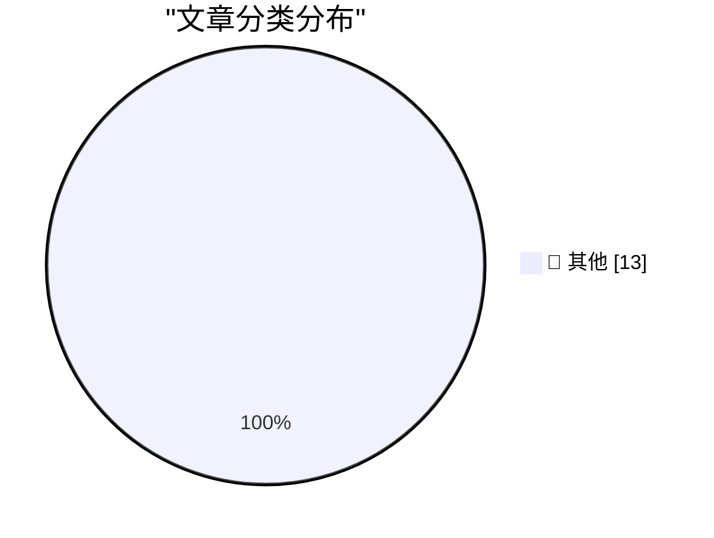

# 📰 AI 博客每日精选 — 2026-06-22

> 来自 Karpathy 推荐的 92 个顶级技术博客，AI 精选 Top 13

## 🏆 今日必读

🥇 **sqlite-utils 4.0rc1 adds migrations and nested transactions**

[sqlite-utils 4.0rc1 adds migrations and nested transactions](https://simonwillison.net/2026/Jun/21/sqlite-utils-40rc1/#atom-everything) — simonwillison.net · 3 小时前 · 📝 其他

> sqlite-utils 4.0rc1 adds migrations and nested transactions

🥈 **sqlite-utils 4.0rc1**

[sqlite-utils 4.0rc1](https://simonwillison.net/2026/Jun/21/sqlite-utils/#atom-everything) — simonwillison.net · 3 小时前 · 📝 其他

> sqlite-utils 4.0rc1

🥉 **Temporary Cloudflare Accounts for AI agents**

[Temporary Cloudflare Accounts for AI agents](https://simonwillison.net/2026/Jun/21/temporary-cloudflare-accounts/#atom-everything) — simonwillison.net · 4 小时前 · 📝 其他

> Temporary Cloudflare Accounts for AI agents

---

## 📊 数据概览

| 扫描源 | 抓取文章 | 时间范围 | 精选 |
|:---:|:---:|:---:|:---:|
| 81/92 | 2447 篇 → 13 篇 | 48h | **13 篇** |

### 分类分布

---

## 📝 其他

### 1. sqlite-utils 4.0rc1 adds migrations and nested transactions

[sqlite-utils 4.0rc1 adds migrations and nested transactions](https://simonwillison.net/2026/Jun/21/sqlite-utils-40rc1/#atom-everything) — **simonwillison.net** · 3 小时前 · ⭐ 15/30

> sqlite-utils 4.0rc1 adds migrations and nested transactions

---

### 2. sqlite-utils 4.0rc1

[sqlite-utils 4.0rc1](https://simonwillison.net/2026/Jun/21/sqlite-utils/#atom-everything) — **simonwillison.net** · 3 小时前 · ⭐ 15/30

> sqlite-utils 4.0rc1

---

### 3. Temporary Cloudflare Accounts for AI agents

[Temporary Cloudflare Accounts for AI agents](https://simonwillison.net/2026/Jun/21/temporary-cloudflare-accounts/#atom-everything) — **simonwillison.net** · 4 小时前 · ⭐ 15/30

> Temporary Cloudflare Accounts for AI agents

---

### 4. Before and After: MacOS 27 Golden Gate Beta 1’s App Icons

[Before and After: MacOS 27 Golden Gate Beta 1’s App Icons](https://basicappleguy.com/basicappleblog/macos-golden-gate-icon-comparison) — **daringfireball.net** · 4 小时前 · ⭐ 15/30

> Before and After: MacOS 27 Golden Gate Beta 1’s App Icons

---

### 5. Mux — Video for Developers

[Mux — Video for Developers](https://www.mux.com/?utm_campaign=fireball&amp;utm_source=DF) — **daringfireball.net** · 5 小时前 · ⭐ 15/30

> Mux — Video for Developers

---

### 6. I know Kung-fu

[I know Kung-fu](https://idiallo.com/blog/i-know-kung-fu) — **idiallo.com** · 1 天前 · ⭐ 15/30

> I know Kung-fu

---

### 7. Pluralistic: How the Epstein Class recruits (20 Jun 2026)

[Pluralistic: How the Epstein Class recruits (20 Jun 2026)](https://pluralistic.net/2026/06/20/any-club-that-would-have-me/) — **pluralistic.net** · 1 天前 · ⭐ 15/30

> Pluralistic: How the Epstein Class recruits (20 Jun 2026)

---

### 8. Queens on a prime order board

[Queens on a prime order board](https://www.johndcook.com/blog/2026/06/21/queens-prime/) — **johndcook.com** · 2 小时前 · ⭐ 15/30

> Queens on a prime order board

---

### 9. All pieces on a 6 by 5 board

[All pieces on a 6 by 5 board](https://www.johndcook.com/blog/2026/06/20/z3-python-claude/) — **johndcook.com** · 1 天前 · ⭐ 15/30

> All pieces on a 6 by 5 board

---

### 10. This Week in Package Management: 20 June 2026

[This Week in Package Management: 20 June 2026](https://nesbitt.io/2026/06/20/this-week-in-package-management.html) — **nesbitt.io** · 1 天前 · ⭐ 15/30

> This Week in Package Management: 20 June 2026

---

### 11. Reading List 06/20/26

[Reading List 06/20/26](https://www.construction-physics.com/p/reading-list-062026) — **construction-physics.com** · 1 天前 · ⭐ 15/30

> Reading List 06/20/26

---

### 12. On Vulgar Materialism

[On Vulgar Materialism](https://borretti.me/article/on-vulgar-materialism) — **borretti.me** · 1 天前 · ⭐ 15/30

> On Vulgar Materialism

---

### 13. The doom justifies the valuation

[The doom justifies the valuation](https://geohot.github.io//blog/jekyll/update/2026/06/21/the-doom-justifies-the-valuation.html) — **geohot.github.io** · 19 小时前 · ⭐ 15/30

> The doom justifies the valuation

---

*生成于 2026-06-22 02:40 | 扫描 81 源 → 获取 2447 篇 → 精选 13 篇*
*基于 [Hacker News Popularity Contest 2025](https://refactoringenglish.com/tools/hn-popularity/) RSS 源列表，由 [Andrej Karpathy](https://x.com/karpathy) 推荐*
*由「懂点儿AI」制作，欢迎关注同名微信公众号获取更多 AI 实用技巧 💡*
