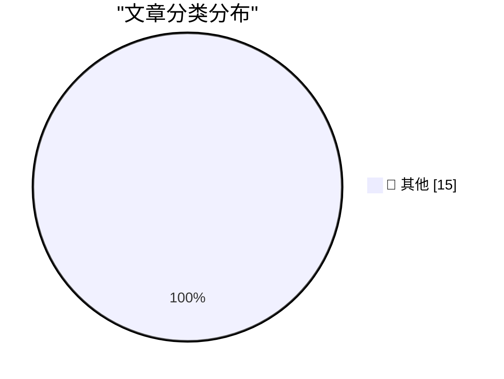

# 📰 AI 博客每日精选 — 2026-06-25

> 来自 Karpathy 推荐的 92 个顶级技术博客，AI 精选 Top 15

## 🏆 今日必读

🥇 **simonw/browser-compat-db**

[simonw/browser-compat-db](https://simonwillison.net/2026/Jun/24/browser-compat-db/#atom-everything) — simonwillison.net · 2 小时前 · 📝 其他

> simonw/browser-compat-db

🥈 **Quoting Tom MacWright**

[Quoting Tom MacWright](https://simonwillison.net/2026/Jun/24/tom-macwright/#atom-everything) — simonwillison.net · 7 小时前 · 📝 其他

> Quoting Tom MacWright

🥉 **datasette 1.0a35**

[datasette 1.0a35](https://simonwillison.net/2026/Jun/23/datasette/#atom-everything) — simonwillison.net · 1 天前 · 📝 其他

> datasette 1.0a35

---

## 📊 数据概览

| 扫描源 | 抓取文章 | 时间范围 | 精选 |
|:---:|:---:|:---:|:---:|
| 80/92 | 2431 篇 → 25 篇 | 48h | **15 篇** |

### 分类分布

---

## 📝 其他

### 1. simonw/browser-compat-db

[simonw/browser-compat-db](https://simonwillison.net/2026/Jun/24/browser-compat-db/#atom-everything) — **simonwillison.net** · 2 小时前 · ⭐ 15/30

> simonw/browser-compat-db

---

### 2. Quoting Tom MacWright

[Quoting Tom MacWright](https://simonwillison.net/2026/Jun/24/tom-macwright/#atom-everything) — **simonwillison.net** · 7 小时前 · ⭐ 15/30

> Quoting Tom MacWright

---

### 3. datasette 1.0a35

[datasette 1.0a35](https://simonwillison.net/2026/Jun/23/datasette/#atom-everything) — **simonwillison.net** · 1 天前 · ⭐ 15/30

> datasette 1.0a35

---

### 4. OPFS + Pyodide test harness

[OPFS + Pyodide test harness](https://simonwillison.net/2026/Jun/23/opfs-pyodide/#atom-everything) — **simonwillison.net** · 1 天前 · ⭐ 15/30

> OPFS + Pyodide test harness

---

### 5. Framework's 10G Ethernet module exposes USB-C's complexity

[Framework's 10G Ethernet module exposes USB-C's complexity](https://www.jeffgeerling.com/blog/2026/framework-10g-ethernet-module-usb-c-complexity/) — **jeffgeerling.com** · 12 小时前 · ⭐ 15/30

> Framework's 10G Ethernet module exposes USB-C's complexity

---

### 6. Scattered Spider Hackers Plead Guilty on Day 1 of Trial

[Scattered Spider Hackers Plead Guilty on Day 1 of Trial](https://krebsonsecurity.com/2026/06/scattered-spider-hackers-plead-guilty-on-day-1-of-trial/) — **krebsonsecurity.com** · 1 天前 · ⭐ 15/30

> Scattered Spider Hackers Plead Guilty on Day 1 of Trial

---

### 7. WebKit Always Enables the Copy Menu Item in Every App

[WebKit Always Enables the Copy Menu Item in Every App](https://lapcatsoftware.com/articles/2026/6/5.html) — **daringfireball.net** · 4 小时前 · ⭐ 15/30

> WebKit Always Enables the Copy Menu Item in Every App

---

### 8. WebKit in Safari 27 Beta

[WebKit in Safari 27 Beta](https://webkit.org/blog/17967/news-from-wwdc26-webkit-in-safari-27-beta/) — **daringfireball.net** · 6 小时前 · ⭐ 15/30

> WebKit in Safari 27 Beta

---

### 9. [Sponsor] WorkOS: Agents Need Auth. There’s Now a Spec for It.

[[Sponsor] WorkOS: Agents Need Auth. There’s Now a Spec for It.](http://workos.com/auth-md?utm_source=daringfireball&amp;utm_medium=newsletter&amp;utm_campaign=q32026) — **daringfireball.net** · 7 小时前 · ⭐ 15/30

> [Sponsor] WorkOS: Agents Need Auth. There’s Now a Spec for It.

---

### 10. Designed in California: An Apple History Podcast

[Designed in California: An Apple History Podcast](https://designed.fm/) — **daringfireball.net** · 10 小时前 · ⭐ 15/30

> Designed in California: An Apple History Podcast

---

### 11. The Talk Show: ‘Perp Walk for Selfies’

[The Talk Show: ‘Perp Walk for Selfies’](https://daringfireball.net/thetalkshow/2026/06/23/ep-450) — **daringfireball.net** · 1 天前 · ⭐ 15/30

> The Talk Show: ‘Perp Walk for Selfies’

---

### 12. Pluralistic: Spying on kids to save kids from spying is very, very stupid (23 Jun 2026)

[Pluralistic: Spying on kids to save kids from spying is very, very stupid (23 Jun 2026)](https://pluralistic.net/2026/06/23/destroy-the-village/) — **pluralistic.net** · 1 天前 · ⭐ 15/30

> Pluralistic: Spying on kids to save kids from spying is very, very stupid (23 Jun 2026)

---

### 13. Auth0 PHP - manually authenticating JWT idTokens

[Auth0 PHP - manually authenticating JWT idTokens](https://shkspr.mobi/blog/2026/06/auth0-php-manually-authenticating-tokens/) — **shkspr.mobi** · 14 小时前 · ⭐ 15/30

> Auth0 PHP - manually authenticating JWT idTokens

---

### 14. "No way to prevent this" say users of only language where this regularly happens

["No way to prevent this" say users of only language where this regularly happens](https://xeiaso.net/shitposts/no-way-to-prevent-this/memory-safety/CVE-2026-55200/) — **xeiaso.net** · 1 天前 · ⭐ 15/30

> "No way to prevent this" say users of only language where this regularly happens

---

### 15. Microspeak elaborated: Isn’t escrow just a release candidate by another name?

[Microspeak elaborated: Isn’t escrow just a release candidate by another name?](https://devblogs.microsoft.com/oldnewthing/20260623-00/?p=112462) — **devblogs.microsoft.com/oldnewthing** · 1 天前 · ⭐ 15/30

> Microspeak elaborated: Isn’t escrow just a release candidate by another name?

---

*生成于 2026-06-25 02:09 | 扫描 80 源 → 获取 2431 篇 → 精选 15 篇*
*基于 [Hacker News Popularity Contest 2025](https://refactoringenglish.com/tools/hn-popularity/) RSS 源列表，由 [Andrej Karpathy](https://x.com/karpathy) 推荐*
*由「懂点儿AI」制作，欢迎关注同名微信公众号获取更多 AI 实用技巧 💡*
