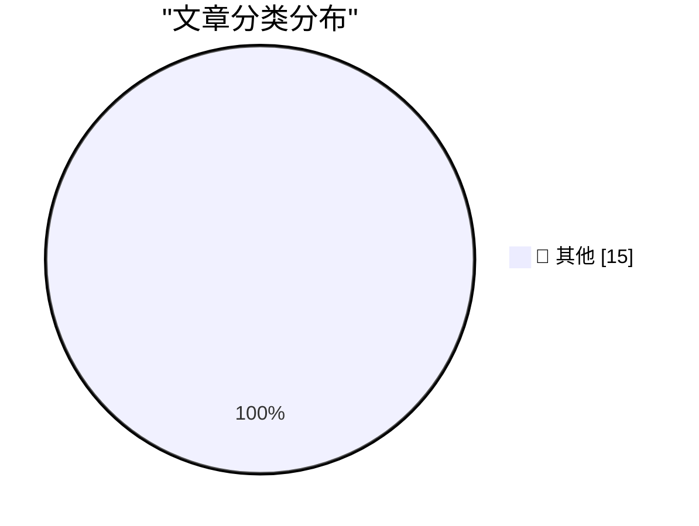

# 📰 AI 博客每日精选 — 2026-06-26

> 来自 Karpathy 推荐的 92 个顶级技术博客，AI 精选 Top 15

## 🏆 今日必读

🥇 **AI and Liability**

[AI and Liability](https://simonwillison.net/2026/Jun/25/ai-and-liability/#atom-everything) — simonwillison.net · 3 小时前 · 📝 其他

> AI and Liability

🥈 **datasette-export-database 0.3a2**

[datasette-export-database 0.3a2](https://simonwillison.net/2026/Jun/25/datasette-export-database/#atom-everything) — simonwillison.net · 8 小时前 · 📝 其他

> datasette-export-database 0.3a2

🥉 **simonw/browser-compat-db**

[simonw/browser-compat-db](https://simonwillison.net/2026/Jun/24/browser-compat-db/#atom-everything) — simonwillison.net · 1 天前 · 📝 其他

> simonw/browser-compat-db

---

## 📊 数据概览

| 扫描源 | 抓取文章 | 时间范围 | 精选 |
|:---:|:---:|:---:|:---:|
| 81/92 | 2461 篇 → 29 篇 | 48h | **15 篇** |

### 分类分布

---

## 📝 其他

### 1. AI and Liability

[AI and Liability](https://simonwillison.net/2026/Jun/25/ai-and-liability/#atom-everything) — **simonwillison.net** · 3 小时前 · ⭐ 15/30

> AI and Liability

---

### 2. datasette-export-database 0.3a2

[datasette-export-database 0.3a2](https://simonwillison.net/2026/Jun/25/datasette-export-database/#atom-everything) — **simonwillison.net** · 8 小时前 · ⭐ 15/30

> datasette-export-database 0.3a2

---

### 3. simonw/browser-compat-db

[simonw/browser-compat-db](https://simonwillison.net/2026/Jun/24/browser-compat-db/#atom-everything) — **simonwillison.net** · 1 天前 · ⭐ 15/30

> simonw/browser-compat-db

---

### 4. Quoting Tom MacWright

[Quoting Tom MacWright](https://simonwillison.net/2026/Jun/24/tom-macwright/#atom-everything) — **simonwillison.net** · 1 天前 · ⭐ 15/30

> Quoting Tom MacWright

---

### 5. Framework's 10G Ethernet module exposes USB-C's complexity

[Framework's 10G Ethernet module exposes USB-C's complexity](https://www.jeffgeerling.com/blog/2026/framework-10g-ethernet-module-usb-c-complexity/) — **jeffgeerling.com** · 1 天前 · ⭐ 15/30

> Framework's 10G Ethernet module exposes USB-C's complexity

---

### 6. Apple Journal’s Atrocious Undo Bug Has Been Fixed (and SwiftUI, Per Se, Is Not to Blame)

[Apple Journal’s Atrocious Undo Bug Has Been Fixed (and SwiftUI, Per Se, Is Not to Blame)](https://daringfireball.net/2026/06/swiftui_only_makes_it_easy_to_develop_bad_apps) — **daringfireball.net** · 3 小时前 · ⭐ 15/30

> Apple Journal’s Atrocious Undo Bug Has Been Fixed (and SwiftUI, Per Se, Is Not to Blame)

---

### 7. ★ Spensive Thoughts

[★ Spensive Thoughts](https://daringfireball.net/2026/06/spensive_thoughts) — **daringfireball.net** · 3 小时前 · ⭐ 15/30

> ★ Spensive Thoughts

---

### 8. Om Malik, 1966-2026

[Om Malik, 1966-2026](https://om.co/2026/06/24/1966-2026/) — **daringfireball.net** · 5 小时前 · ⭐ 15/30

> Om Malik, 1966-2026

---

### 9. Apple Raises Prices on Most Products by 15–25 Percent, but Not iPhones, Watches, or AirPods

[Apple Raises Prices on Most Products by 15–25 Percent, but Not iPhones, Watches, or AirPods](https://www.wsj.com/tech/apple-raises-prices-on-macs-ipads-by-200-or-more-on-some-models-a7463f99?st=zse57R) — **daringfireball.net** · 9 小时前 · ⭐ 15/30

> Apple Raises Prices on Most Products by 15–25 Percent, but Not iPhones, Watches, or AirPods

---

### 10. WebKit Always Enables the Copy Menu Item in Every App

[WebKit Always Enables the Copy Menu Item in Every App](https://lapcatsoftware.com/articles/2026/6/5.html) — **daringfireball.net** · 1 天前 · ⭐ 15/30

> WebKit Always Enables the Copy Menu Item in Every App

---

### 11. WebKit in Safari 27 Beta

[WebKit in Safari 27 Beta](https://webkit.org/blog/17967/news-from-wwdc26-webkit-in-safari-27-beta/) — **daringfireball.net** · 1 天前 · ⭐ 15/30

> WebKit in Safari 27 Beta

---

### 12. [Sponsor] WorkOS: Agents Need Auth. There’s Now a Spec for It.

[[Sponsor] WorkOS: Agents Need Auth. There’s Now a Spec for It.](http://workos.com/auth-md?utm_source=daringfireball&amp;utm_medium=newsletter&amp;utm_campaign=q32026) — **daringfireball.net** · 1 天前 · ⭐ 15/30

> [Sponsor] WorkOS: Agents Need Auth. There’s Now a Spec for It.

---

### 13. Designed in California: An Apple History Podcast

[Designed in California: An Apple History Podcast](https://designed.fm/) — **daringfireball.net** · 1 天前 · ⭐ 15/30

> Designed in California: An Apple History Podcast

---

### 14. Pluralistic: Jailbreaking isn't theft (25 Jun 2026)

[Pluralistic: Jailbreaking isn't theft (25 Jun 2026)](https://pluralistic.net/2026/06/25/thieve-different/) — **pluralistic.net** · 16 小时前 · ⭐ 15/30

> Pluralistic: Jailbreaking isn't theft (25 Jun 2026)

---

### 15. Auth0 PHP - manually authenticating JWT idTokens

[Auth0 PHP - manually authenticating JWT idTokens](https://shkspr.mobi/blog/2026/06/auth0-php-manually-authenticating-tokens/) — **shkspr.mobi** · 1 天前 · ⭐ 15/30

> Auth0 PHP - manually authenticating JWT idTokens

---

*生成于 2026-06-26 02:10 | 扫描 81 源 → 获取 2461 篇 → 精选 15 篇*
*基于 [Hacker News Popularity Contest 2025](https://refactoringenglish.com/tools/hn-popularity/) RSS 源列表，由 [Andrej Karpathy](https://x.com/karpathy) 推荐*
*由「懂点儿AI」制作，欢迎关注同名微信公众号获取更多 AI 实用技巧 💡*
