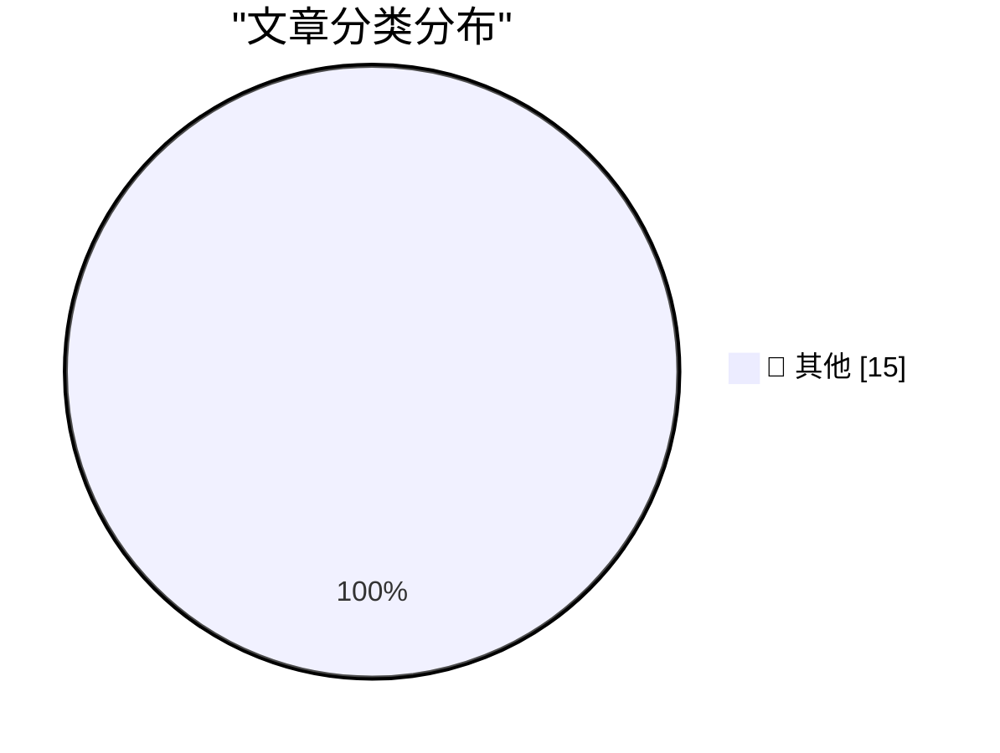

# 📰 AI 博客每日精选 — 2026-06-27

> 来自 Karpathy 推荐的 92 个顶级技术博客，AI 精选 Top 15

## 🏆 今日必读

🥇 **Quoting Dean W. Ball**

[Quoting Dean W. Ball](https://simonwillison.net/2026/Jun/26/dean-w-ball/#atom-everything) — simonwillison.net · 3 小时前 · 📝 其他

> Quoting Dean W. Ball

🥈 **Quoting Timothy B. Lee**

[Quoting Timothy B. Lee](https://simonwillison.net/2026/Jun/26/timothy-b-lee/#atom-everything) — simonwillison.net · 4 小时前 · 📝 其他

> Quoting Timothy B. Lee

🥉 **What happened after 2,000 people tried to hack my AI assistant**

[What happened after 2,000 people tried to hack my AI assistant](https://simonwillison.net/2026/Jun/26/hack-my-ai-assistant/#atom-everything) — simonwillison.net · 7 小时前 · 📝 其他

> What happened after 2,000 people tried to hack my AI assistant

---

## 📊 数据概览

| 扫描源 | 抓取文章 | 时间范围 | 精选 |
|:---:|:---:|:---:|:---:|
| 79/92 | 2421 篇 → 35 篇 | 48h | **15 篇** |

### 分类分布

---

## 📝 其他

### 1. Quoting Dean W. Ball

[Quoting Dean W. Ball](https://simonwillison.net/2026/Jun/26/dean-w-ball/#atom-everything) — **simonwillison.net** · 3 小时前 · ⭐ 15/30

> Quoting Dean W. Ball

---

### 2. Quoting Timothy B. Lee

[Quoting Timothy B. Lee](https://simonwillison.net/2026/Jun/26/timothy-b-lee/#atom-everything) — **simonwillison.net** · 4 小时前 · ⭐ 15/30

> Quoting Timothy B. Lee

---

### 3. What happened after 2,000 people tried to hack my AI assistant

[What happened after 2,000 people tried to hack my AI assistant](https://simonwillison.net/2026/Jun/26/hack-my-ai-assistant/#atom-everything) — **simonwillison.net** · 7 小时前 · ⭐ 15/30

> What happened after 2,000 people tried to hack my AI assistant

---

### 4. Incident Report: CVE-2026-LGTM

[Incident Report: CVE-2026-LGTM](https://simonwillison.net/2026/Jun/26/incident-report/#atom-everything) — **simonwillison.net** · 8 小时前 · ⭐ 15/30

> Incident Report: CVE-2026-LGTM

---

### 5. Quoting OpenAI

[Quoting OpenAI](https://simonwillison.net/2026/Jun/26/openai/#atom-everything) — **simonwillison.net** · 8 小时前 · ⭐ 15/30

> Quoting OpenAI

---

### 6. AI and Liability

[AI and Liability](https://simonwillison.net/2026/Jun/25/ai-and-liability/#atom-everything) — **simonwillison.net** · 1 天前 · ⭐ 15/30

> AI and Liability

---

### 7. datasette-export-database 0.3a2

[datasette-export-database 0.3a2](https://simonwillison.net/2026/Jun/25/datasette-export-database/#atom-everything) — **simonwillison.net** · 1 天前 · ⭐ 15/30

> datasette-export-database 0.3a2

---

### 8. Quickly apply LUTs (color grading) with ffmpeg

[Quickly apply LUTs (color grading) with ffmpeg](https://www.jeffgeerling.com/blog/2026/apply-lut-color-grade-with-ffmpeg/) — **jeffgeerling.com** · 23 小时前 · ⭐ 15/30

> Quickly apply LUTs (color grading) with ffmpeg

---

### 9. AI inference is obviously profitable

[AI inference is obviously profitable](https://seangoedecke.com/ai-inference-is-obviously-profitable/) — **seangoedecke.com** · 1 天前 · ⭐ 15/30

> AI inference is obviously profitable

---

### 10. ★ Om

[★ Om](https://daringfireball.net/2026/06/om) — **daringfireball.net** · 2 小时前 · ⭐ 15/30

> ★ Om

---

### 11. Apple’s Full Statement on Yesterday’s Price Increases

[Apple’s Full Statement on Yesterday’s Price Increases](https://www.macrumors.com/2026/06/25/apple-explains-why-it-raised-prices/) — **daringfireball.net** · 9 小时前 · ⭐ 15/30

> Apple’s Full Statement on Yesterday’s Price Increases

---

### 12. The Price-Hiked Apple TV 4K Is 4 Years Old

[The Price-Hiked Apple TV 4K Is 4 Years Old](https://buyersguide.macrumors.com/#Apple_TV) — **daringfireball.net** · 10 小时前 · ⭐ 15/30

> The Price-Hiked Apple TV 4K Is 4 Years Old

---

### 13. Apple Journal’s Atrocious Undo Bug Has Been Fixed (and SwiftUI, Per Se, Is Not to Blame)

[Apple Journal’s Atrocious Undo Bug Has Been Fixed (and SwiftUI, Per Se, Is Not to Blame)](https://daringfireball.net/2026/06/swiftui_only_makes_it_easy_to_develop_bad_apps) — **daringfireball.net** · 1 天前 · ⭐ 15/30

> Apple Journal’s Atrocious Undo Bug Has Been Fixed (and SwiftUI, Per Se, Is Not to Blame)

---

### 14. ★ Spensive Thoughts

[★ Spensive Thoughts](https://daringfireball.net/2026/06/spensive_thoughts) — **daringfireball.net** · 1 天前 · ⭐ 15/30

> ★ Spensive Thoughts

---

### 15. Om Malik, 1966-2026

[Om Malik, 1966-2026](https://om.co/2026/06/24/1966-2026/) — **daringfireball.net** · 1 天前 · ⭐ 15/30

> Om Malik, 1966-2026

---

*生成于 2026-06-27 02:05 | 扫描 79 源 → 获取 2421 篇 → 精选 15 篇*
*基于 [Hacker News Popularity Contest 2025](https://refactoringenglish.com/tools/hn-popularity/) RSS 源列表，由 [Andrej Karpathy](https://x.com/karpathy) 推荐*
*由「懂点儿AI」制作，欢迎关注同名微信公众号获取更多 AI 实用技巧 💡*
