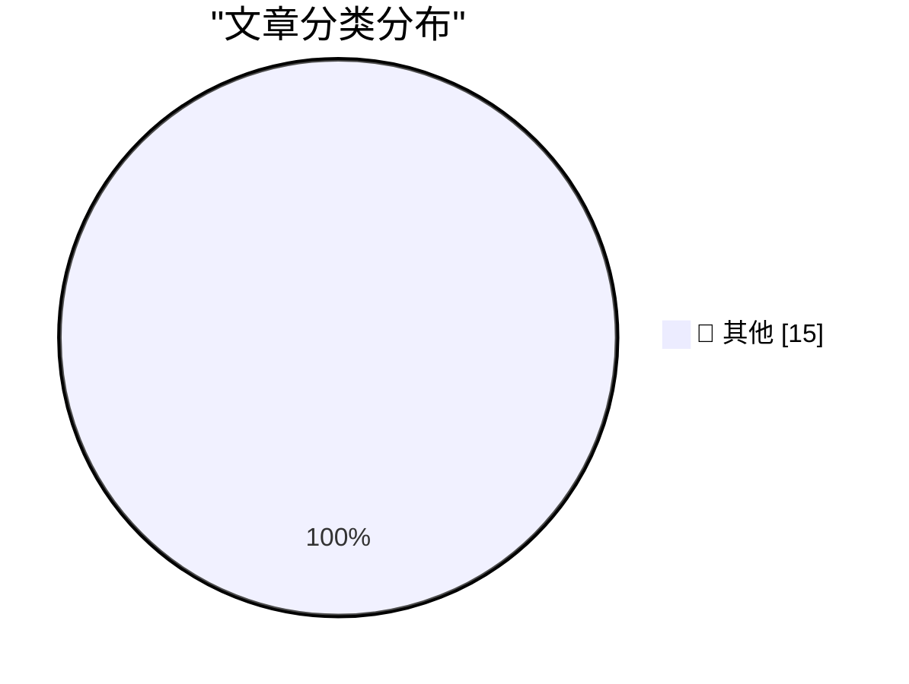

# 📰 AI 博客每日精选 — 2026-06-28

> 来自 Karpathy 推荐的 92 个顶级技术博客，AI 精选 Top 15

## 🏆 今日必读

🥇 **Quoting Dean W. Ball**

[Quoting Dean W. Ball](https://simonwillison.net/2026/Jun/26/dean-w-ball/#atom-everything) — simonwillison.net · 1 天前 · 📝 其他

> Quoting Dean W. Ball

🥈 **Quoting Timothy B. Lee**

[Quoting Timothy B. Lee](https://simonwillison.net/2026/Jun/26/timothy-b-lee/#atom-everything) — simonwillison.net · 1 天前 · 📝 其他

> Quoting Timothy B. Lee

🥉 **What happened after 2,000 people tried to hack my AI assistant**

[What happened after 2,000 people tried to hack my AI assistant](https://simonwillison.net/2026/Jun/26/hack-my-ai-assistant/#atom-everything) — simonwillison.net · 1 天前 · 📝 其他

> What happened after 2,000 people tried to hack my AI assistant

---

## 📊 数据概览

| 扫描源 | 抓取文章 | 时间范围 | 精选 |
|:---:|:---:|:---:|:---:|
| 80/92 | 2447 篇 → 36 篇 | 48h | **15 篇** |

### 分类分布

---

## 📝 其他

### 1. Quoting Dean W. Ball

[Quoting Dean W. Ball](https://simonwillison.net/2026/Jun/26/dean-w-ball/#atom-everything) — **simonwillison.net** · 1 天前 · ⭐ 15/30

> Quoting Dean W. Ball

---

### 2. Quoting Timothy B. Lee

[Quoting Timothy B. Lee](https://simonwillison.net/2026/Jun/26/timothy-b-lee/#atom-everything) — **simonwillison.net** · 1 天前 · ⭐ 15/30

> Quoting Timothy B. Lee

---

### 3. What happened after 2,000 people tried to hack my AI assistant

[What happened after 2,000 people tried to hack my AI assistant](https://simonwillison.net/2026/Jun/26/hack-my-ai-assistant/#atom-everything) — **simonwillison.net** · 1 天前 · ⭐ 15/30

> What happened after 2,000 people tried to hack my AI assistant

---

### 4. Incident Report: CVE-2026-LGTM

[Incident Report: CVE-2026-LGTM](https://simonwillison.net/2026/Jun/26/incident-report/#atom-everything) — **simonwillison.net** · 1 天前 · ⭐ 15/30

> Incident Report: CVE-2026-LGTM

---

### 5. Quoting OpenAI

[Quoting OpenAI](https://simonwillison.net/2026/Jun/26/openai/#atom-everything) — **simonwillison.net** · 1 天前 · ⭐ 15/30

> Quoting OpenAI

---

### 6. Quickly apply LUTs (color grading) with ffmpeg

[Quickly apply LUTs (color grading) with ffmpeg](https://www.jeffgeerling.com/blog/2026/apply-lut-color-grade-with-ffmpeg/) — **jeffgeerling.com** · 1 天前 · ⭐ 15/30

> Quickly apply LUTs (color grading) with ffmpeg

---

### 7. Saying the obvious thing

[Saying the obvious thing](https://seangoedecke.com/saying-the-obvious-thing/) — **seangoedecke.com** · 1 天前 · ⭐ 15/30

> Saying the obvious thing

---

### 8. ★ Bernie Sanders: Ideologue and Economic Ignoramus

[★ Bernie Sanders: Ideologue and Economic Ignoramus](https://daringfireball.net/2026/06/bernie_sanders_ideologue) — **daringfireball.net** · 2 小时前 · ⭐ 15/30

> ★ Bernie Sanders: Ideologue and Economic Ignoramus

---

### 9. Micron Executive Sumit Sadana Tells Tim Cook to Stop Hitting Himself

[Micron Executive Sumit Sadana Tells Tim Cook to Stop Hitting Himself](https://www.wsj.com/tech/apple-raises-prices-on-macs-ipads-by-200-or-more-on-some-models-a7463f99?st=B1aQCP&amp;reflink=desktopwebshare_permalink) — **daringfireball.net** · 2 小时前 · ⭐ 15/30

> Micron Executive Sumit Sadana Tells Tim Cook to Stop Hitting Himself

---

### 10. Apple Faced Bipartisan Opposition When It Last Lobbied to Buy Chinese RAM in 2022

[Apple Faced Bipartisan Opposition When It Last Lobbied to Buy Chinese RAM in 2022](https://www.warner.senate.gov/newsroom/press-releases/warner-rubio-urge-dni-to-review-risk-chinese-chipmaker-ymtc-presents-to-national-security/) — **daringfireball.net** · 3 小时前 · ⭐ 15/30

> Apple Faced Bipartisan Opposition When It Last Lobbied to Buy Chinese RAM in 2022

---

### 11. Microsoft Raises Xbox Prices, Drops High-End Storage Model From Lineup

[Microsoft Raises Xbox Prices, Drops High-End Storage Model From Lineup](https://news.xbox.com/en-us/2026/06/25/xbox-console-price-update/) — **daringfireball.net** · 4 小时前 · ⭐ 15/30

> Microsoft Raises Xbox Prices, Drops High-End Storage Model From Lineup

---

### 12. FT Reports That Apple Is Lobbying to Buy Memory Chips From Blacklisted Chinese Company CXMT

[FT Reports That Apple Is Lobbying to Buy Memory Chips From Blacklisted Chinese Company CXMT](https://www.ft.com/content/d72a25e2-7bde-4aa9-bd8d-0c4f3d6cb2cb) — **daringfireball.net** · 5 小时前 · ⭐ 15/30

> FT Reports That Apple Is Lobbying to Buy Memory Chips From Blacklisted Chinese Company CXMT

---

### 13. Grok Is a Generative Porno App

[Grok Is a Generative Porno App](https://www.theinformation.com/articles/xai-bets-groks-racy-side?rc=jfy0lk) — **daringfireball.net** · 6 小时前 · ⭐ 15/30

> Grok Is a Generative Porno App

---

### 14. OpenAI Announces, But Is Blocked From Releasing, New GPT-5.6 Models

[OpenAI Announces, But Is Blocked From Releasing, New GPT-5.6 Models](https://openai.com/index/previewing-gpt-5-6-sol/) — **daringfireball.net** · 6 小时前 · ⭐ 15/30

> OpenAI Announces, But Is Blocked From Releasing, New GPT-5.6 Models

---

### 15. White House Grants Access to Anthropic’s Mythos Model to 100+ U.S. Institutions; Fable Still Shut Down

[White House Grants Access to Anthropic’s Mythos Model to 100+ U.S. Institutions; Fable Still Shut Down](https://www.semafor.com/article/06/27/2026/us-releases-powerful-anthropic-model-mythos-to-some-us-companies) — **daringfireball.net** · 6 小时前 · ⭐ 15/30

> White House Grants Access to Anthropic’s Mythos Model to 100+ U.S. Institutions; Fable Still Shut Down

---

*生成于 2026-06-28 02:16 | 扫描 80 源 → 获取 2447 篇 → 精选 15 篇*
*基于 [Hacker News Popularity Contest 2025](https://refactoringenglish.com/tools/hn-popularity/) RSS 源列表，由 [Andrej Karpathy](https://x.com/karpathy) 推荐*
*由「懂点儿AI」制作，欢迎关注同名微信公众号获取更多 AI 实用技巧 💡*
