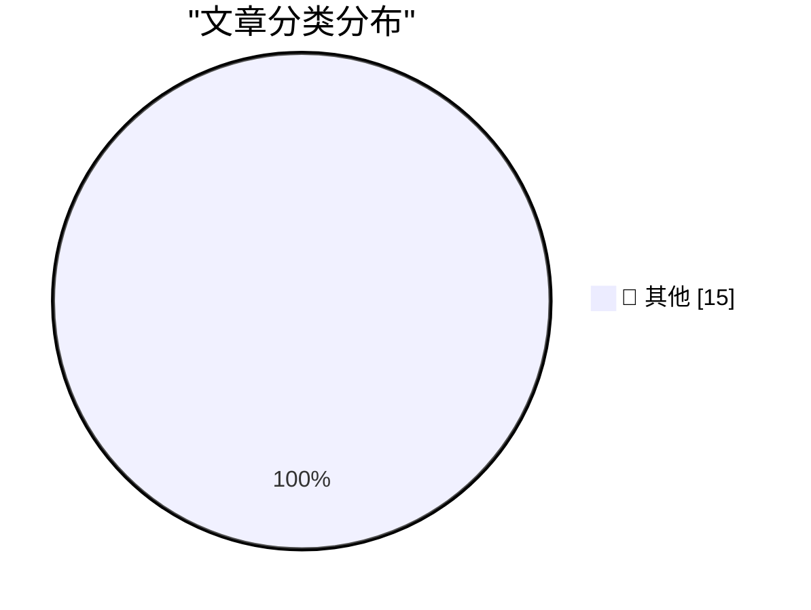

# 📰 AI 博客每日精选 — 2026-07-01

> 来自 Karpathy 推荐的 92 个顶级技术博客，AI 精选 Top 15

## 🏆 今日必读

🥇 **Quoting Anthropic**

[Quoting Anthropic](https://simonwillison.net/2026/Jun/30/anthropic/#atom-everything) — simonwillison.net · 2 小时前 · 📝 其他

> Quoting Anthropic

🥈 **Nano Banana 2 Lite**

[Nano Banana 2 Lite](https://simonwillison.net/2026/Jun/30/nano-banana-2-lite/#atom-everything) — simonwillison.net · 4 小时前 · 📝 其他

> Nano Banana 2 Lite

🥉 **What's new in Claude Sonnet 5**

[What's new in Claude Sonnet 5](https://simonwillison.net/2026/Jun/30/claude-sonnet-5/#atom-everything) — simonwillison.net · 4 小时前 · 📝 其他

> What's new in Claude Sonnet 5

---

## 📊 数据概览

| 扫描源 | 抓取文章 | 时间范围 | 精选 |
|:---:|:---:|:---:|:---:|
| 82/92 | 2481 篇 → 40 篇 | 48h | **15 篇** |

### 分类分布

---

## 📝 其他

### 1. Quoting Anthropic

[Quoting Anthropic](https://simonwillison.net/2026/Jun/30/anthropic/#atom-everything) — **simonwillison.net** · 2 小时前 · ⭐ 15/30

> Quoting Anthropic

---

### 2. Nano Banana 2 Lite

[Nano Banana 2 Lite](https://simonwillison.net/2026/Jun/30/nano-banana-2-lite/#atom-everything) — **simonwillison.net** · 4 小时前 · ⭐ 15/30

> Nano Banana 2 Lite

---

### 3. What's new in Claude Sonnet 5

[What's new in Claude Sonnet 5](https://simonwillison.net/2026/Jun/30/claude-sonnet-5/#atom-everything) — **simonwillison.net** · 4 小时前 · ⭐ 15/30

> What's new in Claude Sonnet 5

---

### 4. The AI Compass

[The AI Compass](https://simonwillison.net/2026/Jun/30/the-ai-compass/#atom-everything) — **simonwillison.net** · 8 小时前 · ⭐ 15/30

> The AI Compass

---

### 5. Have your agent record video demos of its work with shot-scraper video

[Have your agent record video demos of its work with shot-scraper video](https://simonwillison.net/2026/Jun/30/shot-scraper-video/#atom-everything) — **simonwillison.net** · 9 小时前 · ⭐ 15/30

> Have your agent record video demos of its work with shot-scraper video

---

### 6. shot-scraper 1.10

[shot-scraper 1.10](https://simonwillison.net/2026/Jun/30/shot-scraper/#atom-everything) — **simonwillison.net** · 11 小时前 · ⭐ 15/30

> shot-scraper 1.10

---

### 7. HTML table extractor

[HTML table extractor](https://simonwillison.net/2026/Jun/29/html-table-extractor/#atom-everything) — **simonwillison.net** · 1 天前 · ⭐ 15/30

> HTML table extractor

---

### 8. Count the number of Safari tabs

[Count the number of Safari tabs](https://simonwillison.net/2026/Jun/29/safari-tab-count/#atom-everything) — **simonwillison.net** · 1 天前 · ⭐ 15/30

> Count the number of Safari tabs

---

### 9. Ornith-1.0: Self-Scaffolding LLMs for Agentic Coding

[Ornith-1.0: Self-Scaffolding LLMs for Agentic Coding](https://simonwillison.net/2026/Jun/29/ornith/#atom-everything) — **simonwillison.net** · 1 天前 · ⭐ 15/30

> Ornith-1.0: Self-Scaffolding LLMs for Agentic Coding

---

### 10. Gnome

[Gnome](https://lexfriedman.com/gnome/) — **daringfireball.net** · 5 小时前 · ⭐ 15/30

> Gnome

---

### 11. Supreme Court Agrees to Review Apple’s Petition Regarding Civil Contempt Finding in ‘Apple v. Epic Games’

[Supreme Court Agrees to Review Apple’s Petition Regarding Civil Contempt Finding in ‘Apple v. Epic Games’](https://www.supremecourt.gov/orders/courtorders/063026zor_3f14.pdf) — **daringfireball.net** · 6 小时前 · ⭐ 15/30

> Supreme Court Agrees to Review Apple’s Petition Regarding Civil Contempt Finding in ‘Apple v. Epic Games’

---

### 12. Supreme Court Upholds Birthright Citizenship in 6-3 Decision

[Supreme Court Upholds Birthright Citizenship in 6-3 Decision](https://talkingpointsmemo.com/edblog/the-birthright-citizenship-decision-is-more-evidence-for-court-reform/sharetoken/e2bf9547-fa9b-468c-8af3-aa09e72ca698) — **daringfireball.net** · 6 小时前 · ⭐ 15/30

> Supreme Court Upholds Birthright Citizenship in 6-3 Decision

---

### 13. ★ The Supreme Court Rules That Law Enforcement’s Use of ‘Geofence Warrant’ Was a ‘Search’ (But May Be Moot, Technically, Since 2024)

[★ The Supreme Court Rules That Law Enforcement’s Use of ‘Geofence Warrant’ Was a ‘Search’ (But May Be Moot, Technically, Since 2024)](https://daringfireball.net/2026/06/scotus_geofence_warrant_search) — **daringfireball.net** · 7 小时前 · ⭐ 15/30

> ★ The Supreme Court Rules That Law Enforcement’s Use of ‘Geofence Warrant’ Was a ‘Search’ (But May Be Moot, Technically, Since 2024)

---

### 14. Three Players From the Japanese Men’s National Team vs. 100 School Children

[Three Players From the Japanese Men’s National Team vs. 100 School Children](https://x.com/BallStreet/status/950382135969566720) — **daringfireball.net** · 7 小时前 · ⭐ 15/30

> Three Players From the Japanese Men’s National Team vs. 100 School Children

---

### 15. CMA Consultation on Mobile App Steering and NFC Access

[CMA Consultation on Mobile App Steering and NFC Access](https://www.gov.uk/government/news/cma-consults-on-new-requirements-for-apple-and-googles-mobile-platforms) — **daringfireball.net** · 9 小时前 · ⭐ 15/30

> CMA Consultation on Mobile App Steering and NFC Access

---

*生成于 2026-07-01 02:15 | 扫描 82 源 → 获取 2481 篇 → 精选 15 篇*
*基于 [Hacker News Popularity Contest 2025](https://refactoringenglish.com/tools/hn-popularity/) RSS 源列表，由 [Andrej Karpathy](https://x.com/karpathy) 推荐*
*由「懂点儿AI」制作，欢迎关注同名微信公众号获取更多 AI 实用技巧 💡*
