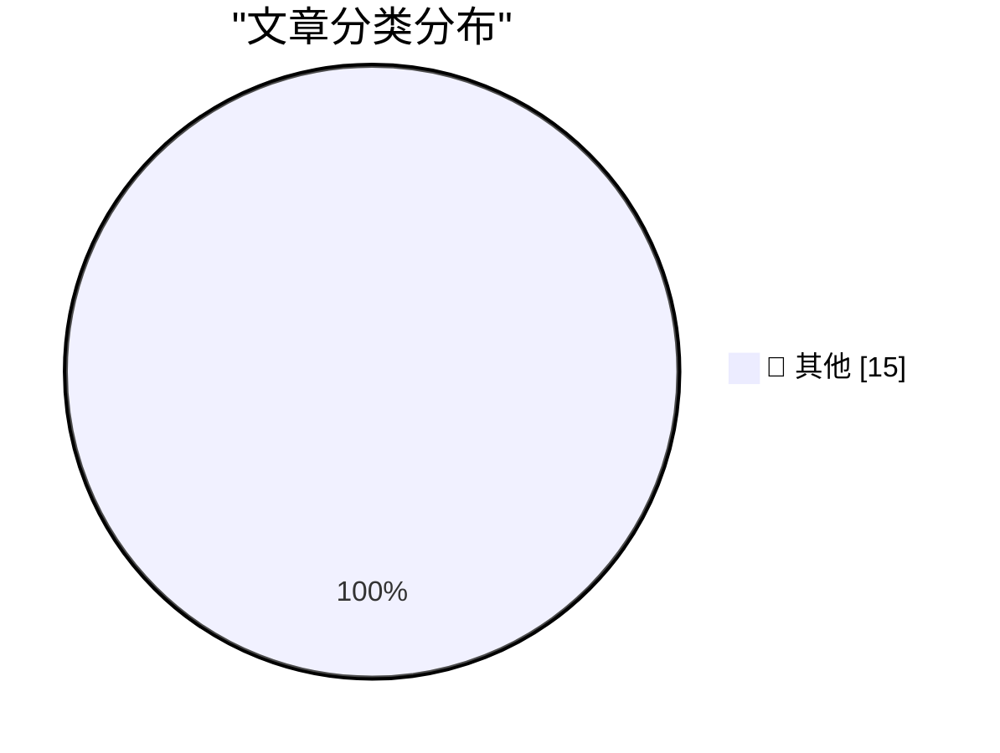

# 📰 AI 博客每日精选 — 2026-07-04

> 来自 Karpathy 推荐的 92 个顶级技术博客，AI 精选 Top 15

## 🏆 今日必读

🥇 **Open Source AI Gap Map**

[Open Source AI Gap Map](https://simonwillison.net/2026/Jul/3/open-source-ai-gap-map/#atom-everything) — simonwillison.net · 3 小时前 · 📝 其他

> Open Source AI Gap Map

🥈 **Quoting Josh W. Comeau**

[Quoting Josh W. Comeau](https://simonwillison.net/2026/Jul/3/josh-w-comeau/#atom-everything) — simonwillison.net · 4 小时前 · 📝 其他

> Quoting Josh W. Comeau

🥉 **Fable's judgement**

[Fable's judgement](https://simonwillison.net/2026/Jul/3/judgement/#atom-everything) — simonwillison.net · 7 小时前 · 📝 其他

> Fable's judgement

---

## 📊 数据概览

| 扫描源 | 抓取文章 | 时间范围 | 精选 |
|:---:|:---:|:---:|:---:|
| 83/92 | 2494 篇 → 32 篇 | 48h | **15 篇** |

### 分类分布

---

## 📝 其他

### 1. Open Source AI Gap Map

[Open Source AI Gap Map](https://simonwillison.net/2026/Jul/3/open-source-ai-gap-map/#atom-everything) — **simonwillison.net** · 3 小时前 · ⭐ 15/30

> Open Source AI Gap Map

---

### 2. Quoting Josh W. Comeau

[Quoting Josh W. Comeau](https://simonwillison.net/2026/Jul/3/josh-w-comeau/#atom-everything) — **simonwillison.net** · 4 小时前 · ⭐ 15/30

> Quoting Josh W. Comeau

---

### 3. Fable's judgement

[Fable's judgement](https://simonwillison.net/2026/Jul/3/judgement/#atom-everything) — **simonwillison.net** · 7 小时前 · ⭐ 15/30

> Fable's judgement

---

### 4. June 2026 newsletter

[June 2026 newsletter](https://simonwillison.net/2026/Jul/3/june-newsletter/#atom-everything) — **simonwillison.net** · 11 小时前 · ⭐ 15/30

> June 2026 newsletter

---

### 5. llm-coding-agent 0.1a0

[llm-coding-agent 0.1a0](https://simonwillison.net/2026/Jul/2/llm-coding-agent/#atom-everything) — **simonwillison.net** · 1 天前 · ⭐ 15/30

> llm-coding-agent 0.1a0

---

### 6. Using DSPy to evaluate and improve Datasette Agent's SQL system prompts

[Using DSPy to evaluate and improve Datasette Agent's SQL system prompts](https://simonwillison.net/2026/Jul/2/dspy-datasette-agent-prompts/#atom-everything) — **simonwillison.net** · 1 天前 · ⭐ 15/30

> Using DSPy to evaluate and improve Datasette Agent's SQL system prompts

---

### 7. Understand to participate

[Understand to participate](https://simonwillison.net/2026/Jul/2/understand-to-participate/#atom-everything) — **simonwillison.net** · 1 天前 · ⭐ 15/30

> Understand to participate

---

### 8. FBI Seizes NetNut Proxy Platform, Popa Botnet

[FBI Seizes NetNut Proxy Platform, Popa Botnet](https://krebsonsecurity.com/2026/07/fbi-seizes-netnut-proxy-platform-popa-botnet/) — **krebsonsecurity.com** · 1 天前 · ⭐ 15/30

> FBI Seizes NetNut Proxy Platform, Popa Botnet

---

### 9. ★ Claude’s Criminally Bad Electron Mac App Is an Inside Job

[★ Claude’s Criminally Bad Electron Mac App Is an Inside Job](https://daringfireball.net/2026/07/claudes_criminally_bad_mac_app_is_an_inside_job) — **daringfireball.net** · 4 小时前 · ⭐ 15/30

> ★ Claude’s Criminally Bad Electron Mac App Is an Inside Job

---

### 10. April Report From Ookla: ‘A Return to mmWave 5G’

[April Report From Ookla: ‘A Return to mmWave 5G’](https://www.ookla.com/articles/a-return-to-mmwave-5g) — **daringfireball.net** · 1 天前 · ⭐ 15/30

> April Report From Ookla: ‘A Return to mmWave 5G’

---

### 11. Introducing the Safari MCP Server for Web Developers

[Introducing the Safari MCP Server for Web Developers](https://webkit.org/blog/18136/introducing-the-safari-mcp-server-for-web-developers/) — **daringfireball.net** · 1 天前 · ⭐ 15/30

> Introducing the Safari MCP Server for Web Developers

---

### 12. EveryMac Turns 30

[EveryMac Turns 30](https://everymac.com/whatsnew/) — **daringfireball.net** · 1 天前 · ⭐ 15/30

> EveryMac Turns 30

---

### 13. I Repeat Myself (5G vs. LTE Edition)

[I Repeat Myself (5G vs. LTE Edition)](https://daringfireball.net/linked/2022/03/23/5g-battery-life) — **daringfireball.net** · 1 天前 · ⭐ 15/30

> I Repeat Myself (5G vs. LTE Edition)

---

### 14. Truth Social Is Still Just Trump’s Blog

[Truth Social Is Still Just Trump’s Blog](https://daringfireball.net/2025/06/truth_social_is_just_trumps_blog) — **daringfireball.net** · 1 天前 · ⭐ 15/30

> Truth Social Is Still Just Trump’s Blog

---

### 15. ‘A Perfect Reflection of Trump’s Washington’

[‘A Perfect Reflection of Trump’s Washington’](https://politicalwire.com/2026/06/19/a-perfect-reflection-of-trumps-washington/) — **daringfireball.net** · 1 天前 · ⭐ 15/30

> ‘A Perfect Reflection of Trump’s Washington’

---

*生成于 2026-07-04 01:51 | 扫描 83 源 → 获取 2494 篇 → 精选 15 篇*
*基于 [Hacker News Popularity Contest 2025](https://refactoringenglish.com/tools/hn-popularity/) RSS 源列表，由 [Andrej Karpathy](https://x.com/karpathy) 推荐*
*由「懂点儿AI」制作，欢迎关注同名微信公众号获取更多 AI 实用技巧 💡*
