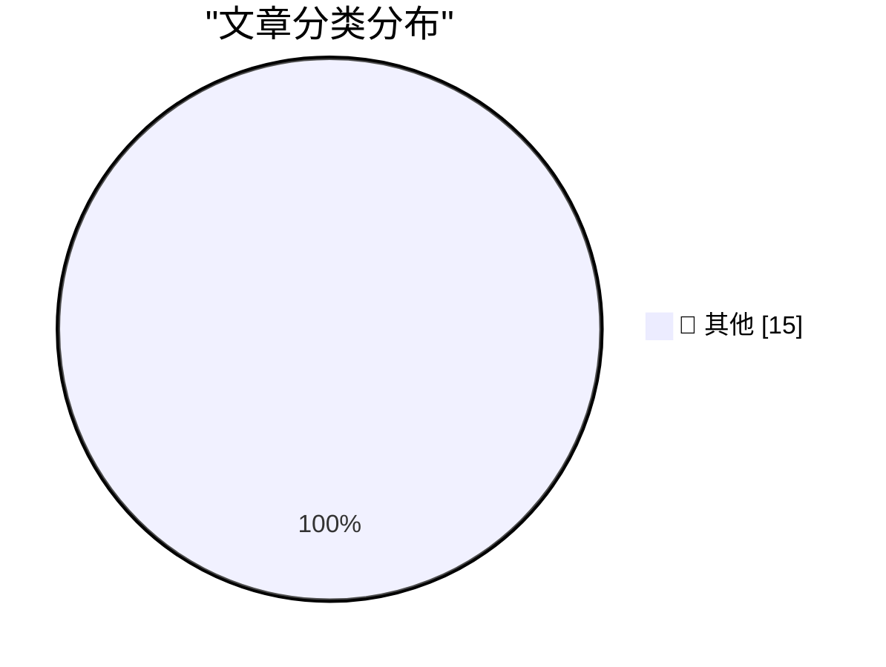

# 📰 AI 博客每日精选 — 2026-07-05

> 来自 Karpathy 推荐的 92 个顶级技术博客，AI 精选 Top 15

## 🏆 今日必读

🥇 **sqlite-utils 4.0rc2, mostly written by Claude Fable (for about $149.25)**

[sqlite-utils 4.0rc2, mostly written by Claude Fable (for about $149.25)](https://simonwillison.net/2026/Jul/5/sqlite-utils-fable/#atom-everything) — simonwillison.net · 56 分钟前 · 📝 其他

> sqlite-utils 4.0rc2, mostly written by Claude Fable (for about $149.25)

🥈 **Building a World Map with only 500 bytes**

[Building a World Map with only 500 bytes](https://simonwillison.net/2026/Jul/4/building-a-world-map-with-only-500-bytes/#atom-everything) — simonwillison.net · 2 小时前 · 📝 其他

> Building a World Map with only 500 bytes

🥉 **Better Models: Worse Tools**

[Better Models: Worse Tools](https://simonwillison.net/2026/Jul/4/better-models-worse-tools/#atom-everything) — simonwillison.net · 3 小时前 · 📝 其他

> Better Models: Worse Tools

---

## 📊 数据概览

| 扫描源 | 抓取文章 | 时间范围 | 精选 |
|:---:|:---:|:---:|:---:|
| 82/92 | 2484 篇 → 24 篇 | 48h | **15 篇** |

### 分类分布

---

## 📝 其他

### 1. sqlite-utils 4.0rc2, mostly written by Claude Fable (for about $149.25)

[sqlite-utils 4.0rc2, mostly written by Claude Fable (for about $149.25)](https://simonwillison.net/2026/Jul/5/sqlite-utils-fable/#atom-everything) — **simonwillison.net** · 56 分钟前 · ⭐ 15/30

> sqlite-utils 4.0rc2, mostly written by Claude Fable (for about $149.25)

---

### 2. Building a World Map with only 500 bytes

[Building a World Map with only 500 bytes](https://simonwillison.net/2026/Jul/4/building-a-world-map-with-only-500-bytes/#atom-everything) — **simonwillison.net** · 2 小时前 · ⭐ 15/30

> Building a World Map with only 500 bytes

---

### 3. Better Models: Worse Tools

[Better Models: Worse Tools](https://simonwillison.net/2026/Jul/4/better-models-worse-tools/#atom-everything) — **simonwillison.net** · 3 小时前 · ⭐ 15/30

> Better Models: Worse Tools

---

### 4. Open Source AI Gap Map

[Open Source AI Gap Map](https://simonwillison.net/2026/Jul/3/open-source-ai-gap-map/#atom-everything) — **simonwillison.net** · 1 天前 · ⭐ 15/30

> Open Source AI Gap Map

---

### 5. Quoting Josh W. Comeau

[Quoting Josh W. Comeau](https://simonwillison.net/2026/Jul/3/josh-w-comeau/#atom-everything) — **simonwillison.net** · 1 天前 · ⭐ 15/30

> Quoting Josh W. Comeau

---

### 6. Fable's judgement

[Fable's judgement](https://simonwillison.net/2026/Jul/3/judgement/#atom-everything) — **simonwillison.net** · 1 天前 · ⭐ 15/30

> Fable's judgement

---

### 7. June 2026 newsletter

[June 2026 newsletter](https://simonwillison.net/2026/Jul/3/june-newsletter/#atom-everything) — **simonwillison.net** · 1 天前 · ⭐ 15/30

> June 2026 newsletter

---

### 8. Day One Journal

[Day One Journal](https://dayoneapp.com/blog/introducing-daily-chat/) — **daringfireball.net** · 4 小时前 · ⭐ 15/30

> Day One Journal

---

### 9. From the DF Archive: ‘Electron and the Decline of Native Apps’

[From the DF Archive: ‘Electron and the Decline of Native Apps’](https://daringfireball.net/2018/12/electron_and_the_decline_of_native_apps) — **daringfireball.net** · 6 小时前 · ⭐ 15/30

> From the DF Archive: ‘Electron and the Decline of Native Apps’

---

### 10. Fantastical 4.1.15 Adds Calendar Mirroring

[Fantastical 4.1.15 Adds Calendar Mirroring](https://flexibits.com/blog/2026/06/double-booked-never-heard-of-it-meet-calendar-mirroring-in-fantastical/) — **daringfireball.net** · 9 小时前 · ⭐ 15/30

> Fantastical 4.1.15 Adds Calendar Mirroring

---

### 11. ★ Claude’s Criminally Bad Electron Mac App Is an Inside Job

[★ Claude’s Criminally Bad Electron Mac App Is an Inside Job](https://daringfireball.net/2026/07/claudes_criminally_bad_mac_app_is_an_inside_job) — **daringfireball.net** · 1 天前 · ⭐ 15/30

> ★ Claude’s Criminally Bad Electron Mac App Is an Inside Job

---

### 12. Pluralistic: CARDiac, syntax coloring, view source and vibe code (03 Jul 2026)

[Pluralistic: CARDiac, syntax coloring, view source and vibe code (03 Jul 2026)](https://pluralistic.net/2026/07/03/rod-logic/) — **pluralistic.net** · 1 天前 · ⭐ 15/30

> Pluralistic: CARDiac, syntax coloring, view source and vibe code (03 Jul 2026)

---

### 13. Combined 1D and 2D Barcodes

[Combined 1D and 2D Barcodes](https://shkspr.mobi/blog/2026/07/combined-1d-and-2d-barcodes/) — **shkspr.mobi** · 14 小时前 · ⭐ 15/30

> Combined 1D and 2D Barcodes

---

### 14. How did we conclude that CcNamespace.dll was the ringleader of a group of DLLs that unloaded prematurely?

[How did we conclude that CcNamespace.dll was the ringleader of a group of DLLs that unloaded prematurely?](https://devblogs.microsoft.com/oldnewthing/20260703-00/?p=112504) — **devblogs.microsoft.com/oldnewthing** · 1 天前 · ⭐ 15/30

> How did we conclude that CcNamespace.dll was the ringleader of a group of DLLs that unloaded prematurely?

---

### 15. Better Models: Worse Tools

[Better Models: Worse Tools](https://lucumr.pocoo.org/2026/7/4/better-models-worse-tools/) — **lucumr.pocoo.org** · 1 天前 · ⭐ 15/30

> Better Models: Worse Tools

---

*生成于 2026-07-05 01:57 | 扫描 82 源 → 获取 2484 篇 → 精选 15 篇*
*基于 [Hacker News Popularity Contest 2025](https://refactoringenglish.com/tools/hn-popularity/) RSS 源列表，由 [Andrej Karpathy](https://x.com/karpathy) 推荐*
*由「懂点儿AI」制作，欢迎关注同名微信公众号获取更多 AI 实用技巧 💡*
