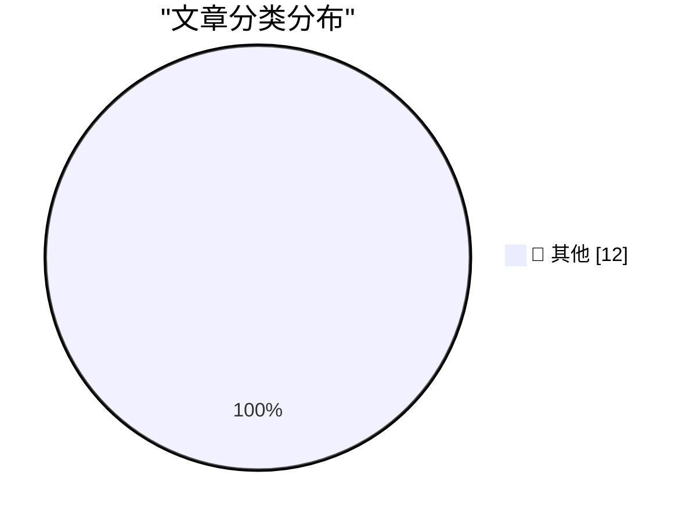

# 📰 AI 博客每日精选 — 2026-07-06

> 来自 Karpathy 推荐的 92 个顶级技术博客，AI 精选 Top 12

## 🏆 今日必读

🥇 **sqlite-utils 4.0rc2, mostly written by Claude Fable (for about $149.25)**

[sqlite-utils 4.0rc2, mostly written by Claude Fable (for about $149.25)](https://simonwillison.net/2026/Jul/5/sqlite-utils-fable/#atom-everything) — simonwillison.net · 1 天前 · 📝 其他

> sqlite-utils 4.0rc2, mostly written by Claude Fable (for about $149.25)

🥈 **sqlite-utils 4.0rc2**

[sqlite-utils 4.0rc2](https://simonwillison.net/2026/Jul/5/sqlite-utils/#atom-everything) — simonwillison.net · 1 天前 · 📝 其他

> sqlite-utils 4.0rc2

🥉 **Building a World Map with only 500 bytes**

[Building a World Map with only 500 bytes](https://simonwillison.net/2026/Jul/4/building-a-world-map-with-only-500-bytes/#atom-everything) — simonwillison.net · 1 天前 · 📝 其他

> Building a World Map with only 500 bytes

---

## 📊 数据概览

| 扫描源 | 抓取文章 | 时间范围 | 精选 |
|:---:|:---:|:---:|:---:|
| 83/92 | 2496 篇 → 12 篇 | 48h | **12 篇** |

### 分类分布

---

## 📝 其他

### 1. sqlite-utils 4.0rc2, mostly written by Claude Fable (for about $149.25)

[sqlite-utils 4.0rc2, mostly written by Claude Fable (for about $149.25)](https://simonwillison.net/2026/Jul/5/sqlite-utils-fable/#atom-everything) — **simonwillison.net** · 1 天前 · ⭐ 15/30

> sqlite-utils 4.0rc2, mostly written by Claude Fable (for about $149.25)

---

### 2. sqlite-utils 4.0rc2

[sqlite-utils 4.0rc2](https://simonwillison.net/2026/Jul/5/sqlite-utils/#atom-everything) — **simonwillison.net** · 1 天前 · ⭐ 15/30

> sqlite-utils 4.0rc2

---

### 3. Building a World Map with only 500 bytes

[Building a World Map with only 500 bytes](https://simonwillison.net/2026/Jul/4/building-a-world-map-with-only-500-bytes/#atom-everything) — **simonwillison.net** · 1 天前 · ⭐ 15/30

> Building a World Map with only 500 bytes

---

### 4. Better Models: Worse Tools

[Better Models: Worse Tools](https://simonwillison.net/2026/Jul/4/better-models-worse-tools/#atom-everything) — **simonwillison.net** · 1 天前 · ⭐ 15/30

> Better Models: Worse Tools

---

### 5. Day One Journal

[Day One Journal](https://dayoneapp.com/blog/introducing-daily-chat/) — **daringfireball.net** · 1 天前 · ⭐ 15/30

> Day One Journal

---

### 6. From the DF Archive: ‘Electron and the Decline of Native Apps’

[From the DF Archive: ‘Electron and the Decline of Native Apps’](https://daringfireball.net/2018/12/electron_and_the_decline_of_native_apps) — **daringfireball.net** · 1 天前 · ⭐ 15/30

> From the DF Archive: ‘Electron and the Decline of Native Apps’

---

### 7. Fantastical 4.1.15 Adds Calendar Mirroring

[Fantastical 4.1.15 Adds Calendar Mirroring](https://flexibits.com/blog/2026/06/double-booked-never-heard-of-it-meet-calendar-mirroring-in-fantastical/) — **daringfireball.net** · 1 天前 · ⭐ 15/30

> Fantastical 4.1.15 Adds Calendar Mirroring

---

### 8. Combined 1D and 2D Barcodes

[Combined 1D and 2D Barcodes](https://shkspr.mobi/blog/2026/07/combined-1d-and-2d-barcodes/) — **shkspr.mobi** · 1 天前 · ⭐ 15/30

> Combined 1D and 2D Barcodes

---

### 9. Does additional data always reduce posterior variance?

[Does additional data always reduce posterior variance?](https://www.johndcook.com/blog/2026/07/03/does-additional-data-always-reduce-posterior-variance/) — **johndcook.com** · 1 天前 · ⭐ 15/30

> Does additional data always reduce posterior variance?

---

### 10. This Week in Package Management: 4 July 2026

[This Week in Package Management: 4 July 2026](https://nesbitt.io/2026/07/04/this-week-in-package-management.html) — **nesbitt.io** · 1 天前 · ⭐ 15/30

> This Week in Package Management: 4 July 2026

---

### 11. Reading List 07/04/26

[Reading List 07/04/26](https://www.construction-physics.com/p/reading-list-070426) — **construction-physics.com** · 1 天前 · ⭐ 15/30

> Reading List 07/04/26

---

### 12. Travel notes: PLDI Boulder

[Travel notes: PLDI Boulder](https://bernsteinbear.com/blog/travel-notes-pldi-boulder/?utm_source=rss) — **bernsteinbear.com** · 1 天前 · ⭐ 15/30

> Travel notes: PLDI Boulder

---

*生成于 2026-07-06 02:04 | 扫描 83 源 → 获取 2496 篇 → 精选 12 篇*
*基于 [Hacker News Popularity Contest 2025](https://refactoringenglish.com/tools/hn-popularity/) RSS 源列表，由 [Andrej Karpathy](https://x.com/karpathy) 推荐*
*由「懂点儿AI」制作，欢迎关注同名微信公众号获取更多 AI 实用技巧 💡*
