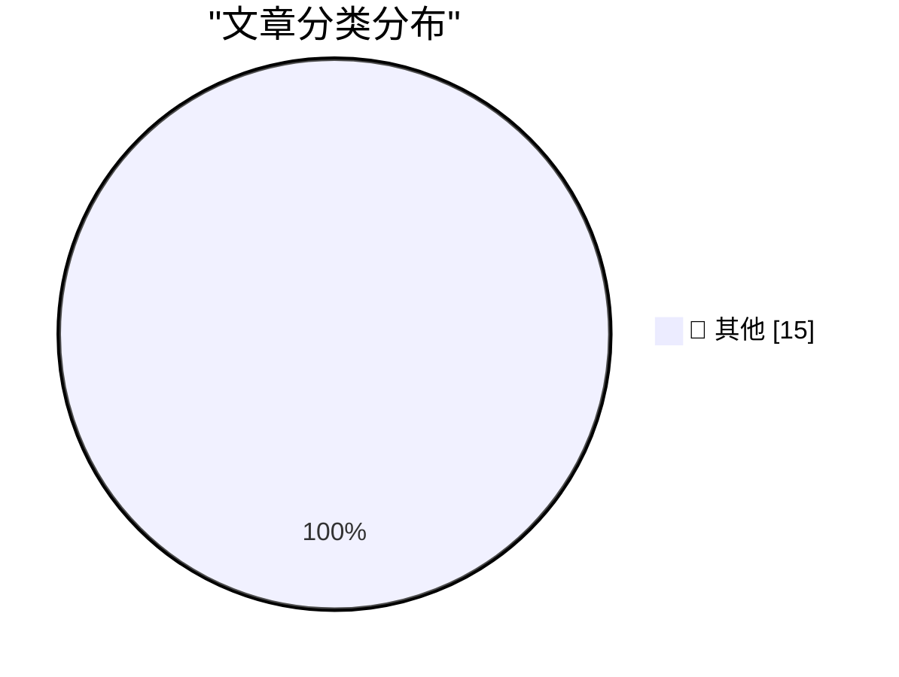

# 📰 AI 博客每日精选 — 2026-07-09

> 来自 Karpathy 推荐的 92 个顶级技术博客，AI 精选 Top 15

## 🏆 今日必读

🥇 **Rewriting Bun in Rust**

[Rewriting Bun in Rust](https://simonwillison.net/2026/Jul/8/rewriting-bun-in-rust/#atom-everything) — simonwillison.net · 1 小时前 · 📝 其他

> Rewriting Bun in Rust

🥈 **Introducing GPT‑Live**

[Introducing GPT‑Live](https://simonwillison.net/2026/Jul/8/introducing-gptlive/#atom-everything) — simonwillison.net · 2 小时前 · 📝 其他

> Introducing GPT‑Live

🥉 **Quoting Kenton Varda**

[Quoting Kenton Varda](https://simonwillison.net/2026/Jul/8/kenton-varda/#atom-everything) — simonwillison.net · 5 小时前 · 📝 其他

> Quoting Kenton Varda

---

## 📊 数据概览

| 扫描源 | 抓取文章 | 时间范围 | 精选 |
|:---:|:---:|:---:|:---:|
| 82/92 | 2476 篇 → 34 篇 | 48h | **15 篇** |

### 分类分布

---

## 📝 其他

### 1. Rewriting Bun in Rust

[Rewriting Bun in Rust](https://simonwillison.net/2026/Jul/8/rewriting-bun-in-rust/#atom-everything) — **simonwillison.net** · 1 小时前 · ⭐ 15/30

> Rewriting Bun in Rust

---

### 2. Introducing GPT‑Live

[Introducing GPT‑Live](https://simonwillison.net/2026/Jul/8/introducing-gptlive/#atom-everything) — **simonwillison.net** · 2 小时前 · ⭐ 15/30

> Introducing GPT‑Live

---

### 3. Quoting Kenton Varda

[Quoting Kenton Varda](https://simonwillison.net/2026/Jul/8/kenton-varda/#atom-everything) — **simonwillison.net** · 5 小时前 · ⭐ 15/30

> Quoting Kenton Varda

---

### 4. sqlite-utils 4.0, now with database schema migrations

[sqlite-utils 4.0, now with database schema migrations](https://simonwillison.net/2026/Jul/7/sqlite-utils-4/#atom-everything) — **simonwillison.net** · 1 天前 · ⭐ 15/30

> sqlite-utils 4.0, now with database schema migrations

---

### 5. sqlite-migrate 0.2

[sqlite-migrate 0.2](https://simonwillison.net/2026/Jul/7/sqlite-migrate/#atom-everything) — **simonwillison.net** · 1 天前 · ⭐ 15/30

> sqlite-migrate 0.2

---

### 6. github-code Web Component

[github-code Web Component](https://simonwillison.net/2026/Jul/7/github-code-component/#atom-everything) — **simonwillison.net** · 1 天前 · ⭐ 15/30

> github-code Web Component

---

### 7. sqlite-utils 4.0

[sqlite-utils 4.0](https://simonwillison.net/2026/Jul/7/sqlite-utils/#atom-everything) — **simonwillison.net** · 1 天前 · ⭐ 15/30

> sqlite-utils 4.0

---

### 8. sqlite-utils 4.0rc4

[sqlite-utils 4.0rc4](https://simonwillison.net/2026/Jul/7/sqlite-utils-2/#atom-everything) — **simonwillison.net** · 1 天前 · ⭐ 15/30

> sqlite-utils 4.0rc4

---

### 9. The Special Value Pi 4 was extremely short-lived

[The Special Value Pi 4 was extremely short-lived](https://www.jeffgeerling.com/blog/2026/special-value-pi-4-extremely-short-lived/) — **jeffgeerling.com** · 11 小时前 · ⭐ 15/30

> The Special Value Pi 4 was extremely short-lived

---

### 10. Felons, Fraudsters Flog Offensive Cybersecurity Startup

[Felons, Fraudsters Flog Offensive Cybersecurity Startup](https://krebsonsecurity.com/2026/07/felons-fraudsters-flog-offensive-cybersecurity-startup/) — **krebsonsecurity.com** · 13 小时前 · ⭐ 15/30

> Felons, Fraudsters Flog Offensive Cybersecurity Startup

---

### 11. ★ What’s Good for the iOS Goose Is Often Not Good for the MacOS Gander

[★ What’s Good for the iOS Goose Is Often Not Good for the MacOS Gander](https://daringfireball.net/2026/07/whats_good_for_the_ios_goose_is_often_not_good_for_the_macos_gander) — **daringfireball.net** · 6 分钟前 · ⭐ 15/30

> ★ What’s Good for the iOS Goose Is Often Not Good for the MacOS Gander

---

### 12. ‘PARRY Encounters the DOCTOR’ — Chatbot on Chatbot Action Circa 1973

[‘PARRY Encounters the DOCTOR’ — Chatbot on Chatbot Action Circa 1973](https://www.rfc-editor.org/info/rfc439/) — **daringfireball.net** · 3 小时前 · ⭐ 15/30

> ‘PARRY Encounters the DOCTOR’ — Chatbot on Chatbot Action Circa 1973

---

### 13. Mac Apps Can Escape From Squircle Jail If They’re Not in the Mac App Store

[Mac Apps Can Escape From Squircle Jail If They’re Not in the Mac App Store](https://tyler.io/2026/07/05/escape-from-squircle-jail/) — **daringfireball.net** · 4 小时前 · ⭐ 15/30

> Mac Apps Can Escape From Squircle Jail If They’re Not in the Mac App Store

---

### 14. ‘Searching for SmarterChild’ Kickstarter

[‘Searching for SmarterChild’ Kickstarter](https://www.kickstarter.com/projects/smarterchild/searching-for-smarterchild-a-feature-documentary/creator) — **daringfireball.net** · 5 小时前 · ⭐ 15/30

> ‘Searching for SmarterChild’ Kickstarter

---

### 15. My Conversation With ELIZA

[My Conversation With ELIZA](https://sites.google.com/view/elizaarchaeology/try-eliza?authuser=0) — **daringfireball.net** · 8 小时前 · ⭐ 15/30

> My Conversation With ELIZA

---

*生成于 2026-07-09 01:51 | 扫描 82 源 → 获取 2476 篇 → 精选 15 篇*
*基于 [Hacker News Popularity Contest 2025](https://refactoringenglish.com/tools/hn-popularity/) RSS 源列表，由 [Andrej Karpathy](https://x.com/karpathy) 推荐*
*由「懂点儿AI」制作，欢迎关注同名微信公众号获取更多 AI 实用技巧 💡*
