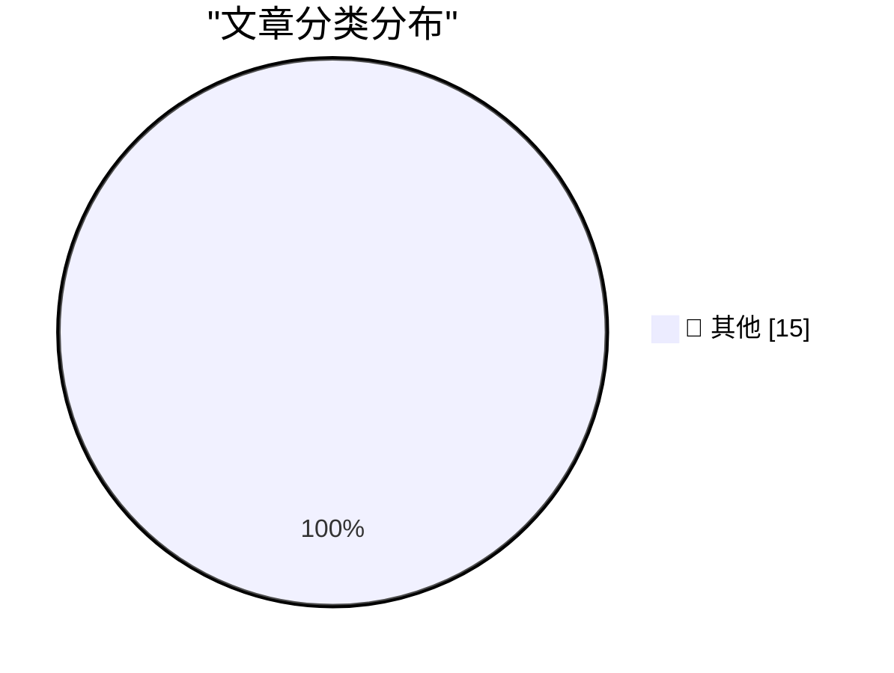

# 📰 AI 博客每日精选 — 2026-07-10

> 来自 Karpathy 推荐的 92 个顶级技术博客，AI 精选 Top 15

## 🏆 今日必读

🥇 **Quoting OpenAI**

[Quoting OpenAI](https://simonwillison.net/2026/Jul/10/openai/#atom-everything) — simonwillison.net · 43 分钟前 · 📝 其他

> Quoting OpenAI

🥈 **The new GPT-5.6 family: Luna, Terra, Sol**

[The new GPT-5.6 family: Luna, Terra, Sol](https://simonwillison.net/2026/Jul/9/gpt-5-6/#atom-everything) — simonwillison.net · 6 小时前 · 📝 其他

> The new GPT-5.6 family: Luna, Terra, Sol

🥉 **Introducing Muse Spark 1.1**

[Introducing Muse Spark 1.1](https://simonwillison.net/2026/Jul/9/muse-spark-1-1/#atom-everything) — simonwillison.net · 9 小时前 · 📝 其他

> Introducing Muse Spark 1.1

---

## 📊 数据概览

| 扫描源 | 抓取文章 | 时间范围 | 精选 |
|:---:|:---:|:---:|:---:|
| 83/92 | 2498 篇 → 39 篇 | 48h | **15 篇** |

### 分类分布

---

## 📝 其他

### 1. Quoting OpenAI

[Quoting OpenAI](https://simonwillison.net/2026/Jul/10/openai/#atom-everything) — **simonwillison.net** · 43 分钟前 · ⭐ 15/30

> Quoting OpenAI

---

### 2. The new GPT-5.6 family: Luna, Terra, Sol

[The new GPT-5.6 family: Luna, Terra, Sol](https://simonwillison.net/2026/Jul/9/gpt-5-6/#atom-everything) — **simonwillison.net** · 6 小时前 · ⭐ 15/30

> The new GPT-5.6 family: Luna, Terra, Sol

---

### 3. Introducing Muse Spark 1.1

[Introducing Muse Spark 1.1](https://simonwillison.net/2026/Jul/9/muse-spark-1-1/#atom-everything) — **simonwillison.net** · 9 小时前 · ⭐ 15/30

> Introducing Muse Spark 1.1

---

### 4. llm-meta-ai 0.1

[llm-meta-ai 0.1](https://simonwillison.net/2026/Jul/9/llm-meta-ai/#atom-everything) — **simonwillison.net** · 9 小时前 · ⭐ 15/30

> llm-meta-ai 0.1

---

### 5. llm 0.31.1

[llm 0.31.1](https://simonwillison.net/2026/Jul/9/llm/#atom-everything) — **simonwillison.net** · 9 小时前 · ⭐ 15/30

> llm 0.31.1

---

### 6. Rewriting Bun in Rust

[Rewriting Bun in Rust](https://simonwillison.net/2026/Jul/8/rewriting-bun-in-rust/#atom-everything) — **simonwillison.net** · 1 天前 · ⭐ 15/30

> Rewriting Bun in Rust

---

### 7. Introducing GPT‑Live

[Introducing GPT‑Live](https://simonwillison.net/2026/Jul/8/introducing-gptlive/#atom-everything) — **simonwillison.net** · 1 天前 · ⭐ 15/30

> Introducing GPT‑Live

---

### 8. Quoting Kenton Varda

[Quoting Kenton Varda](https://simonwillison.net/2026/Jul/8/kenton-varda/#atom-everything) — **simonwillison.net** · 1 天前 · ⭐ 15/30

> Quoting Kenton Varda

---

### 9. The Special Value Pi 4 was extremely short-lived

[The Special Value Pi 4 was extremely short-lived](https://www.jeffgeerling.com/blog/2026/special-value-pi-4-extremely-short-lived/) — **jeffgeerling.com** · 1 天前 · ⭐ 15/30

> The Special Value Pi 4 was extremely short-lived

---

### 10. Felons, Fraudsters Flog Offensive Cybersecurity Startup

[Felons, Fraudsters Flog Offensive Cybersecurity Startup](https://krebsonsecurity.com/2026/07/felons-fraudsters-flog-offensive-cybersecurity-startup/) — **krebsonsecurity.com** · 1 天前 · ⭐ 15/30

> Felons, Fraudsters Flog Offensive Cybersecurity Startup

---

### 11. Shocking No One, Fidji Simo, Would-Be Usurper, Is Out at OpenAI

[Shocking No One, Fidji Simo, Would-Be Usurper, Is Out at OpenAI](https://www.wsj.com/tech/openai-top-executive-fidji-simo-to-step-down-c3daca47?st=NfBZTe) — **daringfireball.net** · 1 小时前 · ⭐ 15/30

> Shocking No One, Fidji Simo, Would-Be Usurper, Is Out at OpenAI

---

### 12. Today’s the Day OpenAI Fucked Up the ChatGPT Mac App

[Today’s the Day OpenAI Fucked Up the ChatGPT Mac App](https://9to5mac.com/2026/07/09/openai-announcing-the-next-chapter-for-chatgpt-today-watch-here/) — **daringfireball.net** · 5 小时前 · ⭐ 15/30

> Today’s the Day OpenAI Fucked Up the ChatGPT Mac App

---

### 13. Apple’s Classic Mac Era Forays Into ‘Apps as Tiled Buttons’ Simplified Computing: At Ease and Launcher

[Apple’s Classic Mac Era Forays Into ‘Apps as Tiled Buttons’ Simplified Computing: At Ease and Launcher](https://daringfireball.net/2026/07/whats_good_for_the_ios_goose_is_often_not_good_for_the_macos_gander) — **daringfireball.net** · 5 小时前 · ⭐ 15/30

> Apple’s Classic Mac Era Forays Into ‘Apps as Tiled Buttons’ Simplified Computing: At Ease and Launcher

---

### 14. ★ John Ternus Should Reverse Apple’s Slide Down the Advertising Slippery Slope

[★ John Ternus Should Reverse Apple’s Slide Down the Advertising Slippery Slope](https://daringfireball.net/2026/07/ternus_apple_slippery_slope) — **daringfireball.net** · 6 小时前 · ⭐ 15/30

> ★ John Ternus Should Reverse Apple’s Slide Down the Advertising Slippery Slope

---

### 15. Meta Sets Default for Instagram Accounts to Permit Content Reuse by AI

[Meta Sets Default for Instagram Accounts to Permit Content Reuse by AI](https://www.nytimes.com/2026/07/08/technology/meta-instagram-ai.html?unlocked_article_code=1.wVA.Q5Do.Uvg5yPwCEB5H) — **daringfireball.net** · 11 小时前 · ⭐ 15/30

> Meta Sets Default for Instagram Accounts to Permit Content Reuse by AI

---

*生成于 2026-07-10 01:49 | 扫描 83 源 → 获取 2498 篇 → 精选 15 篇*
*基于 [Hacker News Popularity Contest 2025](https://refactoringenglish.com/tools/hn-popularity/) RSS 源列表，由 [Andrej Karpathy](https://x.com/karpathy) 推荐*
*由「懂点儿AI」制作，欢迎关注同名微信公众号获取更多 AI 实用技巧 💡*
