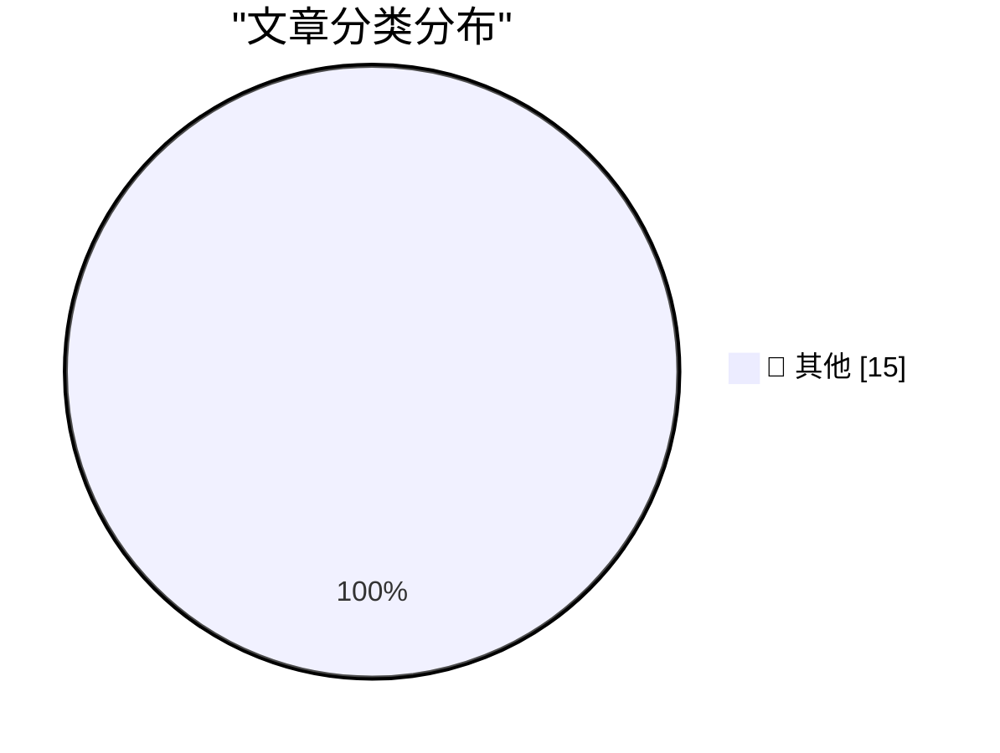

# 📰 AI 博客每日精选 — 2026-07-11

> 来自 Karpathy 推荐的 92 个顶级技术博客，AI 精选 Top 15

## 🏆 今日必读

🥇 **Quoting Nilay Patel**

[Quoting Nilay Patel](https://simonwillison.net/2026/Jul/10/nilay-patel/#atom-everything) — simonwillison.net · 8 小时前 · 📝 其他

> Quoting Nilay Patel

🥈 **Quoting OpenAI**

[Quoting OpenAI](https://simonwillison.net/2026/Jul/10/openai/#atom-everything) — simonwillison.net · 1 天前 · 📝 其他

> Quoting OpenAI

🥉 **The new GPT-5.6 family: Luna, Terra, Sol**

[The new GPT-5.6 family: Luna, Terra, Sol](https://simonwillison.net/2026/Jul/9/gpt-5-6/#atom-everything) — simonwillison.net · 1 天前 · 📝 其他

> The new GPT-5.6 family: Luna, Terra, Sol

---

## 📊 数据概览

| 扫描源 | 抓取文章 | 时间范围 | 精选 |
|:---:|:---:|:---:|:---:|
| 82/92 | 2478 篇 → 28 篇 | 48h | **15 篇** |

### 分类分布

---

## 📝 其他

### 1. Quoting Nilay Patel

[Quoting Nilay Patel](https://simonwillison.net/2026/Jul/10/nilay-patel/#atom-everything) — **simonwillison.net** · 8 小时前 · ⭐ 15/30

> Quoting Nilay Patel

---

### 2. Quoting OpenAI

[Quoting OpenAI](https://simonwillison.net/2026/Jul/10/openai/#atom-everything) — **simonwillison.net** · 1 天前 · ⭐ 15/30

> Quoting OpenAI

---

### 3. The new GPT-5.6 family: Luna, Terra, Sol

[The new GPT-5.6 family: Luna, Terra, Sol](https://simonwillison.net/2026/Jul/9/gpt-5-6/#atom-everything) — **simonwillison.net** · 1 天前 · ⭐ 15/30

> The new GPT-5.6 family: Luna, Terra, Sol

---

### 4. Introducing Muse Spark 1.1

[Introducing Muse Spark 1.1](https://simonwillison.net/2026/Jul/9/muse-spark-1-1/#atom-everything) — **simonwillison.net** · 1 天前 · ⭐ 15/30

> Introducing Muse Spark 1.1

---

### 5. llm-meta-ai 0.1

[llm-meta-ai 0.1](https://simonwillison.net/2026/Jul/9/llm-meta-ai/#atom-everything) — **simonwillison.net** · 1 天前 · ⭐ 15/30

> llm-meta-ai 0.1

---

### 6. llm 0.31.1

[llm 0.31.1](https://simonwillison.net/2026/Jul/9/llm/#atom-everything) — **simonwillison.net** · 1 天前 · ⭐ 15/30

> llm 0.31.1

---

### 7. QuadRF can spot drones and see WiFi through my wall

[QuadRF can spot drones and see WiFi through my wall](https://www.jeffgeerling.com/blog/2026/quadrf-can-spot-drones-and-see-wifi-through-my-wall/) — **jeffgeerling.com** · 11 小时前 · ⭐ 15/30

> QuadRF can spot drones and see WiFi through my wall

---

### 8. John Ternus Calls Sam Altman

[John Ternus Calls Sam Altman](https://www.youtube.com/watch?v=ClASuxd8jQY) — **daringfireball.net** · 1 小时前 · ⭐ 15/30

> John Ternus Calls Sam Altman

---

### 9. Apple Sues OpenAI, io, and Former Employees, Alleging Theft of Trade Secrets

[Apple Sues OpenAI, io, and Former Employees, Alleging Theft of Trade Secrets](https://9to5mac.com/2026/07/10/apple-sues-openai-trade-secret-theft/) — **daringfireball.net** · 4 小时前 · ⭐ 15/30

> Apple Sues OpenAI, io, and Former Employees, Alleging Theft of Trade Secrets

---

### 10. Shocking No One, Fidji Simo, Would-Be Usurper, Is Out at OpenAI

[Shocking No One, Fidji Simo, Would-Be Usurper, Is Out at OpenAI](https://www.wsj.com/tech/openai-top-executive-fidji-simo-to-step-down-c3daca47?st=NfBZTe) — **daringfireball.net** · 1 天前 · ⭐ 15/30

> Shocking No One, Fidji Simo, Would-Be Usurper, Is Out at OpenAI

---

### 11. Today’s the Day OpenAI Fucked Up the ChatGPT Mac App

[Today’s the Day OpenAI Fucked Up the ChatGPT Mac App](https://9to5mac.com/2026/07/09/openai-announcing-the-next-chapter-for-chatgpt-today-watch-here/) — **daringfireball.net** · 1 天前 · ⭐ 15/30

> Today’s the Day OpenAI Fucked Up the ChatGPT Mac App

---

### 12. Apple’s Classic Mac Era Forays Into ‘Apps as Tiled Buttons’ Simplified Computing: At Ease and Launcher

[Apple’s Classic Mac Era Forays Into ‘Apps as Tiled Buttons’ Simplified Computing: At Ease and Launcher](https://daringfireball.net/2026/07/whats_good_for_the_ios_goose_is_often_not_good_for_the_macos_gander) — **daringfireball.net** · 1 天前 · ⭐ 15/30

> Apple’s Classic Mac Era Forays Into ‘Apps as Tiled Buttons’ Simplified Computing: At Ease and Launcher

---

### 13. ★ John Ternus Should Reverse Apple’s Slide Down the Advertising Slippery Slope

[★ John Ternus Should Reverse Apple’s Slide Down the Advertising Slippery Slope](https://daringfireball.net/2026/07/ternus_apple_slippery_slope) — **daringfireball.net** · 1 天前 · ⭐ 15/30

> ★ John Ternus Should Reverse Apple’s Slide Down the Advertising Slippery Slope

---

### 14. Meta Sets Default for Instagram Accounts to Permit Content Reuse by AI

[Meta Sets Default for Instagram Accounts to Permit Content Reuse by AI](https://www.nytimes.com/2026/07/08/technology/meta-instagram-ai.html?unlocked_article_code=1.wVA.Q5Do.Uvg5yPwCEB5H) — **daringfireball.net** · 1 天前 · ⭐ 15/30

> Meta Sets Default for Instagram Accounts to Permit Content Reuse by AI

---

### 15. ★ What’s Good for the iOS Goose Is Often Not Good for the MacOS Gander

[★ What’s Good for the iOS Goose Is Often Not Good for the MacOS Gander](https://daringfireball.net/2026/07/whats_good_for_the_ios_goose_is_often_not_good_for_the_macos_gander) — **daringfireball.net** · 1 天前 · ⭐ 15/30

> ★ What’s Good for the iOS Goose Is Often Not Good for the MacOS Gander

---

*生成于 2026-07-11 01:28 | 扫描 82 源 → 获取 2478 篇 → 精选 15 篇*
*基于 [Hacker News Popularity Contest 2025](https://refactoringenglish.com/tools/hn-popularity/) RSS 源列表，由 [Andrej Karpathy](https://x.com/karpathy) 推荐*
*由「懂点儿AI」制作，欢迎关注同名微信公众号获取更多 AI 实用技巧 💡*
