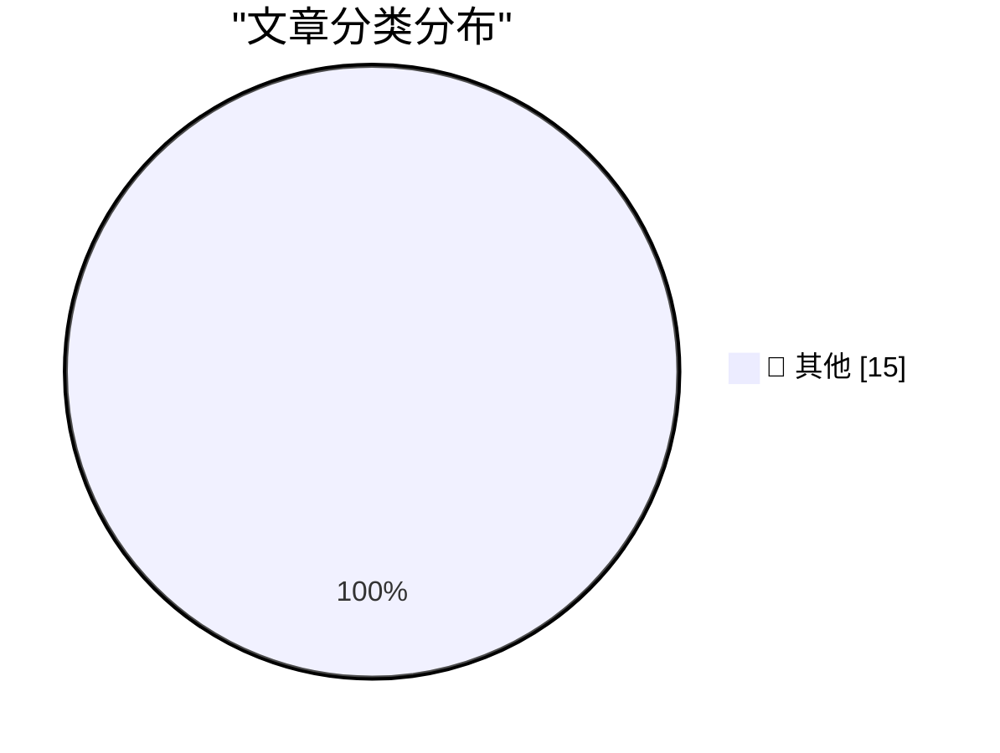

# 📰 AI 博客每日精选 — 2026-07-13

> 来自 Karpathy 推荐的 92 个顶级技术博客，AI 精选 Top 15

## 🏆 今日必读

🥇 **Directly Responsible Individuals (DRI)**

[Directly Responsible Individuals (DRI)](https://simonwillison.net/2026/Jul/12/directly-responsible-individuals/#atom-everything) — simonwillison.net · 1 小时前 · 📝 其他

> Directly Responsible Individuals (DRI)

🥈 **shot-scraper 1.11**

[shot-scraper 1.11](https://simonwillison.net/2026/Jul/12/shot-scraper/#atom-everything) — simonwillison.net · 1 小时前 · 📝 其他

> shot-scraper 1.11

🥉 **Fable gets another bump**

[Fable gets another bump](https://simonwillison.net/2026/Jul/12/bump/#atom-everything) — simonwillison.net · 4 小时前 · 📝 其他

> Fable gets another bump

---

## 📊 数据概览

| 扫描源 | 抓取文章 | 时间范围 | 精选 |
|:---:|:---:|:---:|:---:|
| 84/92 | 2518 篇 → 36 篇 | 48h | **15 篇** |

### 分类分布

---

## 📝 其他

### 1. Directly Responsible Individuals (DRI)

[Directly Responsible Individuals (DRI)](https://simonwillison.net/2026/Jul/12/directly-responsible-individuals/#atom-everything) — **simonwillison.net** · 1 小时前 · ⭐ 15/30

> Directly Responsible Individuals (DRI)

---

### 2. shot-scraper 1.11

[shot-scraper 1.11](https://simonwillison.net/2026/Jul/12/shot-scraper/#atom-everything) — **simonwillison.net** · 1 小时前 · ⭐ 15/30

> shot-scraper 1.11

---

### 3. Fable gets another bump

[Fable gets another bump](https://simonwillison.net/2026/Jul/12/bump/#atom-everything) — **simonwillison.net** · 4 小时前 · ⭐ 15/30

> Fable gets another bump

---

### 4. sqlite-utils 4.1.1

[sqlite-utils 4.1.1](https://simonwillison.net/2026/Jul/12/sqlite-utils/#atom-everything) — **simonwillison.net** · 4 小时前 · ⭐ 15/30

> sqlite-utils 4.1.1

---

### 5. sqlite-utils 4.1

[sqlite-utils 4.1](https://simonwillison.net/2026/Jul/11/sqlite-utils/#atom-everything) — **simonwillison.net** · 1 天前 · ⭐ 15/30

> sqlite-utils 4.1

---

### 6. WorkOS Pipes

[WorkOS Pipes](https://workos.com/pipes?utm_source=daringfireball&amp;utm_medium=newsletter&amp;utm_campaign=q32026) — **daringfireball.net** · 3 小时前 · ⭐ 15/30

> WorkOS Pipes

---

### 7. Paulo Andrade: ‘A WWDC 27 Update on Building a Mac-Assed App With SwiftUI’

[Paulo Andrade: ‘A WWDC 27 Update on Building a Mac-Assed App With SwiftUI’](https://pfandrade.me/blog/swiftui-mac-assed-wwdc27-update/) — **daringfireball.net** · 4 小时前 · ⭐ 15/30

> Paulo Andrade: ‘A WWDC 27 Update on Building a Mac-Assed App With SwiftUI’

---

### 8. How UIs Degrade Over Time

[How UIs Degrade Over Time](https://grumpy.website/1723) — **daringfireball.net** · 5 小时前 · ⭐ 15/30

> How UIs Degrade Over Time

---

### 9. ‘Every Frame Perfect’

[‘Every Frame Perfect’](https://tonsky.me/blog/every-frame-perfect/) — **daringfireball.net** · 5 小时前 · ⭐ 15/30

> ‘Every Frame Perfect’

---

### 10. TwoMillionKit: Use Private Cloud Compute in MacOS 27 Foundation Models Without an Entitlement

[TwoMillionKit: Use Private Cloud Compute in MacOS 27 Foundation Models Without an Entitlement](https://github.com/insidegui/TwoMillionKit) — **daringfireball.net** · 7 小时前 · ⭐ 15/30

> TwoMillionKit: Use Private Cloud Compute in MacOS 27 Foundation Models Without an Entitlement

---

### 11. Sam Altman and Elon Musk Argue Over Who’s Running the Bigger Scam

[Sam Altman and Elon Musk Argue Over Who’s Running the Bigger Scam](https://x.com/sama/status/2075982617976230043) — **daringfireball.net** · 7 小时前 · ⭐ 15/30

> Sam Altman and Elon Musk Argue Over Who’s Running the Bigger Scam

---

### 12. Lunacy — Jeff Halter’s Lunatic Fringe Player

[Lunacy — Jeff Halter’s Lunatic Fringe Player](https://morphing.cloud/lunacy/) — **daringfireball.net** · 8 小时前 · ⭐ 15/30

> Lunacy — Jeff Halter’s Lunatic Fringe Player

---

### 13. Stacks — HyperCard Player for Modern MacOS

[Stacks — HyperCard Player for Modern MacOS](https://morphing.cloud/hypercard/) — **daringfireball.net** · 10 小时前 · ⭐ 15/30

> Stacks — HyperCard Player for Modern MacOS

---

### 14. Can Someone Explain to Me How to Get ‘ChatGPT Classic’?

[Can Someone Explain to Me How to Get ‘ChatGPT Classic’?](https://help.openai.com/en/articles/20001276-moving-to-the-new-chatgpt-desktop-app) — **daringfireball.net** · 1 天前 · ⭐ 15/30

> Can Someone Explain to Me How to Get ‘ChatGPT Classic’?

---

### 15. OpenAI Help Center Describes What Is Wrong With the New ChatGPT

[OpenAI Help Center Describes What Is Wrong With the New ChatGPT](https://help.openai.com/en/articles/20001275-chatgpt-work-and-codex) — **daringfireball.net** · 1 天前 · ⭐ 15/30

> OpenAI Help Center Describes What Is Wrong With the New ChatGPT

---

*生成于 2026-07-13 01:44 | 扫描 84 源 → 获取 2518 篇 → 精选 15 篇*
*基于 [Hacker News Popularity Contest 2025](https://refactoringenglish.com/tools/hn-popularity/) RSS 源列表，由 [Andrej Karpathy](https://x.com/karpathy) 推荐*
*由「懂点儿AI」制作，欢迎关注同名微信公众号获取更多 AI 实用技巧 💡*
