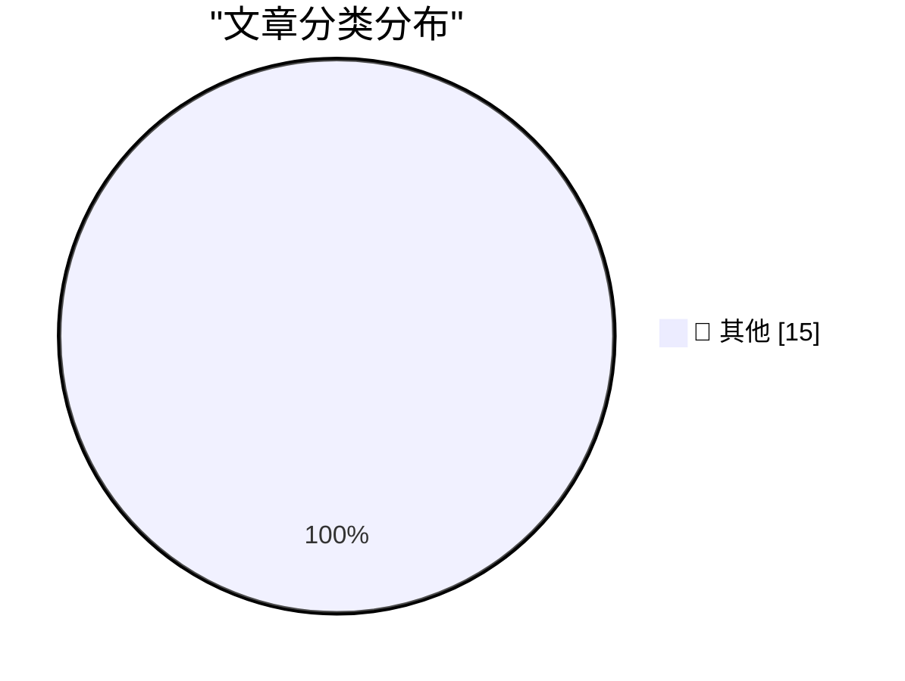

# 📰 AI 博客每日精选 — 2026-07-14

> 来自 Karpathy 推荐的 92 个顶级技术博客，AI 精选 Top 15

## 🏆 今日必读

🥇 **Using uvx in GitHub Actions in a cache-friendly way**

[Using uvx in GitHub Actions in a cache-friendly way](https://simonwillison.net/2026/Jul/14/uvx-github-actions-cache/#atom-everything) — simonwillison.net · 24 分钟前 · 📝 其他

> Using uvx in GitHub Actions in a cache-friendly way

🥈 **DOOMQL**

[DOOMQL](https://simonwillison.net/2026/Jul/13/doomql/#atom-everything) — simonwillison.net · 2 小时前 · 📝 其他

> DOOMQL

🥉 **datasette code-frequency chart on GitHub**

[datasette code-frequency chart on GitHub](https://simonwillison.net/2026/Jul/13/datasette-code-frequency/#atom-everything) — simonwillison.net · 3 小时前 · 📝 其他

> datasette code-frequency chart on GitHub

---

## 📊 数据概览

| 扫描源 | 抓取文章 | 时间范围 | 精选 |
|:---:|:---:|:---:|:---:|
| 82/92 | 2498 篇 → 27 篇 | 48h | **15 篇** |

### 分类分布

---

## 📝 其他

### 1. Using uvx in GitHub Actions in a cache-friendly way

[Using uvx in GitHub Actions in a cache-friendly way](https://simonwillison.net/2026/Jul/14/uvx-github-actions-cache/#atom-everything) — **simonwillison.net** · 24 分钟前 · ⭐ 15/30

> Using uvx in GitHub Actions in a cache-friendly way

---

### 2. DOOMQL

[DOOMQL](https://simonwillison.net/2026/Jul/13/doomql/#atom-everything) — **simonwillison.net** · 2 小时前 · ⭐ 15/30

> DOOMQL

---

### 3. datasette code-frequency chart on GitHub

[datasette code-frequency chart on GitHub](https://simonwillison.net/2026/Jul/13/datasette-code-frequency/#atom-everything) — **simonwillison.net** · 3 小时前 · ⭐ 15/30

> datasette code-frequency chart on GitHub

---

### 4. Directly Responsible Individuals (DRI)

[Directly Responsible Individuals (DRI)](https://simonwillison.net/2026/Jul/12/directly-responsible-individuals/#atom-everything) — **simonwillison.net** · 1 天前 · ⭐ 15/30

> Directly Responsible Individuals (DRI)

---

### 5. shot-scraper 1.11

[shot-scraper 1.11](https://simonwillison.net/2026/Jul/12/shot-scraper/#atom-everything) — **simonwillison.net** · 1 天前 · ⭐ 15/30

> shot-scraper 1.11

---

### 6. Fable gets another bump

[Fable gets another bump](https://simonwillison.net/2026/Jul/12/bump/#atom-everything) — **simonwillison.net** · 1 天前 · ⭐ 15/30

> Fable gets another bump

---

### 7. sqlite-utils 4.1.1

[sqlite-utils 4.1.1](https://simonwillison.net/2026/Jul/12/sqlite-utils/#atom-everything) — **simonwillison.net** · 1 天前 · ⭐ 15/30

> sqlite-utils 4.1.1

---

### 8. Lessons Learned from CISA’s Recent GitHub Leak

[Lessons Learned from CISA’s Recent GitHub Leak](https://krebsonsecurity.com/2026/07/lessons-learned-from-cisas-recent-github-leak/) — **krebsonsecurity.com** · 10 小时前 · ⭐ 15/30

> Lessons Learned from CISA’s Recent GitHub Leak

---

### 9. Remember Musk’s Suit Alleging a Conspiracy Between Apple and OpenAI?

[Remember Musk’s Suit Alleging a Conspiracy Between Apple and OpenAI?](https://arstechnica.com/tech-policy/2025/08/elon-musk-sues-apple-openai-to-block-exclusive-iphone-chatgpt-integration/) — **daringfireball.net** · 9 小时前 · ⭐ 15/30

> Remember Musk’s Suit Alleging a Conspiracy Between Apple and OpenAI?

---

### 10. WorkOS Pipes

[WorkOS Pipes](https://workos.com/pipes?utm_source=daringfireball&amp;utm_medium=newsletter&amp;utm_campaign=q32026) — **daringfireball.net** · 1 天前 · ⭐ 15/30

> WorkOS Pipes

---

### 11. Paulo Andrade: ‘A WWDC 27 Update on Building a Mac-Assed App With SwiftUI’

[Paulo Andrade: ‘A WWDC 27 Update on Building a Mac-Assed App With SwiftUI’](https://pfandrade.me/blog/swiftui-mac-assed-wwdc27-update/) — **daringfireball.net** · 1 天前 · ⭐ 15/30

> Paulo Andrade: ‘A WWDC 27 Update on Building a Mac-Assed App With SwiftUI’

---

### 12. How UIs Degrade Over Time

[How UIs Degrade Over Time](https://grumpy.website/1723) — **daringfireball.net** · 1 天前 · ⭐ 15/30

> How UIs Degrade Over Time

---

### 13. ‘Every Frame Perfect’

[‘Every Frame Perfect’](https://tonsky.me/blog/every-frame-perfect/) — **daringfireball.net** · 1 天前 · ⭐ 15/30

> ‘Every Frame Perfect’

---

### 14. TwoMillionKit: Use Private Cloud Compute in MacOS 27 Foundation Models Without an Entitlement

[TwoMillionKit: Use Private Cloud Compute in MacOS 27 Foundation Models Without an Entitlement](https://github.com/insidegui/TwoMillionKit) — **daringfireball.net** · 1 天前 · ⭐ 15/30

> TwoMillionKit: Use Private Cloud Compute in MacOS 27 Foundation Models Without an Entitlement

---

### 15. Sam Altman and Elon Musk Argue Over Who’s Running the Bigger Scam

[Sam Altman and Elon Musk Argue Over Who’s Running the Bigger Scam](https://x.com/sama/status/2075982617976230043) — **daringfireball.net** · 1 天前 · ⭐ 15/30

> Sam Altman and Elon Musk Argue Over Who’s Running the Bigger Scam

---

*生成于 2026-07-14 01:20 | 扫描 82 源 → 获取 2498 篇 → 精选 15 篇*
*基于 [Hacker News Popularity Contest 2025](https://refactoringenglish.com/tools/hn-popularity/) RSS 源列表，由 [Andrej Karpathy](https://x.com/karpathy) 推荐*
*由「懂点儿AI」制作，欢迎关注同名微信公众号获取更多 AI 实用技巧 💡*
