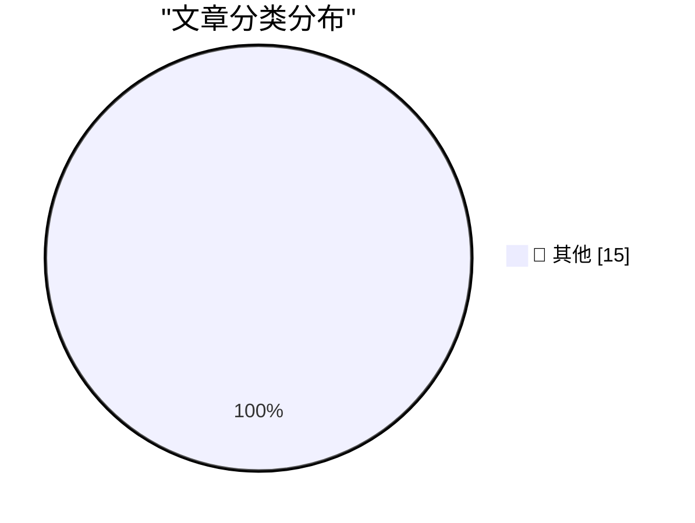

# 📰 AI 博客每日精选 — 2026-07-15

> 来自 Karpathy 推荐的 92 个顶级技术博客，AI 精选 Top 15

## 🏆 今日必读

🥇 **Quoting GitHub Changelog**

[Quoting GitHub Changelog](https://simonwillison.net/2026/Jul/14/github-changeling/#atom-everything) — simonwillison.net · 2 小时前 · 📝 其他

> Quoting GitHub Changelog

🥈 **simonw/pedalican**

[simonw/pedalican](https://simonwillison.net/2026/Jul/14/pedalican/#atom-everything) — simonwillison.net · 2 小时前 · 📝 其他

> simonw/pedalican

🥉 **lobste.rs is now running on SQLite**

[lobste.rs is now running on SQLite](https://simonwillison.net/2026/Jul/14/lobsters-sqlite/#atom-everything) — simonwillison.net · 5 小时前 · 📝 其他

> lobste.rs is now running on SQLite

---

## 📊 数据概览

| 扫描源 | 抓取文章 | 时间范围 | 精选 |
|:---:|:---:|:---:|:---:|
| 83/92 | 2515 篇 → 31 篇 | 48h | **15 篇** |

### 分类分布

---

## 📝 其他

### 1. Quoting GitHub Changelog

[Quoting GitHub Changelog](https://simonwillison.net/2026/Jul/14/github-changeling/#atom-everything) — **simonwillison.net** · 2 小时前 · ⭐ 15/30

> Quoting GitHub Changelog

---

### 2. simonw/pedalican

[simonw/pedalican](https://simonwillison.net/2026/Jul/14/pedalican/#atom-everything) — **simonwillison.net** · 2 小时前 · ⭐ 15/30

> simonw/pedalican

---

### 3. lobste.rs is now running on SQLite

[lobste.rs is now running on SQLite](https://simonwillison.net/2026/Jul/14/lobsters-sqlite/#atom-everything) — **simonwillison.net** · 5 小时前 · ⭐ 15/30

> lobste.rs is now running on SQLite

---

### 4. Quoting Armin Ronacher

[Quoting Armin Ronacher](https://simonwillison.net/2026/Jul/14/armin-ronacher/#atom-everything) — **simonwillison.net** · 7 小时前 · ⭐ 15/30

> Quoting Armin Ronacher

---

### 5. datasette 1.0a37

[datasette 1.0a37](https://simonwillison.net/2026/Jul/14/datasette/#atom-everything) — **simonwillison.net** · 8 小时前 · ⭐ 15/30

> datasette 1.0a37

---

### 6. Using uvx in GitHub Actions in a cache-friendly way

[Using uvx in GitHub Actions in a cache-friendly way](https://simonwillison.net/2026/Jul/14/uvx-github-actions-cache/#atom-everything) — **simonwillison.net** · 1 天前 · ⭐ 15/30

> Using uvx in GitHub Actions in a cache-friendly way

---

### 7. DOOMQL

[DOOMQL](https://simonwillison.net/2026/Jul/13/doomql/#atom-everything) — **simonwillison.net** · 1 天前 · ⭐ 15/30

> DOOMQL

---

### 8. datasette code-frequency chart on GitHub

[datasette code-frequency chart on GitHub](https://simonwillison.net/2026/Jul/13/datasette-code-frequency/#atom-everything) — **simonwillison.net** · 1 天前 · ⭐ 15/30

> datasette code-frequency chart on GitHub

---

### 9. What does "playing politics" mean for software engineers?

[What does "playing politics" mean for software engineers?](https://seangoedecke.com/playing-politics/) — **seangoedecke.com** · 1 天前 · ⭐ 15/30

> What does "playing politics" mean for software engineers?

---

### 10. Microsoft Patches a Record 570 Security Flaws

[Microsoft Patches a Record 570 Security Flaws](https://krebsonsecurity.com/2026/07/microsoft-patches-a-record-570-security-flaws/) — **krebsonsecurity.com** · 5 小时前 · ⭐ 15/30

> Microsoft Patches a Record 570 Security Flaws

---

### 11. Lessons Learned from CISA’s Recent GitHub Leak

[Lessons Learned from CISA’s Recent GitHub Leak](https://krebsonsecurity.com/2026/07/lessons-learned-from-cisas-recent-github-leak/) — **krebsonsecurity.com** · 1 天前 · ⭐ 15/30

> Lessons Learned from CISA’s Recent GitHub Leak

---

### 12. [Sponsor] Paper

[[Sponsor] Paper](https://paper.design/?utm_source=df) — **daringfireball.net** · 20 小时前 · ⭐ 15/30

> [Sponsor] Paper

---

### 13. Remember Musk’s Suit Alleging a Conspiracy Between Apple and OpenAI?

[Remember Musk’s Suit Alleging a Conspiracy Between Apple and OpenAI?](https://arstechnica.com/tech-policy/2025/08/elon-musk-sues-apple-openai-to-block-exclusive-iphone-chatgpt-integration/) — **daringfireball.net** · 1 天前 · ⭐ 15/30

> Remember Musk’s Suit Alleging a Conspiracy Between Apple and OpenAI?

---

### 14. Control the ideas, not the code

[Control the ideas, not the code](http://antirez.com/news/169) — **antirez.com** · 1 天前 · ⭐ 15/30

> Control the ideas, not the code

---

### 15. They Prefer the App

[They Prefer the App](https://idiallo.com/blog/they-prefer-the-app) — **idiallo.com** · 2 小时前 · ⭐ 15/30

> They Prefer the App

---

*生成于 2026-07-15 01:18 | 扫描 83 源 → 获取 2515 篇 → 精选 15 篇*
*基于 [Hacker News Popularity Contest 2025](https://refactoringenglish.com/tools/hn-popularity/) RSS 源列表，由 [Andrej Karpathy](https://x.com/karpathy) 推荐*
*由「懂点儿AI」制作，欢迎关注同名微信公众号获取更多 AI 实用技巧 💡*
