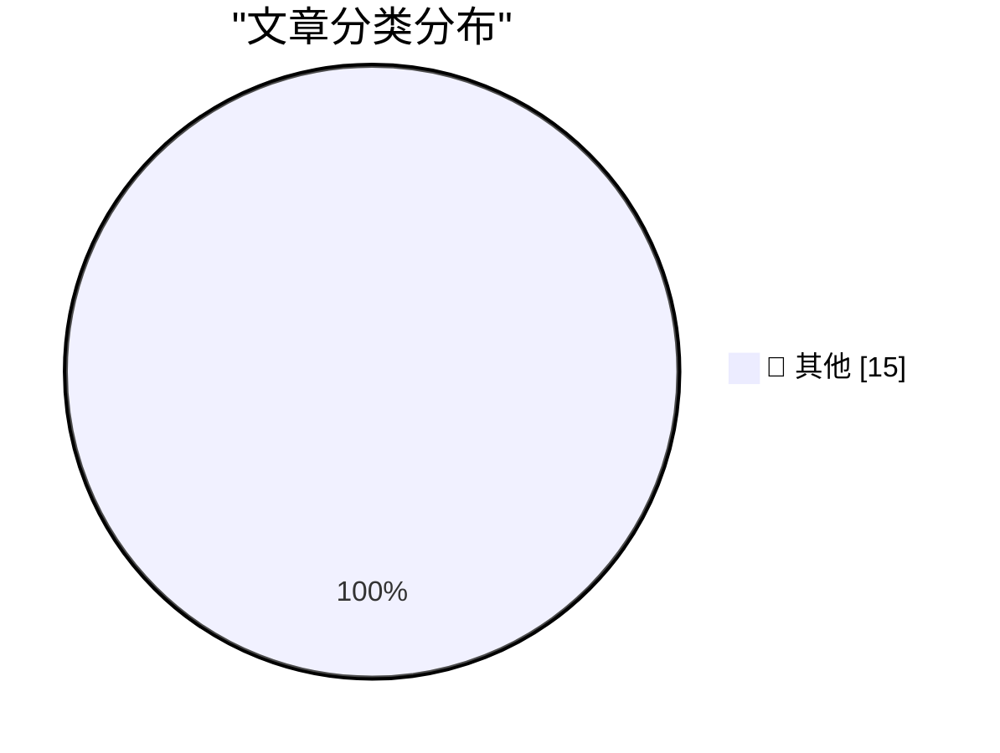

# 📰 AI 博客每日精选 — 2026-07-17

> 来自 Karpathy 推荐的 92 个顶级技术博客，AI 精选 Top 15

## 🏆 今日必读

🥇 **Firefox in WebAssembly**

[Firefox in WebAssembly](https://simonwillison.net/2026/Jul/16/firefox-in-webassembly/#atom-everything) — simonwillison.net · 1 小时前 · 📝 其他

> Firefox in WebAssembly

🥈 **Kimi K3, and what we can still learn from the pelican benchmark**

[Kimi K3, and what we can still learn from the pelican benchmark](https://simonwillison.net/2026/Jul/16/kimi-k3/#atom-everything) — simonwillison.net · 5 小时前 · 📝 其他

> Kimi K3, and what we can still learn from the pelican benchmark

🥉 **Quoting Thibault Sottiaux**

[Quoting Thibault Sottiaux](https://simonwillison.net/2026/Jul/16/bad-codex-bug/#atom-everything) — simonwillison.net · 7 小时前 · 📝 其他

> Quoting Thibault Sottiaux

---

## 📊 数据概览

| 扫描源 | 抓取文章 | 时间范围 | 精选 |
|:---:|:---:|:---:|:---:|
| 84/92 | 2522 篇 → 33 篇 | 48h | **15 篇** |

### 分类分布

---

## 📝 其他

### 1. Firefox in WebAssembly

[Firefox in WebAssembly](https://simonwillison.net/2026/Jul/16/firefox-in-webassembly/#atom-everything) — **simonwillison.net** · 1 小时前 · ⭐ 15/30

> Firefox in WebAssembly

---

### 2. Kimi K3, and what we can still learn from the pelican benchmark

[Kimi K3, and what we can still learn from the pelican benchmark](https://simonwillison.net/2026/Jul/16/kimi-k3/#atom-everything) — **simonwillison.net** · 5 小时前 · ⭐ 15/30

> Kimi K3, and what we can still learn from the pelican benchmark

---

### 3. Quoting Thibault Sottiaux

[Quoting Thibault Sottiaux](https://simonwillison.net/2026/Jul/16/bad-codex-bug/#atom-everything) — **simonwillison.net** · 7 小时前 · ⭐ 15/30

> Quoting Thibault Sottiaux

---

### 4. Inkling: Our open-weights model

[Inkling: Our open-weights model](https://simonwillison.net/2026/Jul/16/inkling/#atom-everything) — **simonwillison.net** · 9 小时前 · ⭐ 15/30

> Inkling: Our open-weights model

---

### 5. Mermaid to ASCII art (mermaid-ascii)

[Mermaid to ASCII art (mermaid-ascii)](https://simonwillison.net/2026/Jul/16/mermaid-ascii/#atom-everything) — **simonwillison.net** · 10 小时前 · ⭐ 15/30

> Mermaid to ASCII art (mermaid-ascii)

---

### 6. Quoting Linus Torvalds

[Quoting Linus Torvalds](https://simonwillison.net/2026/Jul/16/linus-torvalds/#atom-everything) — **simonwillison.net** · 12 小时前 · ⭐ 15/30

> Quoting Linus Torvalds

---

### 7. Mermaid to Unicode box art (grok-mermaid)

[Mermaid to Unicode box art (grok-mermaid)](https://simonwillison.net/2026/Jul/16/grok-mermaid/#atom-everything) — **simonwillison.net** · 1 天前 · ⭐ 15/30

> Mermaid to Unicode box art (grok-mermaid)

---

### 8. xai-org/grok-build, now open source

[xai-org/grok-build, now open source](https://simonwillison.net/2026/Jul/15/grok-build/#atom-everything) — **simonwillison.net** · 1 天前 · ⭐ 15/30

> xai-org/grok-build, now open source

---

### 9. How I tricked Claude into leaking your deepest, darkest secrets

[How I tricked Claude into leaking your deepest, darkest secrets](https://simonwillison.net/2026/Jul/15/claude-web-fetch-exfiltration/#atom-everything) — **simonwillison.net** · 1 天前 · ⭐ 15/30

> How I tricked Claude into leaking your deepest, darkest secrets

---

### 10. Quiche Browser Now Defaults to No-AI Web Search Results

[Quiche Browser Now Defaults to No-AI Web Search Results](https://mastodon.social/@quicheindustries/116918456229212087) — **daringfireball.net** · 1 小时前 · ⭐ 15/30

> Quiche Browser Now Defaults to No-AI Web Search Results

---

### 11. Dithering: ‘Apple Sues OpenAI’

[Dithering: ‘Apple Sues OpenAI’](https://dithering.passport.online/member/episode/apple-sues-open-ai) — **daringfireball.net** · 2 小时前 · ⭐ 15/30

> Dithering: ‘Apple Sues OpenAI’

---

### 12. OpenAI Takes a Second Crack at a Response to Apple’s Trade Secret Theft Lawsuit

[OpenAI Takes a Second Crack at a Response to Apple’s Trade Secret Theft Lawsuit](https://www.bloomberg.com/news/articles/2026-07-14/openai-says-it-s-not-aware-of-any-evidence-that-apple-lawsuit-has-merit) — **daringfireball.net** · 5 小时前 · ⭐ 15/30

> OpenAI Takes a Second Crack at a Response to Apple’s Trade Secret Theft Lawsuit

---

### 13. Lawyer for Apple Mixed Up Two OpenAI Employees’ Names, Sent One Email to the Wrong Guy, Back in February

[Lawyer for Apple Mixed Up Two OpenAI Employees’ Names, Sent One Email to the Wrong Guy, Back in February](https://www.nbcnews.com/tech/apple/apple-openai-lawsuit-suit-trade-product-hardware-email-sam-altman-rcna587376) — **daringfireball.net** · 5 小时前 · ⭐ 15/30

> Lawyer for Apple Mixed Up Two OpenAI Employees’ Names, Sent One Email to the Wrong Guy, Back in February

---

### 14. Louie Mantia: ‘The Shape of Apps’

[Louie Mantia: ‘The Shape of Apps’](https://parakeet.co/blog/the-shape-of-apps/) — **daringfireball.net** · 7 小时前 · ⭐ 15/30

> Louie Mantia: ‘The Shape of Apps’

---

### 15. OpenAI Releases Codex Micro, a Stupid $230 Hardware Keypad

[OpenAI Releases Codex Micro, a Stupid $230 Hardware Keypad](https://openai.com/supply/co-lab/work-louder/) — **daringfireball.net** · 7 小时前 · ⭐ 15/30

> OpenAI Releases Codex Micro, a Stupid $230 Hardware Keypad

---

*生成于 2026-07-17 01:30 | 扫描 84 源 → 获取 2522 篇 → 精选 15 篇*
*基于 [Hacker News Popularity Contest 2025](https://refactoringenglish.com/tools/hn-popularity/) RSS 源列表，由 [Andrej Karpathy](https://x.com/karpathy) 推荐*
*由「懂点儿AI」制作，欢迎关注同名微信公众号获取更多 AI 实用技巧 💡*
