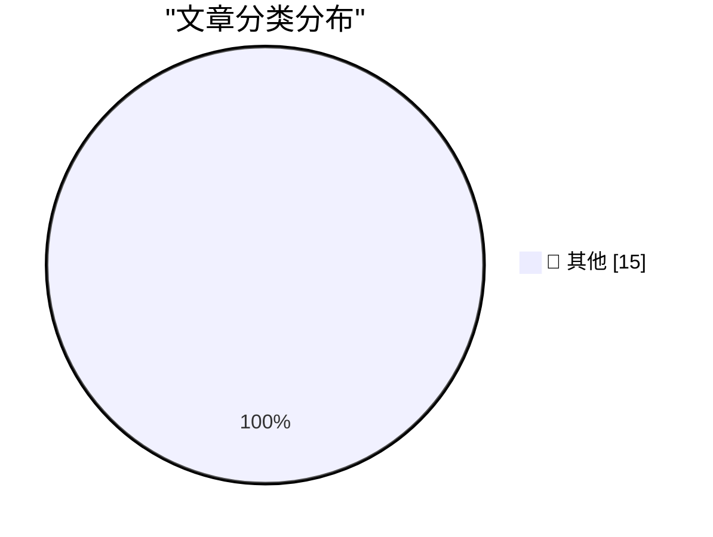

# 📰 AI 博客每日精选 — 2026-07-18

> 来自 Karpathy 推荐的 92 个顶级技术博客，AI 精选 Top 15

## 🏆 今日必读

🥇 **Quoting Kimi K3**

[Quoting Kimi K3](https://simonwillison.net/2026/Jul/17/kimi-k3/#atom-everything) — simonwillison.net · 11 小时前 · 📝 其他

> Quoting Kimi K3

🥈 **LLM cliché highlighter**

[LLM cliché highlighter](https://simonwillison.net/2026/Jul/17/llm-cliche-highlighter/#atom-everything) — simonwillison.net · 13 小时前 · 📝 其他

> LLM cliché highlighter

🥉 **Spot birds not golf**

[Spot birds not golf](https://simonwillison.net/2026/Jul/17/spot-birds-not-golf/#atom-everything) — simonwillison.net · 22 小时前 · 📝 其他

> Spot birds not golf

---

## 📊 数据概览

| 扫描源 | 抓取文章 | 时间范围 | 精选 |
|:---:|:---:|:---:|:---:|
| 83/92 | 2504 篇 → 46 篇 | 48h | **15 篇** |

### 分类分布

---

## 📝 其他

### 1. Quoting Kimi K3

[Quoting Kimi K3](https://simonwillison.net/2026/Jul/17/kimi-k3/#atom-everything) — **simonwillison.net** · 11 小时前 · ⭐ 15/30

> Quoting Kimi K3

---

### 2. LLM cliché highlighter

[LLM cliché highlighter](https://simonwillison.net/2026/Jul/17/llm-cliche-highlighter/#atom-everything) — **simonwillison.net** · 13 小时前 · ⭐ 15/30

> LLM cliché highlighter

---

### 3. Spot birds not golf

[Spot birds not golf](https://simonwillison.net/2026/Jul/17/spot-birds-not-golf/#atom-everything) — **simonwillison.net** · 22 小时前 · ⭐ 15/30

> Spot birds not golf

---

### 4. Firefox in WebAssembly

[Firefox in WebAssembly](https://simonwillison.net/2026/Jul/16/firefox-in-webassembly/#atom-everything) — **simonwillison.net** · 1 天前 · ⭐ 15/30

> Firefox in WebAssembly

---

### 5. Kimi K3, and what we can still learn from the pelican benchmark

[Kimi K3, and what we can still learn from the pelican benchmark](https://simonwillison.net/2026/Jul/16/kimi-k3/#atom-everything) — **simonwillison.net** · 1 天前 · ⭐ 15/30

> Kimi K3, and what we can still learn from the pelican benchmark

---

### 6. Quoting Thibault Sottiaux

[Quoting Thibault Sottiaux](https://simonwillison.net/2026/Jul/16/bad-codex-bug/#atom-everything) — **simonwillison.net** · 1 天前 · ⭐ 15/30

> Quoting Thibault Sottiaux

---

### 7. Inkling: Our open-weights model

[Inkling: Our open-weights model](https://simonwillison.net/2026/Jul/16/inkling/#atom-everything) — **simonwillison.net** · 1 天前 · ⭐ 15/30

> Inkling: Our open-weights model

---

### 8. Mermaid to ASCII art (mermaid-ascii)

[Mermaid to ASCII art (mermaid-ascii)](https://simonwillison.net/2026/Jul/16/mermaid-ascii/#atom-everything) — **simonwillison.net** · 1 天前 · ⭐ 15/30

> Mermaid to ASCII art (mermaid-ascii)

---

### 9. Quoting Linus Torvalds

[Quoting Linus Torvalds](https://simonwillison.net/2026/Jul/16/linus-torvalds/#atom-everything) — **simonwillison.net** · 1 天前 · ⭐ 15/30

> Quoting Linus Torvalds

---

### 10. Overtraining as the path to human-like AI

[Overtraining as the path to human-like AI](https://seangoedecke.com/overtraining-as-the-path-to-human-like-ai/) — **seangoedecke.com** · 1 小时前 · ⭐ 15/30

> Overtraining as the path to human-like AI

---

### 11. Apple Books and Amazon Are Lousy With AI-Generated Books Ripping Off Legitimate Authors

[Apple Books and Amazon Are Lousy With AI-Generated Books Ripping Off Legitimate Authors](https://thenewthings.com/p/apple-big-ai-book-slop-problem) — **daringfireball.net** · 48 分钟前 · ⭐ 15/30

> Apple Books and Amazon Are Lousy With AI-Generated Books Ripping Off Legitimate Authors

---

### 12. Google Runs Out of Appeals, Must Pay Record $4.7 Billion EU Antitrust Fine

[Google Runs Out of Appeals, Must Pay Record $4.7 Billion EU Antitrust Fine](https://www.cnbc.com/2026/07/02/alphabet-google-android-eu-antitrust-fine-4-1-billion-euro-appeal.html) — **daringfireball.net** · 1 小时前 · ⭐ 15/30

> Google Runs Out of Appeals, Must Pay Record $4.7 Billion EU Antitrust Fine

---

### 13. Roblox Set to Introduce AI Game-Building Feature, Including on iOS

[Roblox Set to Introduce AI Game-Building Feature, Including on iOS](https://about.roblox.com/newsroom/2026/07/build-without-limits-on-roblox) — **daringfireball.net** · 4 小时前 · ⭐ 15/30

> Roblox Set to Introduce AI Game-Building Feature, Including on iOS

---

### 14. Apple Raises Prices for Apple Music and Apple One Subscriptions

[Apple Raises Prices for Apple Music and Apple One Subscriptions](https://9to5mac.com/2026/07/17/apple-raises-prices-for-apple-music-and-apple-one-subscriptions/) — **daringfireball.net** · 4 小时前 · ⭐ 15/30

> Apple Raises Prices for Apple Music and Apple One Subscriptions

---

### 15. OpenAI’s Product Shake-Up Put the Complexifiers in Charge

[OpenAI’s Product Shake-Up Put the Complexifiers in Charge](https://www.wired.com/story/openai-reorg-greg-brockman-product/) — **daringfireball.net** · 4 小时前 · ⭐ 15/30

> OpenAI’s Product Shake-Up Put the Complexifiers in Charge

---

*生成于 2026-07-18 01:22 | 扫描 83 源 → 获取 2504 篇 → 精选 15 篇*
*基于 [Hacker News Popularity Contest 2025](https://refactoringenglish.com/tools/hn-popularity/) RSS 源列表，由 [Andrej Karpathy](https://x.com/karpathy) 推荐*
*由「懂点儿AI」制作，欢迎关注同名微信公众号获取更多 AI 实用技巧 💡*
