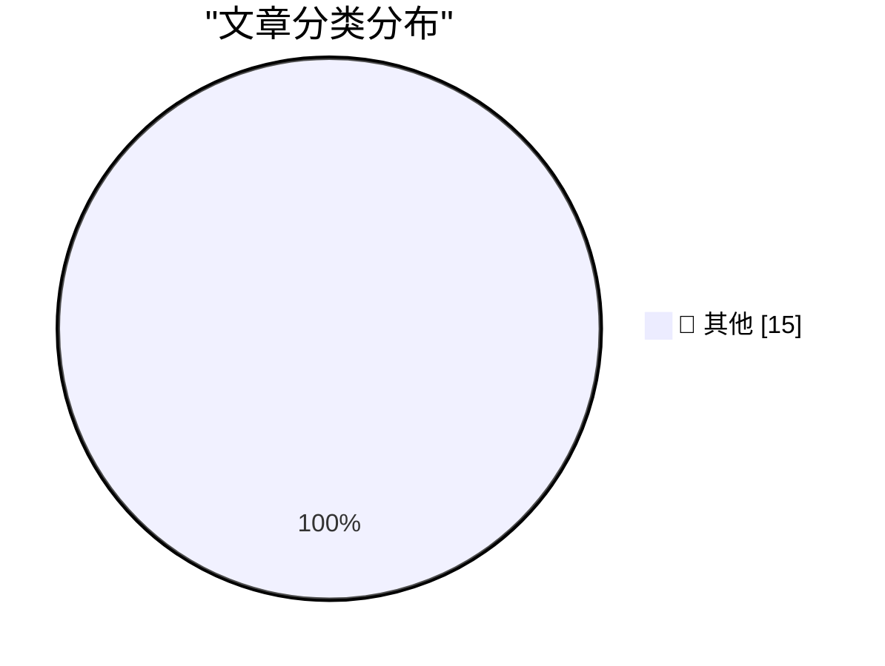

# 📰 AI 博客每日精选 — 2026-07-21

> 来自 Karpathy 推荐的 92 个顶级技术博客，AI 精选 Top 15

## 🏆 今日必读

🥇 **Reverse-engineering is cheap now**

[Reverse-engineering is cheap now](https://simonwillison.net/2026/Jul/20/cheap-reverse-engineering/#atom-everything) — simonwillison.net · 6 小时前 · 📝 其他

> Reverse-engineering is cheap now

🥈 **Who’s Afraid of Chinese Models?**

[Who’s Afraid of Chinese Models?](https://simonwillison.net/2026/Jul/20/afraid-of-chinese-models/#atom-everything) — simonwillison.net · 8 小时前 · 📝 其他

> Who’s Afraid of Chinese Models?

🥉 **Quoting Sam Altman**

[Quoting Sam Altman](https://simonwillison.net/2026/Jul/20/sam-altman/#atom-everything) — simonwillison.net · 21 小时前 · 📝 其他

> Quoting Sam Altman

---

## 📊 数据概览

| 扫描源 | 抓取文章 | 时间范围 | 精选 |
|:---:|:---:|:---:|:---:|
| 84/92 | 2524 篇 → 21 篇 | 48h | **15 篇** |

### 分类分布

---

## 📝 其他

### 1. Reverse-engineering is cheap now

[Reverse-engineering is cheap now](https://simonwillison.net/2026/Jul/20/cheap-reverse-engineering/#atom-everything) — **simonwillison.net** · 6 小时前 · ⭐ 15/30

> Reverse-engineering is cheap now

---

### 2. Who’s Afraid of Chinese Models?

[Who’s Afraid of Chinese Models?](https://simonwillison.net/2026/Jul/20/afraid-of-chinese-models/#atom-everything) — **simonwillison.net** · 8 小时前 · ⭐ 15/30

> Who’s Afraid of Chinese Models?

---

### 3. Quoting Sam Altman

[Quoting Sam Altman](https://simonwillison.net/2026/Jul/20/sam-altman/#atom-everything) — **simonwillison.net** · 21 小时前 · ⭐ 15/30

> Quoting Sam Altman

---

### 4. AI Mania Is Eviscerating Global Decision-Making

[AI Mania Is Eviscerating Global Decision-Making](https://simonwillison.net/2026/Jul/19/ai-mania/#atom-everything) — **simonwillison.net** · 1 天前 · ⭐ 15/30

> AI Mania Is Eviscerating Global Decision-Making

---

### 5. Claude Code uses Bun written in Rust now

[Claude Code uses Bun written in Rust now](https://simonwillison.net/2026/Jul/19/claude-code-in-bun-in-rust/#atom-everything) — **simonwillison.net** · 1 天前 · ⭐ 15/30

> Claude Code uses Bun written in Rust now

---

### 6. [Sponsor] WorkOS MCP: Manage Your Auth Platform From Any AI Agent

[[Sponsor] WorkOS MCP: Manage Your Auth Platform From Any AI Agent](https://workos.com/blog/management-mcp-server?utm_source=daringfireball&amp;utm_medium=newsletter&amp;utm_campaign=q32026) — **daringfireball.net** · 2 小时前 · ⭐ 15/30

> [Sponsor] WorkOS MCP: Manage Your Auth Platform From Any AI Agent

---

### 7. ‘Who’s Afraid of Chinese Models?’

[‘Who’s Afraid of Chinese Models?’](https://stratechery.com/2026/whos-afraid-of-chinese-models/) — **daringfireball.net** · 9 小时前 · ⭐ 15/30

> ‘Who’s Afraid of Chinese Models?’

---

### 8. Paper

[Paper](https://paper.design/?utm_source=df) — **daringfireball.net** · 1 天前 · ⭐ 15/30

> Paper

---

### 9. 9to5Mac Uncovers Dozens of Disguised Gambling Apps on the App Store in Brazil

[9to5Mac Uncovers Dozens of Disguised Gambling Apps on the App Store in Brazil](https://9to5mac.com/2026/07/17/investigation-reveals-dozens-of-disguised-gambling-apps-on-the-app-store-in-brazil/) — **daringfireball.net** · 1 天前 · ⭐ 15/30

> 9to5Mac Uncovers Dozens of Disguised Gambling Apps on the App Store in Brazil

---

### 10. Expensive Is Just a Brand Now

[Expensive Is Just a Brand Now](https://idiallo.com/blog/expensive-is-just-branding) — **idiallo.com** · 2 小时前 · ⭐ 15/30

> Expensive Is Just a Brand Now

---

### 11. Public Transport - Don't Make Me Think!

[Public Transport - Don't Make Me Think!](https://shkspr.mobi/blog/2026/07/public-transport-dont-make-me-think/) — **shkspr.mobi** · 13 小时前 · ⭐ 15/30

> Public Transport - Don't Make Me Think!

---

### 12. Making an agile version of a Windows Runtime delegate in C++/WinRT, part 1

[Making an agile version of a Windows Runtime delegate in C++/WinRT, part 1](https://devblogs.microsoft.com/oldnewthing/20260720-00/?p=112545) — **devblogs.microsoft.com/oldnewthing** · 11 小时前 · ⭐ 15/30

> Making an agile version of a Windows Runtime delegate in C++/WinRT, part 1

---

### 13. Volume to Area ratio for Regular Solids

[Volume to Area ratio for Regular Solids](https://www.johndcook.com/blog/2026/07/20/volume-area-regular-solids/) — **johndcook.com** · 10 小时前 · ⭐ 15/30

> Volume to Area ratio for Regular Solids

---

### 14. Solving a chess puzzle with Grok 4.5

[Solving a chess puzzle with Grok 4.5](https://www.johndcook.com/blog/2026/07/20/grok-chess/) — **johndcook.com** · 10 小时前 · ⭐ 15/30

> Solving a chess puzzle with Grok 4.5

---

### 15. Fitting a regular expression to a list of words

[Fitting a regular expression to a list of words](https://www.johndcook.com/blog/2026/07/19/fitting-a-regex/) — **johndcook.com** · 1 天前 · ⭐ 15/30

> Fitting a regular expression to a list of words

---

*生成于 2026-07-21 01:27 | 扫描 84 源 → 获取 2524 篇 → 精选 15 篇*
*基于 [Hacker News Popularity Contest 2025](https://refactoringenglish.com/tools/hn-popularity/) RSS 源列表，由 [Andrej Karpathy](https://x.com/karpathy) 推荐*
*由「懂点儿AI」制作，欢迎关注同名微信公众号获取更多 AI 实用技巧 💡*
