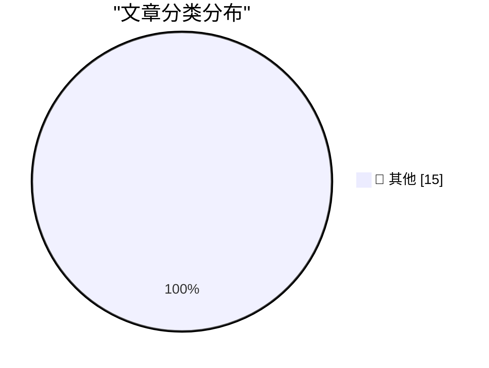

# 📰 AI 博客每日精选 — 2026-07-24

> 来自 Karpathy 推荐的 92 个顶级技术博客，AI 精选 Top 15

## 🏆 今日必读

🥇 **The first known runaway AI agent - or a very bad marketing stunt?**

[The first known runaway AI agent - or a very bad marketing stunt?](https://simonwillison.net/2026/Jul/23/the-first-known-runaway-ai-agent/#atom-everything) — simonwillison.net · 2 小时前 · 📝 其他

> The first known runaway AI agent - or a very bad marketing stunt?

🥈 **Quoting Seth Larson**

[Quoting Seth Larson](https://simonwillison.net/2026/Jul/23/seth-larson/#atom-everything) — simonwillison.net · 20 小时前 · 📝 其他

> Quoting Seth Larson

🥉 **Quoting Thomas Ptacek**

[Quoting Thomas Ptacek](https://simonwillison.net/2026/Jul/22/thomas-ptacek/#atom-everything) — simonwillison.net · 1 天前 · 📝 其他

> Quoting Thomas Ptacek

---

## 📊 数据概览

| 扫描源 | 抓取文章 | 时间范围 | 精选 |
|:---:|:---:|:---:|:---:|
| 84/92 | 2531 篇 → 29 篇 | 48h | **15 篇** |

### 分类分布

---

## 📝 其他

### 1. The first known runaway AI agent - or a very bad marketing stunt?

[The first known runaway AI agent - or a very bad marketing stunt?](https://simonwillison.net/2026/Jul/23/the-first-known-runaway-ai-agent/#atom-everything) — **simonwillison.net** · 2 小时前 · ⭐ 15/30

> The first known runaway AI agent - or a very bad marketing stunt?

---

### 2. Quoting Seth Larson

[Quoting Seth Larson](https://simonwillison.net/2026/Jul/23/seth-larson/#atom-everything) — **simonwillison.net** · 20 小时前 · ⭐ 15/30

> Quoting Seth Larson

---

### 3. Quoting Thomas Ptacek

[Quoting Thomas Ptacek](https://simonwillison.net/2026/Jul/22/thomas-ptacek/#atom-everything) — **simonwillison.net** · 1 天前 · ⭐ 15/30

> Quoting Thomas Ptacek

---

### 4. OpenAI’s accidental cyberattack against Hugging Face is science fiction that happened

[OpenAI’s accidental cyberattack against Hugging Face is science fiction that happened](https://simonwillison.net/2026/Jul/22/openai-cyberattack/#atom-everything) — **simonwillison.net** · 1 天前 · ⭐ 15/30

> OpenAI’s accidental cyberattack against Hugging Face is science fiction that happened

---

### 5. Are AI labs pelicanmaxxing?

[Are AI labs pelicanmaxxing?](https://simonwillison.net/2026/Jul/22/are-ai-labs-pelicanmaxxing/#atom-everything) — **simonwillison.net** · 1 天前 · ⭐ 15/30

> Are AI labs pelicanmaxxing?

---

### 6. Orchestrions

[Orchestrions](https://simonwillison.net/2026/Jul/22/all-the-orchestrions/#atom-everything) — **simonwillison.net** · 1 天前 · ⭐ 15/30

> Orchestrions

---

### 7. Open Sauce and GPS time were my summer AI Antiseptics

[Open Sauce and GPS time were my summer AI Antiseptics](https://www.jeffgeerling.com/blog/2026/open-sauce-gps-time-badge/) — **jeffgeerling.com** · 1 天前 · ⭐ 15/30

> Open Sauce and GPS time were my summer AI Antiseptics

---

### 8. Powerful AIs might escape containment by releasing themselves as open-weight models

[Powerful AIs might escape containment by releasing themselves as open-weight models](https://seangoedecke.com/powerful-ais-might-escape-by-releasing-open-weight-models/) — **seangoedecke.com** · 1 天前 · ⭐ 15/30

> Powerful AIs might escape containment by releasing themselves as open-weight models

---

### 9. Bond Movie Filming Locations Map

[Bond Movie Filming Locations Map](https://department-m.agency/) — **daringfireball.net** · 5 小时前 · ⭐ 15/30

> Bond Movie Filming Locations Map

---

### 10. ★ The Ads on Apple News Continue to Suck, but at Least There Are a Lot of Them

[★ The Ads on Apple News Continue to Suck, but at Least There Are a Lot of Them](https://daringfireball.net/2026/07/ads_on_apple_news_suck) — **daringfireball.net** · 6 小时前 · ⭐ 15/30

> ★ The Ads on Apple News Continue to Suck, but at Least There Are a Lot of Them

---

### 11. John Dvorak on Computer Chronicles in 1987 to Discuss the Then-New IBM PS/2

[John Dvorak on Computer Chronicles in 1987 to Discuss the Then-New IBM PS/2](https://www.youtube.com/watch?v=uY2WF_sPecI) — **daringfireball.net** · 7 小时前 · ⭐ 15/30

> John Dvorak on Computer Chronicles in 1987 to Discuss the Then-New IBM PS/2

---

### 12. John Dvorak Drops Dead at 80

[John Dvorak Drops Dead at 80](https://appleinsider.com/articles/26/07/23/famed-technology-journalist-john-c-dvorak-dies-aged-80) — **daringfireball.net** · 8 小时前 · ⭐ 15/30

> John Dvorak Drops Dead at 80

---

### 13. Flighty New Connection Assistant Feature

[Flighty New Connection Assistant Feature](https://9to5mac.com/2026/07/07/flighty-update-adds-powerful-new-connection-assistant-feature/) — **daringfireball.net** · 9 小时前 · ⭐ 15/30

> Flighty New Connection Assistant Feature

---

### 14. Not just development, distribution of software may change as well

[Not just development, distribution of software may change as well](http://antirez.com/news/170) — **antirez.com** · 1 天前 · ⭐ 15/30

> Not just development, distribution of software may change as well

---

### 15. Pluralistic: California's privacy obstacle course (23 Jul 2026)

[Pluralistic: California's privacy obstacle course (23 Jul 2026)](https://pluralistic.net/2026/07/23/drop-a-dime/) — **pluralistic.net** · 15 小时前 · ⭐ 15/30

> Pluralistic: California's privacy obstacle course (23 Jul 2026)

---

*生成于 2026-07-24 01:30 | 扫描 84 源 → 获取 2531 篇 → 精选 15 篇*
*基于 [Hacker News Popularity Contest 2025](https://refactoringenglish.com/tools/hn-popularity/) RSS 源列表，由 [Andrej Karpathy](https://x.com/karpathy) 推荐*
*由「懂点儿AI」制作，欢迎关注同名微信公众号获取更多 AI 实用技巧 💡*
