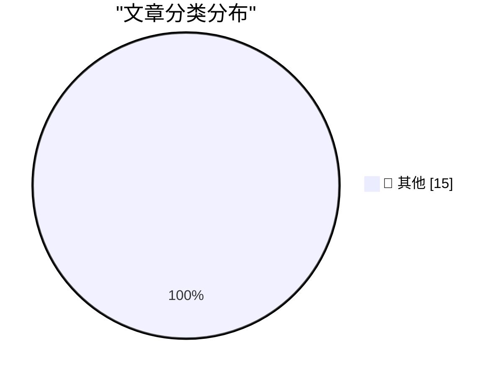

# 📰 AI 博客每日精选 — 2026-07-29

> 来自 Karpathy 推荐的 92 个顶级技术博客，AI 精选 Top 15

## 🏆 今日必读

🥇 **Discovering cryptographic weaknesses with Claude**

[Discovering cryptographic weaknesses with Claude](https://simonwillison.net/2026/Jul/28/discovering-cryptographic-weaknesses-with-claude/#atom-everything) — simonwillison.net · 2 小时前 · 📝 其他

> Discovering cryptographic weaknesses with Claude

🥈 **Quoting Akshat Bubna**

[Quoting Akshat Bubna](https://simonwillison.net/2026/Jul/28/akshat-bubna/#atom-everything) — simonwillison.net · 3 小时前 · 📝 其他

> Quoting Akshat Bubna

🥉 **uv 0.12.0**

[uv 0.12.0](https://simonwillison.net/2026/Jul/28/uv/#atom-everything) — simonwillison.net · 3 小时前 · 📝 其他

> uv 0.12.0

---

## 📊 数据概览

| 扫描源 | 抓取文章 | 时间范围 | 精选 |
|:---:|:---:|:---:|:---:|
| 84/92 | 2533 篇 → 31 篇 | 48h | **15 篇** |

### 分类分布

---

## 📝 其他

### 1. Discovering cryptographic weaknesses with Claude

[Discovering cryptographic weaknesses with Claude](https://simonwillison.net/2026/Jul/28/discovering-cryptographic-weaknesses-with-claude/#atom-everything) — **simonwillison.net** · 2 小时前 · ⭐ 15/30

> Discovering cryptographic weaknesses with Claude

---

### 2. Quoting Akshat Bubna

[Quoting Akshat Bubna](https://simonwillison.net/2026/Jul/28/akshat-bubna/#atom-everything) — **simonwillison.net** · 3 小时前 · ⭐ 15/30

> Quoting Akshat Bubna

---

### 3. uv 0.12.0

[uv 0.12.0](https://simonwillison.net/2026/Jul/28/uv/#atom-everything) — **simonwillison.net** · 3 小时前 · ⭐ 15/30

> uv 0.12.0

---

### 4. Anatomy of a Frontier Lab Agent Intrusion: A Technical Timeline of the July 2026 Incident

[Anatomy of a Frontier Lab Agent Intrusion: A Technical Timeline of the July 2026 Incident](https://simonwillison.net/2026/Jul/28/anatomy-of-a-frontier-lab-agent-intrusion/#atom-everything) — **simonwillison.net** · 3 小时前 · ⭐ 15/30

> Anatomy of a Frontier Lab Agent Intrusion: A Technical Timeline of the July 2026 Incident

---

### 5. moonshotai/Kimi-K3

[moonshotai/Kimi-K3](https://simonwillison.net/2026/Jul/27/kimi-k3/#atom-everything) — **simonwillison.net** · 1 天前 · ⭐ 15/30

> moonshotai/Kimi-K3

---

### 6. An opinionated guide to which AI to use to do stuff

[An opinionated guide to which AI to use to do stuff](https://simonwillison.net/2026/Jul/27/an-opinionated-guide-to-which-ai-to-use-to-do-stuff/#atom-everything) — **simonwillison.net** · 1 天前 · ⭐ 15/30

> An opinionated guide to which AI to use to do stuff

---

### 7. Steve Jobs in 2011: ‘We Build Products That We Want for Ourselves, Too, and We Just Don’t Want Ads’

[Steve Jobs in 2011: ‘We Build Products That We Want for Ourselves, Too, and We Just Don’t Want Ads’](https://www.businessinsider.com/apple-snubs-the-iad-2011-6) — **daringfireball.net** · 9 小时前 · ⭐ 15/30

> Steve Jobs in 2011: ‘We Build Products That We Want for Ourselves, Too, and We Just Don’t Want Ads’

---

### 8. [Sponsor] Introducing Agent Fone

[[Sponsor] Introducing Agent Fone](https://fail.xyz/phone/) — **daringfireball.net** · 23 小时前 · ⭐ 15/30

> [Sponsor] Introducing Agent Fone

---

### 9. ‘Always Choose the Good Soap’

[‘Always Choose the Good Soap’](https://sixcolors.com/post/2026/07/always-choose-the-good-soap/) — **daringfireball.net** · 1 天前 · ⭐ 15/30

> ‘Always Choose the Good Soap’

---

### 10. ★ Ads in Software Are Like Stickers on Laptops

[★ Ads in Software Are Like Stickers on Laptops](https://daringfireball.net/2026/07/ads_in_software_are_like_stickers_on_laptops) — **daringfireball.net** · 1 天前 · ⭐ 15/30

> ★ Ads in Software Are Like Stickers on Laptops

---

### 11. WorkOS MCP

[WorkOS MCP](https://workos.com/blog/management-mcp-server?utm_source=daringfireball&amp;utm_medium=newsletter&amp;utm_campaign=q32026) — **daringfireball.net** · 1 天前 · ⭐ 15/30

> WorkOS MCP

---

### 12. The real AI risk is inside the labs

[The real AI risk is inside the labs](http://antirez.com/news/172) — **antirez.com** · 16 小时前 · ⭐ 15/30

> The real AI risk is inside the labs

---

### 13. Pluralistic: Discernment (28 Jul 2026)

[Pluralistic: Discernment (28 Jul 2026)](https://pluralistic.net/2026/07/28/hitl-ers/) — **pluralistic.net** · 14 小时前 · ⭐ 15/30

> Pluralistic: Discernment (28 Jul 2026)

---

### 14. Pluralistic: How the EU can punish Google (despite Trump) (27 Jul 2026)

[Pluralistic: How the EU can punish Google (despite Trump) (27 Jul 2026)](https://pluralistic.net/2026/07/27/eucd-6/) — **pluralistic.net** · 1 天前 · ⭐ 15/30

> Pluralistic: How the EU can punish Google (despite Trump) (27 Jul 2026)

---

### 15. Google Calendar "Unable to launch event" - caused by missing DTSTAMP

[Google Calendar "Unable to launch event" - caused by missing DTSTAMP](https://shkspr.mobi/blog/2026/07/google-calendar-unable-to-launch-event-caused-by-missing-dtstamp/) — **shkspr.mobi** · 13 小时前 · ⭐ 15/30

> Google Calendar "Unable to launch event" - caused by missing DTSTAMP

---

*生成于 2026-07-29 01:27 | 扫描 84 源 → 获取 2533 篇 → 精选 15 篇*
*基于 [Hacker News Popularity Contest 2025](https://refactoringenglish.com/tools/hn-popularity/) RSS 源列表，由 [Andrej Karpathy](https://x.com/karpathy) 推荐*
*由「懂点儿AI」制作，欢迎关注同名微信公众号获取更多 AI 实用技巧 💡*
