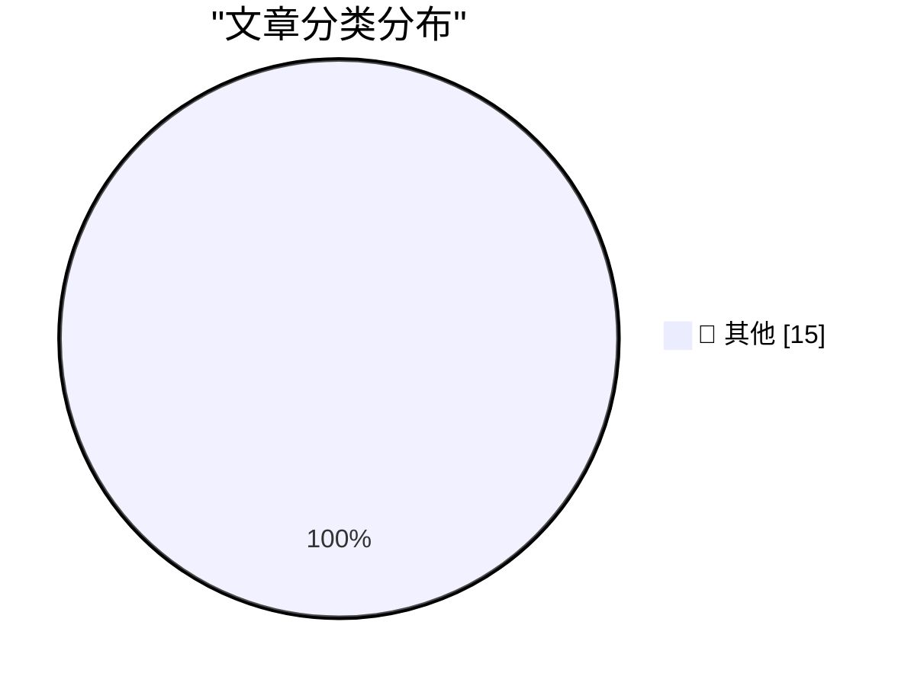

# 📰 AI 博客每日精选 — 2026-08-03

> 来自 Karpathy 推荐的 92 个顶级技术博客，AI 精选 Top 15

## 🏆 今日必读

🥇 **condense-json 1.0**

[condense-json 1.0](https://simonwillison.net/2026/Aug/2/condense-json/#atom-everything) — simonwillison.net · 3 小时前 · 📝 其他

> condense-json 1.0

🥈 **Open letters about AI development**

[Open letters about AI development](https://simonwillison.net/2026/Aug/2/open-letters/#atom-everything) — simonwillison.net · 21 小时前 · 📝 其他

> Open letters about AI development

🥉 **July 2026 newsletter**

[July 2026 newsletter](https://simonwillison.net/2026/Aug/2/july-newsletter/#atom-everything) — simonwillison.net · 21 小时前 · 📝 其他

> July 2026 newsletter

---

## 📊 数据概览

| 扫描源 | 抓取文章 | 时间范围 | 精选 |
|:---:|:---:|:---:|:---:|
| 82/92 | 2498 篇 → 25 篇 | 48h | **15 篇** |

### 分类分布

---

## 📝 其他

### 1. condense-json 1.0

[condense-json 1.0](https://simonwillison.net/2026/Aug/2/condense-json/#atom-everything) — **simonwillison.net** · 3 小时前 · ⭐ 15/30

> condense-json 1.0

---

### 2. Open letters about AI development

[Open letters about AI development](https://simonwillison.net/2026/Aug/2/open-letters/#atom-everything) — **simonwillison.net** · 21 小时前 · ⭐ 15/30

> Open letters about AI development

---

### 3. July 2026 newsletter

[July 2026 newsletter](https://simonwillison.net/2026/Aug/2/july-newsletter/#atom-everything) — **simonwillison.net** · 21 小时前 · ⭐ 15/30

> July 2026 newsletter

---

### 4. Quoting Greg Brockman

[Quoting Greg Brockman](https://simonwillison.net/2026/Aug/1/greg-brockman/#atom-everything) — **simonwillison.net** · 1 天前 · ⭐ 15/30

> Quoting Greg Brockman

---

### 5. datasette-apps 0.2a0

[datasette-apps 0.2a0](https://simonwillison.net/2026/Aug/1/datasette-apps/#atom-everything) — **simonwillison.net** · 1 天前 · ⭐ 15/30

> datasette-apps 0.2a0

---

### 6. Ten advances in mathematics and theoretical computer science

[Ten advances in mathematics and theoretical computer science](https://simonwillison.net/2026/Aug/1/ten-advances-in-mathematics/#atom-everything) — **simonwillison.net** · 1 天前 · ⭐ 15/30

> Ten advances in mathematics and theoretical computer science

---

### 7. Giving and taking credit in big tech companies

[Giving and taking credit in big tech companies](https://seangoedecke.com/giving-and-taking-credit/) — **seangoedecke.com** · 1 天前 · ⭐ 15/30

> Giving and taking credit in big tech companies

---

### 8. Agent Fone

[Agent Fone](https://fail.xyz/phone/) — **daringfireball.net** · 4 小时前 · ⭐ 15/30

> Agent Fone

---

### 9. Boris Cherny on Trying to Get Claude Code to Rewrite the Claude App

[Boris Cherny on Trying to Get Claude Code to Rewrite the Claude App](https://www.ycrootaccess.com/p/boris-cherny-building-claude-code) — **daringfireball.net** · 4 小时前 · ⭐ 15/30

> Boris Cherny on Trying to Get Claude Code to Rewrite the Claude App

---

### 10. The Apple Upgrade Situation

[The Apple Upgrade Situation](https://randsinrepose.com/archives/the-apple-upgrade-situation/) — **daringfireball.net** · 1 天前 · ⭐ 15/30

> The Apple Upgrade Situation

---

### 11. Apple Q3 2026 Results

[Apple Q3 2026 Results](https://sixcolors.com/post/2026/07/apple-announces-record-q3-results/) — **daringfireball.net** · 1 天前 · ⭐ 15/30

> Apple Q3 2026 Results

---

### 12. Pluralistic: Why businesses lie about AI (01 Aug 2026)

[Pluralistic: Why businesses lie about AI (01 Aug 2026)](https://pluralistic.net/2026/08/01/dare-snot/) — **pluralistic.net** · 1 天前 · ⭐ 15/30

> Pluralistic: Why businesses lie about AI (01 Aug 2026)

---

### 13. Holonomic functions

[Holonomic functions](https://www.johndcook.com/blog/2026/08/02/holonomic-functions/) — **johndcook.com** · 4 小时前 · ⭐ 15/30

> Holonomic functions

---

### 14. Estimating a cumulative sum

[Estimating a cumulative sum](https://www.johndcook.com/blog/2026/08/02/estimating-a-cumulative-sum/) — **johndcook.com** · 7 小时前 · ⭐ 15/30

> Estimating a cumulative sum

---

### 15. Why polynomial coefficients?

[Why polynomial coefficients?](https://www.johndcook.com/blog/2026/08/01/why-polynomial-coefficients/) — **johndcook.com** · 1 天前 · ⭐ 15/30

> Why polynomial coefficients?

---

*生成于 2026-08-03 01:46 | 扫描 82 源 → 获取 2498 篇 → 精选 15 篇*
*基于 [Hacker News Popularity Contest 2025](https://refactoringenglish.com/tools/hn-popularity/) RSS 源列表，由 [Andrej Karpathy](https://x.com/karpathy) 推荐*
*由「懂点儿AI」制作，欢迎关注同名微信公众号获取更多 AI 实用技巧 💡*
