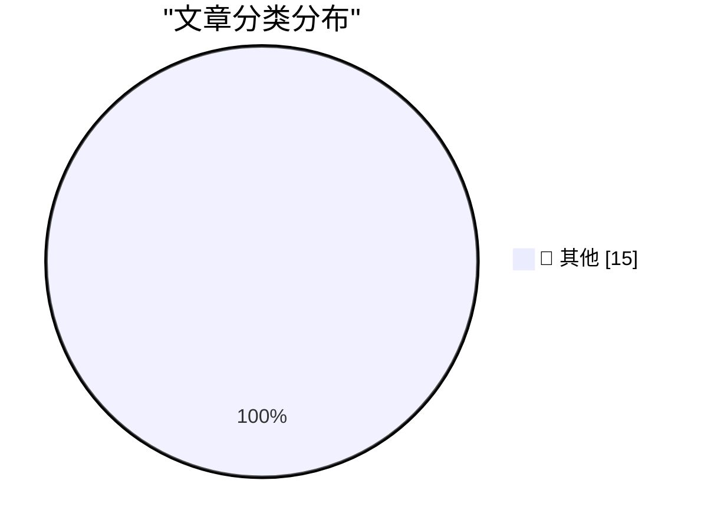

# 📰 AI 博客每日精选 — 2026-08-11

> 来自 Karpathy 推荐的 92 个顶级技术博客，AI 精选 Top 15

## 🏆 今日必读

🥇 **Introducing Muse Glimmer**

[Introducing Muse Glimmer](https://simonwillison.net/2026/Aug/10/introducing-muse-glimmer/#atom-everything) — simonwillison.net · 57 分钟前 · 📝 其他

> Introducing Muse Glimmer

🥈 **Quoting OpenClaw**

[Quoting OpenClaw](https://simonwillison.net/2026/Aug/10/openclaw/#atom-everything) — simonwillison.net · 22 小时前 · 📝 其他

> Quoting OpenClaw

🥉 **Quoting Claude Opus 5 system prompt**

[Quoting Claude Opus 5 system prompt](https://simonwillison.net/2026/Aug/9/claude-opus-5-system-prompt/#atom-everything) — simonwillison.net · 1 天前 · 📝 其他

> Quoting Claude Opus 5 system prompt

---

## 📊 数据概览

| 扫描源 | 抓取文章 | 时间范围 | 精选 |
|:---:|:---:|:---:|:---:|
| 80/92 | 2458 篇 → 26 篇 | 48h | **15 篇** |

### 分类分布

---

## 📝 其他

### 1. Introducing Muse Glimmer

[Introducing Muse Glimmer](https://simonwillison.net/2026/Aug/10/introducing-muse-glimmer/#atom-everything) — **simonwillison.net** · 57 分钟前 · ⭐ 15/30

> Introducing Muse Glimmer

---

### 2. Quoting OpenClaw

[Quoting OpenClaw](https://simonwillison.net/2026/Aug/10/openclaw/#atom-everything) — **simonwillison.net** · 22 小时前 · ⭐ 15/30

> Quoting OpenClaw

---

### 3. Quoting Claude Opus 5 system prompt

[Quoting Claude Opus 5 system prompt](https://simonwillison.net/2026/Aug/9/claude-opus-5-system-prompt/#atom-everything) — **simonwillison.net** · 1 天前 · ⭐ 15/30

> Quoting Claude Opus 5 system prompt

---

### 4. GitHub Models is now retired

[GitHub Models is now retired](https://simonwillison.net/2026/Aug/9/github-models-is-now-retired/#atom-everything) — **simonwillison.net** · 1 天前 · ⭐ 15/30

> GitHub Models is now retired

---

### 5. SQLite compressed text-history prototypes

[SQLite compressed text-history prototypes](https://simonwillison.net/2026/Aug/9/sqlite-text-history-prototype/#atom-everything) — **simonwillison.net** · 1 天前 · ⭐ 15/30

> SQLite compressed text-history prototypes

---

### 6. [Sponsor] Drata

[[Sponsor] Drata](https://drata.com/daring) — **daringfireball.net** · 2 小时前 · ⭐ 15/30

> [Sponsor] Drata

---

### 7. What’s New in iOS 27 Beta 5

[What’s New in iOS 27 Beta 5](https://9to5mac.com/2026/08/10/heres-whats-new-with-ios-27-beta-5/) — **daringfireball.net** · 2 小时前 · ⭐ 15/30

> What’s New in iOS 27 Beta 5

---

### 8. ‘Friday Night Baseball’ Will Start Broadcasting Games Live, in Apple Immersive, on Vision Pro

[‘Friday Night Baseball’ Will Start Broadcasting Games Live, in Apple Immersive, on Vision Pro](https://www.apple.com/newsroom/2026/08/apple-mlb-announce-september-friday-night-baseball-schedule/) — **daringfireball.net** · 4 小时前 · ⭐ 15/30

> ‘Friday Night Baseball’ Will Start Broadcasting Games Live, in Apple Immersive, on Vision Pro

---

### 9. Michael Tsai on My Retraction of the Astrology/Astronomy App Store Rejection Story

[Michael Tsai on My Retraction of the Astrology/Astronomy App Store Rejection Story](https://mjtsai.com/blog/2026/08/07/dark-hours-rejected-from-the-app-store/) — **daringfireball.net** · 4 小时前 · ⭐ 15/30

> Michael Tsai on My Retraction of the Astrology/Astronomy App Store Rejection Story

---

### 10. ‘The Problem With Vibe-Coded Flattery’

[‘The Problem With Vibe-Coded Flattery’](https://tedium.co/2026/08/09/vibe-coding-insincerity/) — **daringfireball.net** · 8 小时前 · ⭐ 15/30

> ‘The Problem With Vibe-Coded Flattery’

---

### 11. The NYT and WSJ on Apple, China, and the RAM Crisis

[The NYT and WSJ on Apple, China, and the RAM Crisis](https://www.nytimes.com/2026/08/10/technology/memory-chip-shortage-ai.html?unlocked_article_code=1.4VA.49f7.Qj8S541DkkOz) — **daringfireball.net** · 9 小时前 · ⭐ 15/30

> The NYT and WSJ on Apple, China, and the RAM Crisis

---

### 12. WorkOS: Connect Your Agents to Your API

[WorkOS: Connect Your Agents to Your API](https://workos.com/blog/mcp-vs-rest?utm_source=daringfireball&amp;utm_medium=newsletter&amp;utm_campaign=q32026) — **daringfireball.net** · 1 天前 · ⭐ 15/30

> WorkOS: Connect Your Agents to Your API

---

### 13. ★ Retraction: The App Store Rejection of the Week That Was, in Fact, a Correct Rejection

[★ Retraction: The App Store Rejection of the Week That Was, in Fact, a Correct Rejection](https://daringfireball.net/2026/08/retraction_app_store_rejection_of_the_week) — **daringfireball.net** · 1 天前 · ⭐ 15/30

> ★ Retraction: The App Store Rejection of the Week That Was, in Fact, a Correct Rejection

---

### 14. Failing after Success

[Failing after Success](https://idiallo.com/blog/failing-after-success) — **idiallo.com** · 17 小时前 · ⭐ 15/30

> Failing after Success

---

### 15. When the Aliens Finally Came to Visit

[When the Aliens Finally Came to Visit](https://idiallo.com/byte-size/when-the-aliens-came-to-visit) — **idiallo.com** · 20 小时前 · ⭐ 15/30

> When the Aliens Finally Came to Visit

---

*生成于 2026-08-11 00:53 | 扫描 80 源 → 获取 2458 篇 → 精选 15 篇*
*基于 [Hacker News Popularity Contest 2025](https://refactoringenglish.com/tools/hn-popularity/) RSS 源列表，由 [Andrej Karpathy](https://x.com/karpathy) 推荐*
*由「懂点儿AI」制作，欢迎关注同名微信公众号获取更多 AI 实用技巧 💡*
