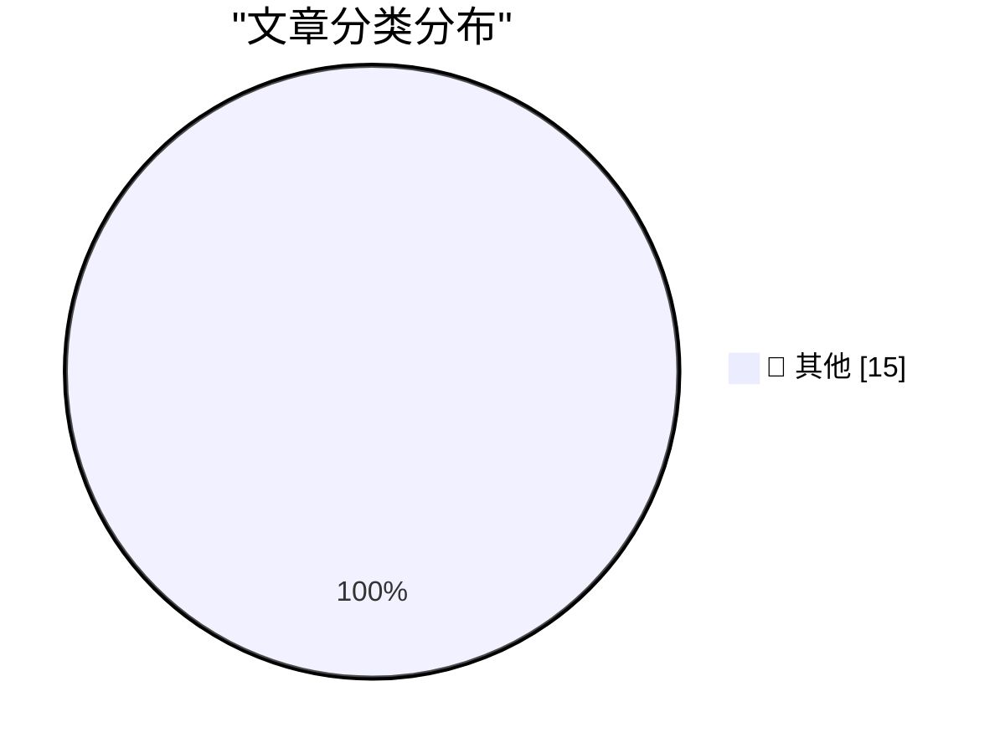

# 📰 AI 博客每日精选 — 2026-08-16

> 来自 Karpathy 推荐的 92 个顶级技术博客，AI 精选 Top 15

## 🏆 今日必读

🥇 **Northern Gannet**

[Northern Gannet](https://simonwillison.net/2026/Aug/15/sighting-391300422/) — simonwillison.net · 21 小时前 · 📝 其他

> Northern Gannet

🥈 **Don't classify. Hallucinate!**

[Don't classify. Hallucinate!](https://simonwillison.net/2026/Aug/14/dont-classify-hallucinate/) — simonwillison.net · 1 天前 · 📝 其他

> Don't classify. Hallucinate!

🥉 **Who’s Tracking You? Use This New Service to Find Out**

[Who’s Tracking You? Use This New Service to Find Out](https://krebsonsecurity.com/2026/08/whos-tracking-you-use-this-new-service-to-find-out/) — krebsonsecurity.com · 1 天前 · 📝 其他

> Who’s Tracking You? Use This New Service to Find Out

---

## 📊 数据概览

| 扫描源 | 抓取文章 | 时间范围 | 精选 |
|:---:|:---:|:---:|:---:|
| 83/92 | 2520 篇 → 27 篇 | 48h | **15 篇** |

### 分类分布

---

## 📝 其他

### 1. Northern Gannet

[Northern Gannet](https://simonwillison.net/2026/Aug/15/sighting-391300422/) — **simonwillison.net** · 21 小时前 · ⭐ 15/30

> Northern Gannet

---

### 2. Don't classify. Hallucinate!

[Don't classify. Hallucinate!](https://simonwillison.net/2026/Aug/14/dont-classify-hallucinate/) — **simonwillison.net** · 1 天前 · ⭐ 15/30

> Don't classify. Hallucinate!

---

### 3. Who’s Tracking You? Use This New Service to Find Out

[Who’s Tracking You? Use This New Service to Find Out](https://krebsonsecurity.com/2026/08/whos-tracking-you-use-this-new-service-to-find-out/) — **krebsonsecurity.com** · 1 天前 · ⭐ 15/30

> Who’s Tracking You? Use This New Service to Find Out

---

### 4. Drata

[Drata](https://drata.com/daring) — **daringfireball.net** · 2 小时前 · ⭐ 15/30

> Drata

---

### 5. ★ You Don’t Need to Worry About Scratching Your iPhone Camera Lenses

[★ You Don’t Need to Worry About Scratching Your iPhone Camera Lenses](https://daringfireball.net/2026/08/iphone_camera_lens_scratch_resistance) — **daringfireball.net** · 1 天前 · ⭐ 15/30

> ★ You Don’t Need to Worry About Scratching Your iPhone Camera Lenses

---

### 6. Google’s ‘Material 3’ Design Write-Up Is 93.3 Percent Embarrassing

[Google’s ‘Material 3’ Design Write-Up Is 93.3 Percent Embarrassing](https://design.google/library/expressive-material-design-google-research) — **daringfireball.net** · 1 天前 · ⭐ 15/30

> Google’s ‘Material 3’ Design Write-Up Is 93.3 Percent Embarrassing

---

### 7. Pluralistic: Capital formation (14 Aug 2026)

[Pluralistic: Capital formation (14 Aug 2026)](https://pluralistic.net/2026/08/14/one-chokable-throat/) — **pluralistic.net** · 1 天前 · ⭐ 15/30

> Pluralistic: Capital formation (14 Aug 2026)

---

### 8. Book Review: Slags by Emma Jane Unsworth ★★★⯪☆

[Book Review: Slags by Emma Jane Unsworth ★★★⯪☆](https://shkspr.mobi/blog/2026/08/book-review-slags-by-emma-jane-unsworth/) — **shkspr.mobi** · 13 小时前 · ⭐ 15/30

> Book Review: Slags by Emma Jane Unsworth ★★★⯪☆

---

### 9. Edinburgh Fringe: Target Audience ★★★★★

[Edinburgh Fringe: Target Audience ★★★★★](https://shkspr.mobi/blog/2026/08/edinburgh-fringe-target-audience/) — **shkspr.mobi** · 1 天前 · ⭐ 15/30

> Edinburgh Fringe: Target Audience ★★★★★

---

### 10. Edinburgh Fringe: Stand-up Philosophy ★★★⯪☆

[Edinburgh Fringe: Stand-up Philosophy ★★★⯪☆](https://shkspr.mobi/blog/2026/08/edinburgh-fringe-stand-up-philosophy/) — **shkspr.mobi** · 1 天前 · ⭐ 15/30

> Edinburgh Fringe: Stand-up Philosophy ★★★⯪☆

---

### 11. Edinburgh Fringe: Waiting for Wonka ★★★⯪☆

[Edinburgh Fringe: Waiting for Wonka ★★★⯪☆](https://shkspr.mobi/blog/2026/08/edinburgh-fringe-waiting-for-wonka/) — **shkspr.mobi** · 1 天前 · ⭐ 15/30

> Edinburgh Fringe: Waiting for Wonka ★★★⯪☆

---

### 12. Site update: a few posts have been removed

[Site update: a few posts have been removed](https://xeiaso.net/notes/2026/blogposts-removed/) — **xeiaso.net** · 1 天前 · ⭐ 15/30

> Site update: a few posts have been removed

---

### 13. Forcing an ARM64X executable to run as a specific architecture

[Forcing an ARM64X executable to run as a specific architecture](https://devblogs.microsoft.com/oldnewthing/20260814-00/?p=112613) — **devblogs.microsoft.com/oldnewthing** · 1 天前 · ⭐ 15/30

> Forcing an ARM64X executable to run as a specific architecture

---

### 14. Probability of correcting errors

[Probability of correcting errors](https://www.johndcook.com/blog/2026/08/15/probability-of-correcting-errors/) — **johndcook.com** · 8 小时前 · ⭐ 15/30

> Probability of correcting errors

---

### 15. Compressing a Hadamard matrix

[Compressing a Hadamard matrix](https://www.johndcook.com/blog/2026/08/15/compressing-a-hadamard-matrix/) — **johndcook.com** · 8 小时前 · ⭐ 15/30

> Compressing a Hadamard matrix

---

*生成于 2026-08-16 00:37 | 扫描 83 源 → 获取 2520 篇 → 精选 15 篇*
*基于 [Hacker News Popularity Contest 2025](https://refactoringenglish.com/tools/hn-popularity/) RSS 源列表，由 [Andrej Karpathy](https://x.com/karpathy) 推荐*
*由「懂点儿AI」制作，欢迎关注同名微信公众号获取更多 AI 实用技巧 💡*
