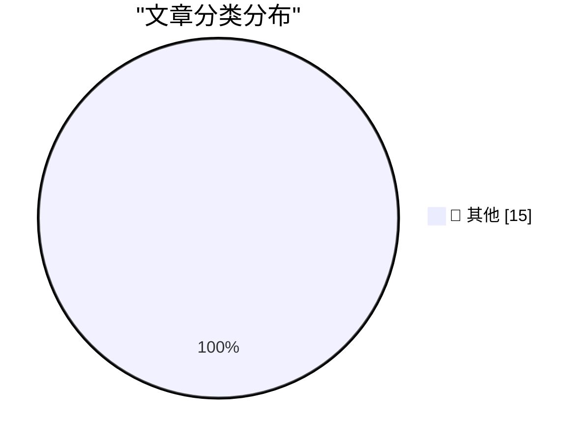

# 📰 AI 博客每日精选 — 2026-08-19

> 来自 Karpathy 推荐的 92 个顶级技术博客，AI 精选 Top 15

## 🏆 今日必读

🥇 **Mojo🔥 is now open source**

[Mojo🔥 is now open source](https://simonwillison.net/2026/Aug/18/mojo-is-now-open-source/) — simonwillison.net · 2 小时前 · 📝 其他

> Mojo🔥 is now open source

🥈 **Qwen 3.8 27B scores 52 on the Artificial Analysis Intelligence Index**

[Qwen 3.8 27B scores 52 on the Artificial Analysis Intelligence Index](https://simonwillison.net/2026/Aug/17/qwen-38-27b-scores-52/) — simonwillison.net · 1 天前 · 📝 其他

> Qwen 3.8 27B scores 52 on the Artificial Analysis Intelligence Index

🥉 **We Tracked a Shipment of Rare Books. It Ended at an Amazon AI Training Facility**

[We Tracked a Shipment of Rare Books. It Ended at an Amazon AI Training Facility](https://simonwillison.net/2026/Aug/17/we-tracked-a-shipment-of-rare-books-it-ended-at-an-amazon-ai-tra/) — simonwillison.net · 1 天前 · 📝 其他

> We Tracked a Shipment of Rare Books. It Ended at an Amazon AI Training Facility

---

## 📊 数据概览

| 扫描源 | 抓取文章 | 时间范围 | 精选 |
|:---:|:---:|:---:|:---:|
| 81/92 | 2471 篇 → 30 篇 | 48h | **15 篇** |

### 分类分布

---

## 📝 其他

### 1. Mojo🔥 is now open source

[Mojo🔥 is now open source](https://simonwillison.net/2026/Aug/18/mojo-is-now-open-source/) — **simonwillison.net** · 2 小时前 · ⭐ 15/30

> Mojo🔥 is now open source

---

### 2. Qwen 3.8 27B scores 52 on the Artificial Analysis Intelligence Index

[Qwen 3.8 27B scores 52 on the Artificial Analysis Intelligence Index](https://simonwillison.net/2026/Aug/17/qwen-38-27b-scores-52/) — **simonwillison.net** · 1 天前 · ⭐ 15/30

> Qwen 3.8 27B scores 52 on the Artificial Analysis Intelligence Index

---

### 3. We Tracked a Shipment of Rare Books. It Ended at an Amazon AI Training Facility

[We Tracked a Shipment of Rare Books. It Ended at an Amazon AI Training Facility](https://simonwillison.net/2026/Aug/17/we-tracked-a-shipment-of-rare-books-it-ended-at-an-amazon-ai-tra/) — **simonwillison.net** · 1 天前 · ⭐ 15/30

> We Tracked a Shipment of Rare Books. It Ended at an Amazon AI Training Facility

---

### 4. Disney’s ABC Sues Trump’s FCC Over Challenge to Its Broadcast License

[Disney’s ABC Sues Trump’s FCC Over Challenge to Its Broadcast License](https://www.wsj.com/business/media/disneys-abc-sues-fcc-over-challenge-to-its-broadcast-licenses-64e8f794?st=XTL4tA) — **daringfireball.net** · 1 小时前 · ⭐ 15/30

> Disney’s ABC Sues Trump’s FCC Over Challenge to Its Broadcast License

---

### 5. Apple Gives Legal Middle Finger to DOJ Challenge on Apple’s July Discovery Win

[Apple Gives Legal Middle Finger to DOJ Challenge on Apple’s July Discovery Win](https://9to5mac.com/2026/08/17/apple-dojs-latest-challenge-in-antitrust-case-fails-at-every-level/) — **daringfireball.net** · 2 小时前 · ⭐ 15/30

> Apple Gives Legal Middle Finger to DOJ Challenge on Apple’s July Discovery Win

---

### 6. Organized Thieves Are Targeting AI Server Chips With Violent Highway Hijackings

[Organized Thieves Are Targeting AI Server Chips With Violent Highway Hijackings](https://www.wired.com/story/the-worst-ive-ever-seen-cargo-thieves-are-turning-violent-in-pursuit-of-ai-hardware/) — **daringfireball.net** · 5 小时前 · ⭐ 15/30

> Organized Thieves Are Targeting AI Server Chips With Violent Highway Hijackings

---

### 7. ‘Dickover’ Makes It Into The Guardian

[‘Dickover’ Makes It Into The Guardian](https://www.theguardian.com/technology/2026/aug/18/dickovers-baggravation-botiquette-18-new-words-tech-hellscape) — **daringfireball.net** · 8 小时前 · ⭐ 15/30

> ‘Dickover’ Makes It Into The Guardian

---

### 8. OpenAI Pot Complains That Google Kettle Is Black

[OpenAI Pot Complains That Google Kettle Is Black](https://x.com/thsottiaux/status/2083373529081291076?s=12) — **daringfireball.net** · 9 小时前 · ⭐ 15/30

> OpenAI Pot Complains That Google Kettle Is Black

---

### 9. Nature Is Healing: MacOS 27 Golden Gate Beta 6 Adds Redesigned Traffic Light Window Controls

[Nature Is Healing: MacOS 27 Golden Gate Beta 6 Adds Redesigned Traffic Light Window Controls](https://9to5mac.com/2026/08/17/macos-27-golden-gate-beta-6-features-redesigned-traffic-light-window-controls/) — **daringfireball.net** · 12 小时前 · ⭐ 15/30

> Nature Is Healing: MacOS 27 Golden Gate Beta 6 Adds Redesigned Traffic Light Window Controls

---

### 10. MacOS 26.7 Tahoe Release Candidate Contains a Video Demonstrating Camera-Equipped AirPods in Action

[MacOS 26.7 Tahoe Release Candidate Contains a Video Demonstrating Camera-Equipped AirPods in Action](https://www.macrumors.com/2026/08/17/camera-equipped-airpods-macos-26-7/) — **daringfireball.net** · 20 小时前 · ⭐ 15/30

> MacOS 26.7 Tahoe Release Candidate Contains a Video Demonstrating Camera-Equipped AirPods in Action

---

### 11. ★ Follow-Up Thoughts on Watermarking Schemes for AI-Generated Text

[★ Follow-Up Thoughts on Watermarking Schemes for AI-Generated Text](https://daringfireball.net/2026/08/follow-up_thoughts_on_watermarking) — **daringfireball.net** · 23 小时前 · ⭐ 15/30

> ★ Follow-Up Thoughts on Watermarking Schemes for AI-Generated Text

---

### 12. Apple TV Still Has No Start Date for ‘The Savant’

[Apple TV Still Has No Start Date for ‘The Savant’](https://daringfireball.net/linked/2026/04/19/chastain-says-the-savant-will-be-released) — **daringfireball.net** · 1 天前 · ⭐ 15/30

> Apple TV Still Has No Start Date for ‘The Savant’

---

### 13. No Update Since Early July Regarding Siri AI Coming to the EU, Ever

[No Update Since Early July Regarding Siri AI Coming to the EU, Ever](https://www.ft.com/content/807d25c3-f4ac-4402-b815-3aa91018237d) — **daringfireball.net** · 1 天前 · ⭐ 15/30

> No Update Since Early July Regarding Siri AI Coming to the EU, Ever

---

### 14. Pluralistic: IP can't save you from AI (18 Aug 2026)

[Pluralistic: IP can't save you from AI (18 Aug 2026)](https://pluralistic.net/2026/08/18/enron-corpus/) — **pluralistic.net** · 9 小时前 · ⭐ 15/30

> Pluralistic: IP can't save you from AI (18 Aug 2026)

---

### 15. Pluralistic: Jennifer Jenkins' 'Music Copyright, Creativity, and Culture' (17 Aug 2026)

[Pluralistic: Jennifer Jenkins' 'Music Copyright, Creativity, and Culture' (17 Aug 2026)](https://pluralistic.net/2026/08/17/great-sousas-ghost/) — **pluralistic.net** · 1 天前 · ⭐ 15/30

> Pluralistic: Jennifer Jenkins' 'Music Copyright, Creativity, and Culture' (17 Aug 2026)

---

*生成于 2026-08-19 00:35 | 扫描 81 源 → 获取 2471 篇 → 精选 15 篇*
*基于 [Hacker News Popularity Contest 2025](https://refactoringenglish.com/tools/hn-popularity/) RSS 源列表，由 [Andrej Karpathy](https://x.com/karpathy) 推荐*
*由「懂点儿AI」制作，欢迎关注同名微信公众号获取更多 AI 实用技巧 💡*
