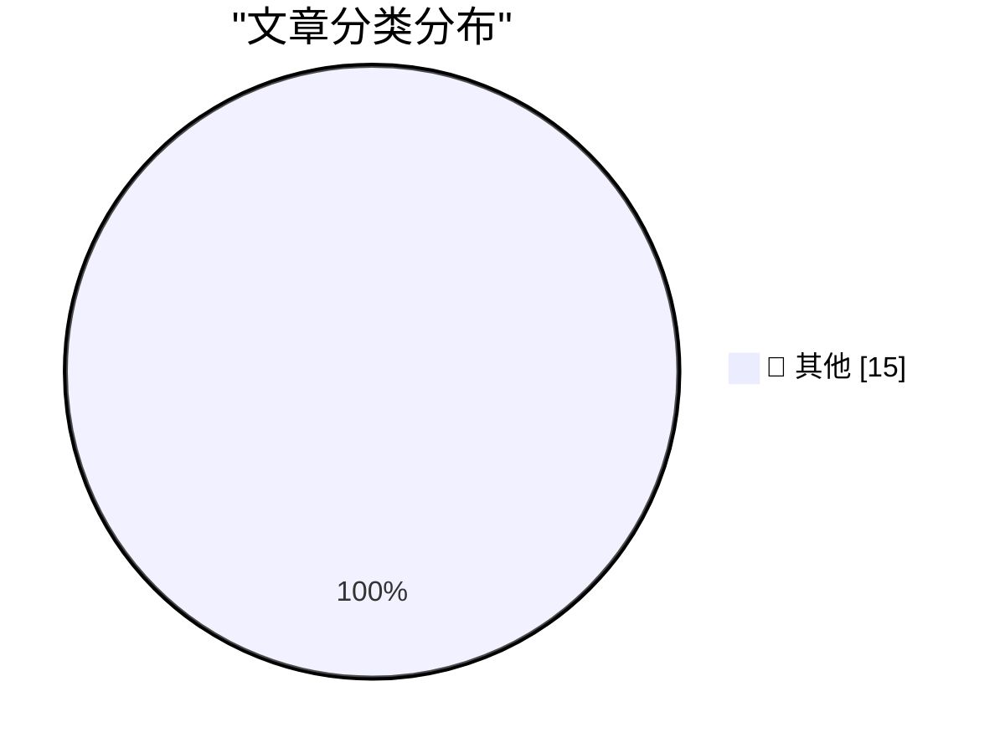

# 📰 AI 博客每日精选 — 2026-08-25

> 来自 Karpathy 推荐的 92 个顶级技术博客，AI 精选 Top 15

## 🏆 今日必读

🥇 **llm-anthropic 0.27**

[llm-anthropic 0.27](https://simonwillison.net/2026/Aug/24/llm-anthropic/) — simonwillison.net · 8 小时前 · 📝 其他

> llm-anthropic 0.27

🥈 **Your executable is a SQLite database**

[Your executable is a SQLite database](https://simonwillison.net/2026/Aug/24/your-executable-is-a-sqlite-database/) — simonwillison.net · 12 小时前 · 📝 其他

> Your executable is a SQLite database

🥉 **Anthropic’s best AI model struggles to attract users as cheaper tools thrive**

[Anthropic’s best AI model struggles to attract users as cheaper tools thrive](https://simonwillison.net/2026/Aug/23/anthropics-best-ai-model-struggles-to-attract-users-as-cheaper-t/) — simonwillison.net · 1 天前 · 📝 其他

> Anthropic’s best AI model struggles to attract users as cheaper tools thrive

---

## 📊 数据概览

| 扫描源 | 抓取文章 | 时间范围 | 精选 |
|:---:|:---:|:---:|:---:|
| 83/92 | 2526 篇 → 23 篇 | 48h | **15 篇** |

### 分类分布

---

## 📝 其他

### 1. llm-anthropic 0.27

[llm-anthropic 0.27](https://simonwillison.net/2026/Aug/24/llm-anthropic/) — **simonwillison.net** · 8 小时前 · ⭐ 15/30

> llm-anthropic 0.27

---

### 2. Your executable is a SQLite database

[Your executable is a SQLite database](https://simonwillison.net/2026/Aug/24/your-executable-is-a-sqlite-database/) — **simonwillison.net** · 12 小时前 · ⭐ 15/30

> Your executable is a SQLite database

---

### 3. Anthropic’s best AI model struggles to attract users as cheaper tools thrive

[Anthropic’s best AI model struggles to attract users as cheaper tools thrive](https://simonwillison.net/2026/Aug/23/anthropics-best-ai-model-struggles-to-attract-users-as-cheaper-t/) — **simonwillison.net** · 1 天前 · ⭐ 15/30

> Anthropic’s best AI model struggles to attract users as cheaper tools thrive

---

### 4. Quoting Drew Breunig

[Quoting Drew Breunig](https://simonwillison.net/2026/Aug/23/drew-breunig/) — **simonwillison.net** · 1 天前 · ⭐ 15/30

> Quoting Drew Breunig

---

### 5. Apple Rethinks Plan to Merge ‘Hide My Email’ Domain Name With ‘Sign In With Apple’

[Apple Rethinks Plan to Merge ‘Hide My Email’ Domain Name With ‘Sign In With Apple’](https://developer.apple.com/news/?id=1ptvdtcm) — **daringfireball.net** · 1 小时前 · ⭐ 15/30

> Apple Rethinks Plan to Merge ‘Hide My Email’ Domain Name With ‘Sign In With Apple’

---

### 6. ★ What Is the Point of the DMA?

[★ What Is the Point of the DMA?](https://daringfireball.net/2026/08/what_is_the_point_of_the_dma) — **daringfireball.net** · 1 小时前 · ⭐ 15/30

> ★ What Is the Point of the DMA?

---

### 7. BitCam: The 1-Bit Camera App Turns 2.0

[BitCam: The 1-Bit Camera App Turns 2.0](https://bitcam-app.com/) — **daringfireball.net** · 7 小时前 · ⭐ 15/30

> BitCam: The 1-Bit Camera App Turns 2.0

---

### 8. More on TestFlight’s Screwy Sort Order

[More on TestFlight’s Screwy Sort Order](https://daringfireball.net/2026/08/apple_testflight_list_sort_order) — **daringfireball.net** · 9 小时前 · ⭐ 15/30

> More on TestFlight’s Screwy Sort Order

---

### 9. Cooper Sharp Proves That American Cheese Can Be Great Cheese

[Cooper Sharp Proves That American Cheese Can Be Great Cheese](https://sixcolors.com/member/2026/08/this-week-in-apple-lets-fight/) — **daringfireball.net** · 1 天前 · ⭐ 15/30

> Cooper Sharp Proves That American Cheese Can Be Great Cheese

---

### 10. Pluralistic: How Canada can help Americans and defeat America (23 Aug 2026)

[Pluralistic: How Canada can help Americans and defeat America (23 Aug 2026)](https://pluralistic.net/2026/08/24/elbows-really-up/) — **pluralistic.net** · 3 小时前 · ⭐ 15/30

> Pluralistic: How Canada can help Americans and defeat America (23 Aug 2026)

---

### 11. Why do audience members choose specific shows at the Edinburgh Fringe?

[Why do audience members choose specific shows at the Edinburgh Fringe?](https://shkspr.mobi/blog/2026/08/why-do-audience-members-choose-specific-shows-at-the-edinburgh-fringe/) — **shkspr.mobi** · 13 小时前 · ⭐ 15/30

> Why do audience members choose specific shows at the Edinburgh Fringe?

---

### 12. Death to px, long live ch!

[Death to px, long live ch!](https://shkspr.mobi/blog/2026/08/death-to-px-long-live-ch/) — **shkspr.mobi** · 1 天前 · ⭐ 15/30

> Death to px, long live ch!

---

### 13. Anger, Anxiety and Agency

[Anger, Anxiety and Agency](https://lucumr.pocoo.org/2026/8/24/anger-anxiety-agency/) — **lucumr.pocoo.org** · 1 天前 · ⭐ 15/30

> Anger, Anxiety and Agency

---

### 14. Three-term recurrences

[Three-term recurrences](https://www.johndcook.com/blog/2026/08/24/three-term-recurrences/) — **johndcook.com** · 10 小时前 · ⭐ 15/30

> Three-term recurrences

---

### 15. The von Mises-Fisher distribution

[The von Mises-Fisher distribution](https://www.johndcook.com/blog/2026/08/24/von-mises-fisher/) — **johndcook.com** · 10 小时前 · ⭐ 15/30

> The von Mises-Fisher distribution

---

*生成于 2026-08-25 00:36 | 扫描 83 源 → 获取 2526 篇 → 精选 15 篇*
*基于 [Hacker News Popularity Contest 2025](https://refactoringenglish.com/tools/hn-popularity/) RSS 源列表，由 [Andrej Karpathy](https://x.com/karpathy) 推荐*
*由「懂点儿AI」制作，欢迎关注同名微信公众号获取更多 AI 实用技巧 💡*
