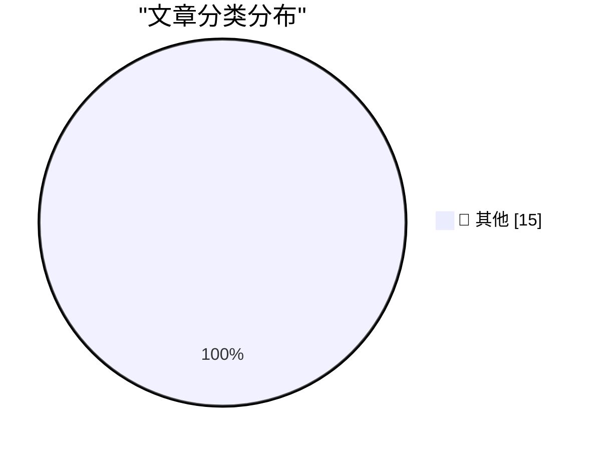

# 📰 AI 博客每日精选 — 2026-08-26

> 来自 Karpathy 推荐的 92 个顶级技术博客，AI 精选 Top 15

## 🏆 今日必读

🥇 **EVE Online: The Move to Python 3 Begins!**

[EVE Online: The Move to Python 3 Begins!](https://simonwillison.net/2026/Aug/25/eve-online-move-to-python-3/) — simonwillison.net · 1 小时前 · 📝 其他

> EVE Online: The Move to Python 3 Begins!

🥈 **llm-anthropic 0.27**

[llm-anthropic 0.27](https://simonwillison.net/2026/Aug/24/llm-anthropic/) — simonwillison.net · 1 天前 · 📝 其他

> llm-anthropic 0.27

🥉 **Your executable is a SQLite database**

[Your executable is a SQLite database](https://simonwillison.net/2026/Aug/24/your-executable-is-a-sqlite-database/) — simonwillison.net · 1 天前 · 📝 其他

> Your executable is a SQLite database

---

## 📊 数据概览

| 扫描源 | 抓取文章 | 时间范围 | 精选 |
|:---:|:---:|:---:|:---:|
| 81/92 | 2479 篇 → 37 篇 | 48h | **15 篇** |

### 分类分布

---

## 📝 其他

### 1. EVE Online: The Move to Python 3 Begins!

[EVE Online: The Move to Python 3 Begins!](https://simonwillison.net/2026/Aug/25/eve-online-move-to-python-3/) — **simonwillison.net** · 1 小时前 · ⭐ 15/30

> EVE Online: The Move to Python 3 Begins!

---

### 2. llm-anthropic 0.27

[llm-anthropic 0.27](https://simonwillison.net/2026/Aug/24/llm-anthropic/) — **simonwillison.net** · 1 天前 · ⭐ 15/30

> llm-anthropic 0.27

---

### 3. Your executable is a SQLite database

[Your executable is a SQLite database](https://simonwillison.net/2026/Aug/24/your-executable-is-a-sqlite-database/) — **simonwillison.net** · 1 天前 · ⭐ 15/30

> Your executable is a SQLite database

---

### 4. Debugging Ubiquiti's 5G Backup on AT&T

[Debugging Ubiquiti's 5G Backup on AT&T](https://www.jeffgeerling.com/blog/2026/unifi-u5g-backup-debugging/) — **jeffgeerling.com** · 5 小时前 · ⭐ 15/30

> Debugging Ubiquiti's 5G Backup on AT&T

---

### 5. XCancel, the Twitter/X Mirror, Shuts Down After Cease and Desist From the Fine Folks at X Corp

[XCancel, the Twitter/X Mirror, Shuts Down After Cease and Desist From the Fine Folks at X Corp](https://xcancel.com/) — **daringfireball.net** · 1 小时前 · ⭐ 15/30

> XCancel, the Twitter/X Mirror, Shuts Down After Cease and Desist From the Fine Folks at X Corp

---

### 6. Dolly Parton Dies at 80

[Dolly Parton Dies at 80](https://www.nytimes.com/2026/08/25/arts/music/dolly-parton-dead.html) — **daringfireball.net** · 1 小时前 · ⭐ 15/30

> Dolly Parton Dies at 80

---

### 7. Update Regarding the Base Prices of the M5 Max Mac Studio

[Update Regarding the Base Prices of the M5 Max Mac Studio](https://daringfireball.net/2026/08/configurations_and_pricing_for_new_mac_minis_and_mac_studios) — **daringfireball.net** · 2 小时前 · ⭐ 15/30

> Update Regarding the Base Prices of the M5 Max Mac Studio

---

### 8. Footnote Regarding the GDPR and Cookie Permission Prompts

[Footnote Regarding the GDPR and Cookie Permission Prompts](https://daringfireball.net/2026/08/what_is_the_point_of_the_dma#fn1-2026-08-24) — **daringfireball.net** · 8 小时前 · ⭐ 15/30

> Footnote Regarding the GDPR and Cookie Permission Prompts

---

### 9. ★ Memory and Storage Configurations and Pricing for the New Mac Minis (M6/M5 Pro) and Mac Studios (M5 Max/M5 Ultra)

[★ Memory and Storage Configurations and Pricing for the New Mac Minis (M6/M5 Pro) and Mac Studios (M5 Max/M5 Ultra)](https://daringfireball.net/2026/08/configurations_and_pricing_for_new_mac_minis_and_mac_studios) — **daringfireball.net** · 9 小时前 · ⭐ 15/30

> ★ Memory and Storage Configurations and Pricing for the New Mac Minis (M6/M5 Pro) and Mac Studios (M5 Max/M5 Ultra)

---

### 10. Apple Introduces M6 and M5 Ultra Chips, in New Mac Mini and Mac Studio

[Apple Introduces M6 and M5 Ultra Chips, in New Mac Mini and Mac Studio](https://www.apple.com/newsroom/2026/08/apple-introduces-m6-and-m5-ultra-for-a-big-leap-in-performance-and-ai-compute/) — **daringfireball.net** · 11 小时前 · ⭐ 15/30

> Apple Introduces M6 and M5 Ultra Chips, in New Mac Mini and Mac Studio

---

### 11. [Sponsor] Finalist 4: Inspired by Paper Day Planners

[[Sponsor] Finalist 4: Inspired by Paper Day Planners](https://www.finalist.works/?utm_source=df-aug-2026) — **daringfireball.net** · 1 天前 · ⭐ 15/30

> [Sponsor] Finalist 4: Inspired by Paper Day Planners

---

### 12. Apple Rethinks Plan to Merge ‘Hide My Email’ Domain Name With ‘Sign In With Apple’

[Apple Rethinks Plan to Merge ‘Hide My Email’ Domain Name With ‘Sign In With Apple’](https://developer.apple.com/news/?id=1ptvdtcm) — **daringfireball.net** · 1 天前 · ⭐ 15/30

> Apple Rethinks Plan to Merge ‘Hide My Email’ Domain Name With ‘Sign In With Apple’

---

### 13. ★ What Is the Point of the DMA?

[★ What Is the Point of the DMA?](https://daringfireball.net/2026/08/what_is_the_point_of_the_dma) — **daringfireball.net** · 1 天前 · ⭐ 15/30

> ★ What Is the Point of the DMA?

---

### 14. BitCam: The 1-Bit Camera App Turns 2.0

[BitCam: The 1-Bit Camera App Turns 2.0](https://bitcam-app.com/) — **daringfireball.net** · 1 天前 · ⭐ 15/30

> BitCam: The 1-Bit Camera App Turns 2.0

---

### 15. More on TestFlight’s Screwy Sort Order

[More on TestFlight’s Screwy Sort Order](https://daringfireball.net/2026/08/apple_testflight_list_sort_order) — **daringfireball.net** · 1 天前 · ⭐ 15/30

> More on TestFlight’s Screwy Sort Order

---

*生成于 2026-08-26 00:37 | 扫描 81 源 → 获取 2479 篇 → 精选 15 篇*
*基于 [Hacker News Popularity Contest 2025](https://refactoringenglish.com/tools/hn-popularity/) RSS 源列表，由 [Andrej Karpathy](https://x.com/karpathy) 推荐*
*由「懂点儿AI」制作，欢迎关注同名微信公众号获取更多 AI 实用技巧 💡*
