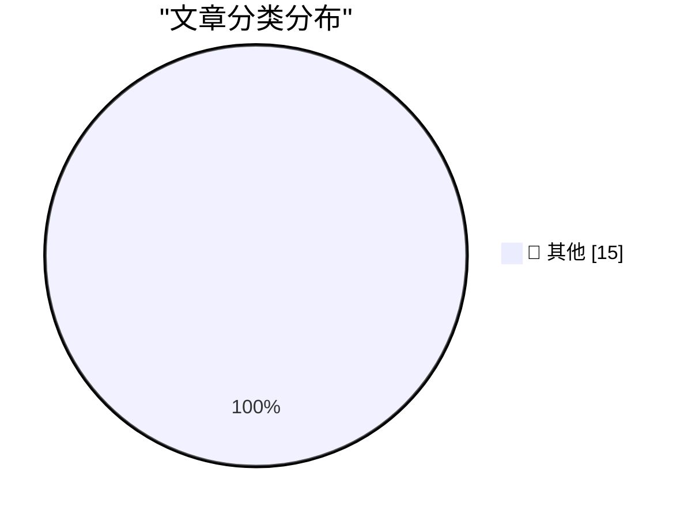

# 📰 AI 博客每日精选 — 2026-08-27

> 来自 Karpathy 推荐的 92 个顶级技术博客，AI 精选 Top 15

## 🏆 今日必读

🥇 **Qwen3.8-Flash-Next**

[Qwen3.8-Flash-Next](https://simonwillison.net/2026/Aug/26/qwen38-flash-next/) — simonwillison.net · 5 小时前 · 📝 其他

> Qwen3.8-Flash-Next

🥈 **Quoting Paul Dix**

[Quoting Paul Dix](https://simonwillison.net/2026/Aug/26/paul-dix/) — simonwillison.net · 21 小时前 · 📝 其他

> Quoting Paul Dix

🥉 **EVE Online: The Move to Python 3 Begins!**

[EVE Online: The Move to Python 3 Begins!](https://simonwillison.net/2026/Aug/25/eve-online-move-to-python-3/) — simonwillison.net · 1 天前 · 📝 其他

> EVE Online: The Move to Python 3 Begins!

---

## 📊 数据概览

| 扫描源 | 抓取文章 | 时间范围 | 精选 |
|:---:|:---:|:---:|:---:|
| 83/92 | 2532 篇 → 36 篇 | 48h | **15 篇** |

### 分类分布

---

## 📝 其他

### 1. Qwen3.8-Flash-Next

[Qwen3.8-Flash-Next](https://simonwillison.net/2026/Aug/26/qwen38-flash-next/) — **simonwillison.net** · 5 小时前 · ⭐ 15/30

> Qwen3.8-Flash-Next

---

### 2. Quoting Paul Dix

[Quoting Paul Dix](https://simonwillison.net/2026/Aug/26/paul-dix/) — **simonwillison.net** · 21 小时前 · ⭐ 15/30

> Quoting Paul Dix

---

### 3. EVE Online: The Move to Python 3 Begins!

[EVE Online: The Move to Python 3 Begins!](https://simonwillison.net/2026/Aug/25/eve-online-move-to-python-3/) — **simonwillison.net** · 1 天前 · ⭐ 15/30

> EVE Online: The Move to Python 3 Begins!

---

### 4. Debugging Ubiquiti's 5G Backup on AT&T

[Debugging Ubiquiti's 5G Backup on AT&T](https://www.jeffgeerling.com/blog/2026/unifi-u5g-backup-debugging/) — **jeffgeerling.com** · 1 天前 · ⭐ 15/30

> Debugging Ubiquiti's 5G Backup on AT&T

---

### 5. POSIWID: The Purpose of a System Is What It Does

[POSIWID: The Purpose of a System Is What It Does](https://en.wikipedia.org/wiki/The_purpose_of_a_system_is_what_it_does) — **daringfireball.net** · 9 小时前 · ⭐ 15/30

> POSIWID: The Purpose of a System Is What It Does

---

### 6. Apple’s Polishing Cloth Is Now Just $9

[Apple’s Polishing Cloth Is Now Just $9](https://9to5mac.com/2026/08/25/apple-releases-new-polishing-cloth-for-9/) — **daringfireball.net** · 10 小时前 · ⭐ 15/30

> Apple’s Polishing Cloth Is Now Just $9

---

### 7. ‘Surprise and Shine’ Apple Event: Wednesday 9 September

[‘Surprise and Shine’ Apple Event: Wednesday 9 September](https://9to5mac.com/2026/08/26/apple-officially-announces-iphone-18-pro-foldable-event/) — **daringfireball.net** · 10 小时前 · ⭐ 15/30

> ‘Surprise and Shine’ Apple Event: Wednesday 9 September

---

### 8. XCancel, the Twitter/X Mirror, Shuts Down After Cease and Desist From the Fine Folks at X Corp

[XCancel, the Twitter/X Mirror, Shuts Down After Cease and Desist From the Fine Folks at X Corp](https://xcancel.com/) — **daringfireball.net** · 1 天前 · ⭐ 15/30

> XCancel, the Twitter/X Mirror, Shuts Down After Cease and Desist From the Fine Folks at X Corp

---

### 9. Dolly Parton Dies at 80

[Dolly Parton Dies at 80](https://www.nytimes.com/2026/08/25/arts/music/dolly-parton-dead.html) — **daringfireball.net** · 1 天前 · ⭐ 15/30

> Dolly Parton Dies at 80

---

### 10. Update Regarding the Base Prices of the M5 Max Mac Studio

[Update Regarding the Base Prices of the M5 Max Mac Studio](https://daringfireball.net/2026/08/configurations_and_pricing_for_new_mac_minis_and_mac_studios) — **daringfireball.net** · 1 天前 · ⭐ 15/30

> Update Regarding the Base Prices of the M5 Max Mac Studio

---

### 11. Footnote Regarding the GDPR and Cookie Permission Prompts

[Footnote Regarding the GDPR and Cookie Permission Prompts](https://daringfireball.net/2026/08/what_is_the_point_of_the_dma#fn1-2026-08-24) — **daringfireball.net** · 1 天前 · ⭐ 15/30

> Footnote Regarding the GDPR and Cookie Permission Prompts

---

### 12. ★ Memory and Storage Configurations and Pricing for the New Mac Minis (M6/M5 Pro) and Mac Studios (M5 Max/M5 Ultra)

[★ Memory and Storage Configurations and Pricing for the New Mac Minis (M6/M5 Pro) and Mac Studios (M5 Max/M5 Ultra)](https://daringfireball.net/2026/08/configurations_and_pricing_for_new_mac_minis_and_mac_studios) — **daringfireball.net** · 1 天前 · ⭐ 15/30

> ★ Memory and Storage Configurations and Pricing for the New Mac Minis (M6/M5 Pro) and Mac Studios (M5 Max/M5 Ultra)

---

### 13. Apple Introduces M6 and M5 Ultra Chips, in New Mac Mini and Mac Studio

[Apple Introduces M6 and M5 Ultra Chips, in New Mac Mini and Mac Studio](https://www.apple.com/newsroom/2026/08/apple-introduces-m6-and-m5-ultra-for-a-big-leap-in-performance-and-ai-compute/) — **daringfireball.net** · 1 天前 · ⭐ 15/30

> Apple Introduces M6 and M5 Ultra Chips, in New Mac Mini and Mac Studio

---

### 14. Foot Guns for Sale

[Foot Guns for Sale](https://idiallo.com/blog/foot-gun-for-sale) — **idiallo.com** · 1 天前 · ⭐ 15/30

> Foot Guns for Sale

---

### 15. Pluralistic: The age of disinvention (25 Aug 2026)

[Pluralistic: The age of disinvention (25 Aug 2026)](https://pluralistic.net/2026/08/25/gammamax/) — **pluralistic.net** · 1 天前 · ⭐ 15/30

> Pluralistic: The age of disinvention (25 Aug 2026)

---

*生成于 2026-08-27 05:35 | 扫描 83 源 → 获取 2532 篇 → 精选 15 篇*
*基于 [Hacker News Popularity Contest 2025](https://refactoringenglish.com/tools/hn-popularity/) RSS 源列表，由 [Andrej Karpathy](https://x.com/karpathy) 推荐*
*由「懂点儿AI」制作，欢迎关注同名微信公众号获取更多 AI 实用技巧 💡*
