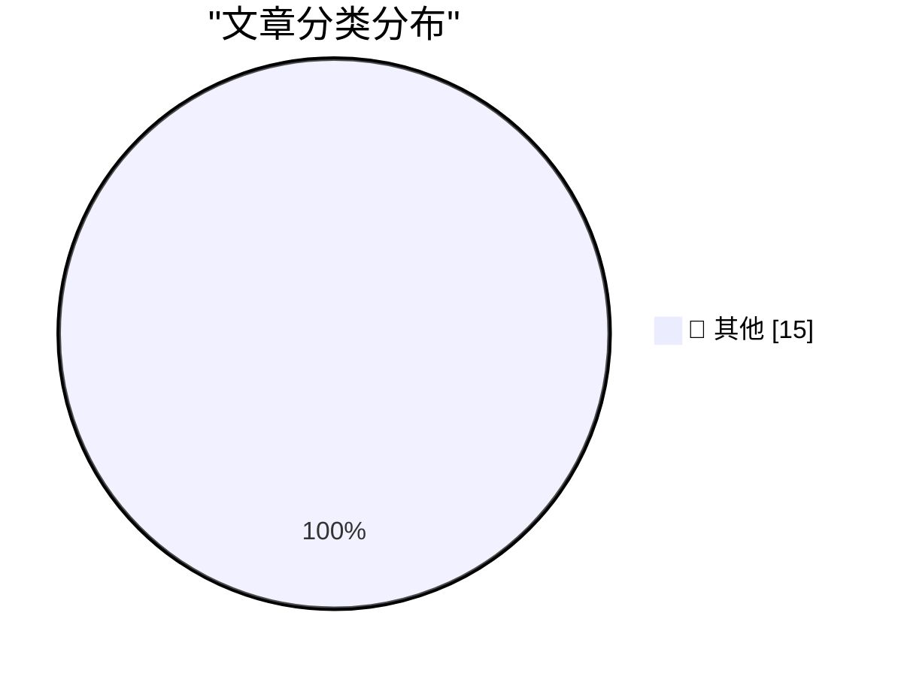

# 📰 AI 博客每日精选 — 2026-08-31

> 来自 Karpathy 推荐的 92 个顶级技术博客，AI 精选 Top 15

## 🏆 今日必读

🥇 **Understanding ChatGPT Work**

[Understanding ChatGPT Work](https://simonwillison.net/2026/Aug/30/understanding-chatgpt-work/) — simonwillison.net · 2 小时前 · 📝 其他

> Understanding ChatGPT Work

🥈 **Introducing Hy4 Preview**

[Introducing Hy4 Preview](https://simonwillison.net/2026/Aug/29/hy4/) — simonwillison.net · 1 天前 · 📝 其他

> Introducing Hy4 Preview

🥉 **Before NTP there were Time and Daytime**

[Before NTP there were Time and Daytime](https://www.jeffgeerling.com/blog/2026/rfc-867-868-time/) — jeffgeerling.com · 3 小时前 · 📝 其他

> Before NTP there were Time and Daytime

---

## 📊 数据概览

| 扫描源 | 抓取文章 | 时间范围 | 精选 |
|:---:|:---:|:---:|:---:|
| 83/92 | 2529 篇 → 20 篇 | 48h | **15 篇** |

### 分类分布

---

## 📝 其他

### 1. Understanding ChatGPT Work

[Understanding ChatGPT Work](https://simonwillison.net/2026/Aug/30/understanding-chatgpt-work/) — **simonwillison.net** · 2 小时前 · ⭐ 15/30

> Understanding ChatGPT Work

---

### 2. Introducing Hy4 Preview

[Introducing Hy4 Preview](https://simonwillison.net/2026/Aug/29/hy4/) — **simonwillison.net** · 1 天前 · ⭐ 15/30

> Introducing Hy4 Preview

---

### 3. Before NTP there were Time and Daytime

[Before NTP there were Time and Daytime](https://www.jeffgeerling.com/blog/2026/rfc-867-868-time/) — **jeffgeerling.com** · 3 小时前 · ⭐ 15/30

> Before NTP there were Time and Daytime

---

### 4. You have to beat the models at something

[You have to beat the models at something](https://seangoedecke.com/you-have-to-beat-the-models-at-something/) — **seangoedecke.com** · 1 天前 · ⭐ 15/30

> You have to beat the models at something

---

### 5. Finalist 4

[Finalist 4](https://www.finalist.works/?utm_source=df-aug-2026) — **daringfireball.net** · 7 小时前 · ⭐ 15/30

> Finalist 4

---

### 6. ★ Thoughts and Observations on Apple’s First Immersive MLB Broadcast, a Yankees 1-0 Win Over the Red Sox

[★ Thoughts and Observations on Apple’s First Immersive MLB Broadcast, a Yankees 1-0 Win Over the Red Sox](https://daringfireball.net/2026/08/thoughts_and_observations_apple_immersive_mlb_broadcast) — **daringfireball.net** · 1 天前 · ⭐ 15/30

> ★ Thoughts and Observations on Apple’s First Immersive MLB Broadcast, a Yankees 1-0 Win Over the Red Sox

---

### 7. New Pebble Weather App + Software Updates

[New Pebble Weather App + Software Updates](https://repebble.com/blog/new-pebble-weather-app-software-updates) — **ericmigi.com** · 1 天前 · ⭐ 15/30

> New Pebble Weather App + Software Updates

---

### 8. ActivityBot is the recipient of an NLnet grant!

[ActivityBot is the recipient of an NLnet grant!](https://shkspr.mobi/blog/2026/08/activitybot-is-the-recipient-of-an-nlnet-grant/) — **shkspr.mobi** · 14 小时前 · ⭐ 15/30

> ActivityBot is the recipient of an NLnet grant!

---

### 9. A simple "copy this code" button in JavaScript

[A simple "copy this code" button in JavaScript](https://shkspr.mobi/blog/2026/08/a-simple-copy-this-code-button-in-javascript/) — **shkspr.mobi** · 1 天前 · ⭐ 15/30

> A simple "copy this code" button in JavaScript

---

### 10. Cores in space: The core memory module from a 1980 Spacelab computer

[Cores in space: The core memory module from a 1980 Spacelab computer](http://www.righto.com/feeds/4645676918273740492/comments/default) — **righto.com** · 9 小时前 · ⭐ 15/30

> Cores in space: The core memory module from a 1980 Spacelab computer

---

### 11. Recreating a 2010 Experiment

[Recreating a 2010 Experiment](http://xania.org/202608/recreating-a-2010-experiment?utm_source=feed&amp;utm_medium=rss) — **xania.org** · 6 小时前 · ⭐ 15/30

> Recreating a 2010 Experiment

---

### 12. The Server Called Paranoia: Defend Autistici/Inventati

[The Server Called Paranoia: Defend Autistici/Inventati](https://micahflee.com/the-server-called-paranoia-defend-autistici-inventati/) — **micahflee.com** · 1 天前 · ⭐ 15/30

> The Server Called Paranoia: Defend Autistici/Inventati

---

### 13. This Week in Package Management: 29 August 2026

[This Week in Package Management: 29 August 2026](https://nesbitt.io/2026/08/29/this-week-in-package-management.html) — **nesbitt.io** · 1 天前 · ⭐ 15/30

> This Week in Package Management: 29 August 2026

---

### 14. Reading List 08/29/26

[Reading List 08/29/26](https://www.construction-physics.com/p/reading-list-082926) — **construction-physics.com** · 1 天前 · ⭐ 15/30

> Reading List 08/29/26

---

### 15. The Rise and Fall of Agent Civilizations

[The Rise and Fall of Agent Civilizations](https://www.dwarkesh.com/p/openai-huggingface) — **dwarkesh.com** · 1 天前 · ⭐ 15/30

> The Rise and Fall of Agent Civilizations

---

*生成于 2026-08-31 02:08 | 扫描 83 源 → 获取 2529 篇 → 精选 15 篇*
*基于 [Hacker News Popularity Contest 2025](https://refactoringenglish.com/tools/hn-popularity/) RSS 源列表，由 [Andrej Karpathy](https://x.com/karpathy) 推荐*
*由「懂点儿AI」制作，欢迎关注同名微信公众号获取更多 AI 实用技巧 💡*
