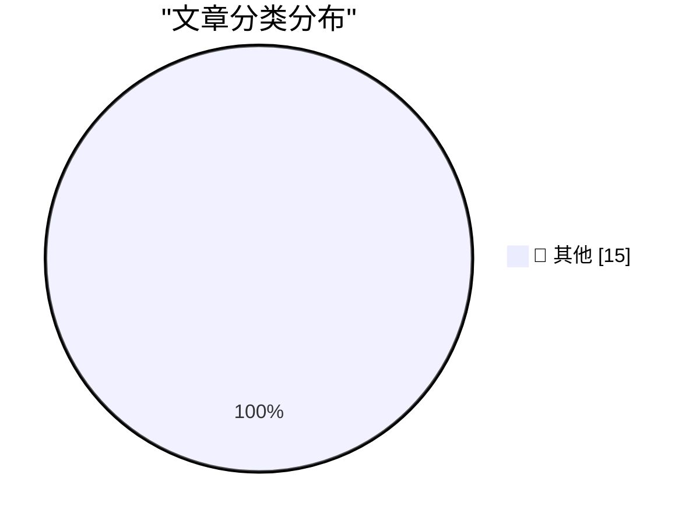

# 📰 AI 博客每日精选 — 2026-09-01

> 来自 Karpathy 推荐的 92 个顶级技术博客，AI 精选 Top 15

## 🏆 今日必读

🥇 **Introducing wrapture**

[Introducing wrapture](https://simonwillison.net/2026/Aug/31/introducing-wrapture/) — simonwillison.net · 2 小时前 · 📝 其他

> Introducing wrapture

🥈 **Quoting Andrew Digby**

[Quoting Andrew Digby](https://simonwillison.net/2026/Aug/31/andrew-digby/) — simonwillison.net · 4 小时前 · 📝 其他

> Quoting Andrew Digby

🥉 **Understanding ChatGPT Work**

[Understanding ChatGPT Work](https://simonwillison.net/2026/Aug/30/understanding-chatgpt-work/) — simonwillison.net · 1 天前 · 📝 其他

> Understanding ChatGPT Work

---

## 📊 数据概览

| 扫描源 | 抓取文章 | 时间范围 | 精选 |
|:---:|:---:|:---:|:---:|
| 82/92 | 2520 篇 → 20 篇 | 48h | **15 篇** |

### 分类分布

---

## 📝 其他

### 1. Introducing wrapture

[Introducing wrapture](https://simonwillison.net/2026/Aug/31/introducing-wrapture/) — **simonwillison.net** · 2 小时前 · ⭐ 15/30

> Introducing wrapture

---

### 2. Quoting Andrew Digby

[Quoting Andrew Digby](https://simonwillison.net/2026/Aug/31/andrew-digby/) — **simonwillison.net** · 4 小时前 · ⭐ 15/30

> Quoting Andrew Digby

---

### 3. Understanding ChatGPT Work

[Understanding ChatGPT Work](https://simonwillison.net/2026/Aug/30/understanding-chatgpt-work/) — **simonwillison.net** · 1 天前 · ⭐ 15/30

> Understanding ChatGPT Work

---

### 4. Before NTP there were Time and Daytime

[Before NTP there were Time and Daytime](https://www.jeffgeerling.com/blog/2026/rfc-867-868-time/) — **jeffgeerling.com** · 1 天前 · ⭐ 15/30

> Before NTP there were Time and Daytime

---

### 5. Finalist 4

[Finalist 4](https://www.finalist.works/?utm_source=df-aug-2026) — **daringfireball.net** · 1 天前 · ⭐ 15/30

> Finalist 4

---

### 6. Here's a good way to present AI videos

[Here's a good way to present AI videos](https://idiallo.com/blog/a-good-way-to-present-ai-videos-on-youtube) — **idiallo.com** · 18 小时前 · ⭐ 15/30

> Here's a good way to present AI videos

---

### 7. Review: Ruined Theatre's A Midsummer Night's Dream ★★★★☆

[Review: Ruined Theatre's A Midsummer Night's Dream ★★★★☆](https://shkspr.mobi/blog/2026/08/review-ruined-theatres-a-midsummer-nights-dream/) — **shkspr.mobi** · 14 小时前 · ⭐ 15/30

> Review: Ruined Theatre's A Midsummer Night's Dream ★★★★☆

---

### 8. ActivityBot is the recipient of an NLnet grant!

[ActivityBot is the recipient of an NLnet grant!](https://shkspr.mobi/blog/2026/08/activitybot-is-the-recipient-of-an-nlnet-grant/) — **shkspr.mobi** · 1 天前 · ⭐ 15/30

> ActivityBot is the recipient of an NLnet grant!

---

### 9. AWE does not require PAE, though PAE makes it much more useful

[AWE does not require PAE, though PAE makes it much more useful](https://devblogs.microsoft.com/oldnewthing/20260831-00/?p=112660) — **devblogs.microsoft.com/oldnewthing** · 12 小时前 · ⭐ 15/30

> AWE does not require PAE, though PAE makes it much more useful

---

### 10. Cores in space: The core memory module from a 1980 Spacelab computer

[Cores in space: The core memory module from a 1980 Spacelab computer](http://www.righto.com/feeds/4645676918273740492/comments/default) — **righto.com** · 1 天前 · ⭐ 15/30

> Cores in space: The core memory module from a 1980 Spacelab computer

---

### 11. Patented application of linear algebra

[Patented application of linear algebra](https://www.johndcook.com/blog/2026/08/31/patented-application-of-linear-algebra/) — **johndcook.com** · 3 小时前 · ⭐ 15/30

> Patented application of linear algebra

---

### 12. Cancelation Terminology

[Cancelation Terminology](https://matklad.github.io/2026/08/31/cancelation-terminology.html) — **matklad.github.io** · 1 天前 · ⭐ 15/30

> Cancelation Terminology

---

### 13. Notes from August 2026

[Notes from August 2026](https://evanhahn.com/notes-from-august-2026/) — **evanhahn.com** · 20 小时前 · ⭐ 15/30

> Notes from August 2026

---

### 14. Recreating a 2010 Experiment

[Recreating a 2010 Experiment](http://xania.org/202608/recreating-a-2010-experiment?utm_source=feed&amp;utm_medium=rss) — **xania.org** · 1 天前 · ⭐ 15/30

> Recreating a 2010 Experiment

---

### 15. The rise and fall of agent civilizations

[The rise and fall of agent civilizations](https://www.dwarkesh.com/p/openai-huggingface-narration) — **dwarkesh.com** · 5 小时前 · ⭐ 15/30

> The rise and fall of agent civilizations

---

*生成于 2026-09-01 02:29 | 扫描 82 源 → 获取 2520 篇 → 精选 15 篇*
*基于 [Hacker News Popularity Contest 2025](https://refactoringenglish.com/tools/hn-popularity/) RSS 源列表，由 [Andrej Karpathy](https://x.com/karpathy) 推荐*
*由「懂点儿AI」制作，欢迎关注同名微信公众号获取更多 AI 实用技巧 💡*
