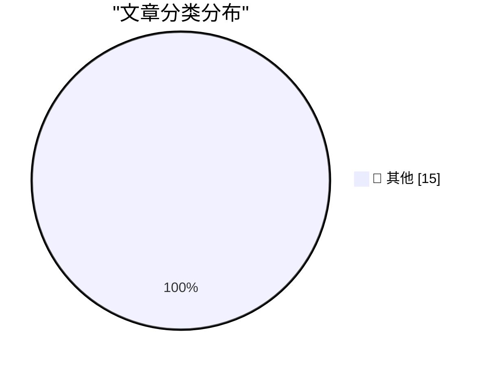

# 📰 AI 博客每日精选 — 2026-09-02

> 来自 Karpathy 推荐的 92 个顶级技术博客，AI 精选 Top 15

## 🏆 今日必读

🥇 **Claude Fable 5.1 made me a really nice animated pelican**

[Claude Fable 5.1 made me a really nice animated pelican](https://simonwillison.net/2026/Sep/1/claude-fable-5-1/) — simonwillison.net · 1 小时前 · 📝 其他

> Claude Fable 5.1 made me a really nice animated pelican

🥈 **Codex bundles LibreOffice**

[Codex bundles LibreOffice](https://simonwillison.net/2026/Sep/1/codex-libreoffice/) — simonwillison.net · 6 小时前 · 📝 其他

> Codex bundles LibreOffice

🥉 **GeoJSON Map Viewer**

[GeoJSON Map Viewer](https://simonwillison.net/2026/Sep/1/geojson/) — simonwillison.net · 7 小时前 · 📝 其他

> GeoJSON Map Viewer

---

## 📊 数据概览

| 扫描源 | 抓取文章 | 时间范围 | 精选 |
|:---:|:---:|:---:|:---:|
| 84/92 | 2548 篇 → 27 篇 | 48h | **15 篇** |

### 分类分布

---

## 📝 其他

### 1. Claude Fable 5.1 made me a really nice animated pelican

[Claude Fable 5.1 made me a really nice animated pelican](https://simonwillison.net/2026/Sep/1/claude-fable-5-1/) — **simonwillison.net** · 1 小时前 · ⭐ 15/30

> Claude Fable 5.1 made me a really nice animated pelican

---

### 2. Codex bundles LibreOffice

[Codex bundles LibreOffice](https://simonwillison.net/2026/Sep/1/codex-libreoffice/) — **simonwillison.net** · 6 小时前 · ⭐ 15/30

> Codex bundles LibreOffice

---

### 3. GeoJSON Map Viewer

[GeoJSON Map Viewer](https://simonwillison.net/2026/Sep/1/geojson/) — **simonwillison.net** · 7 小时前 · ⭐ 15/30

> GeoJSON Map Viewer

---

### 4. Quoting Tarn Adams

[Quoting Tarn Adams](https://simonwillison.net/2026/Sep/1/tarn-adams/) — **simonwillison.net** · 8 小时前 · ⭐ 15/30

> Quoting Tarn Adams

---

### 5. Python 3.15.0 candidate 2 is here!

[Python 3.15.0 candidate 2 is here!](https://simonwillison.net/2026/Sep/1/python-315-rc-2/) — **simonwillison.net** · 10 小时前 · ⭐ 15/30

> Python 3.15.0 candidate 2 is here!

---

### 6. Introducing wrapture

[Introducing wrapture](https://simonwillison.net/2026/Aug/31/introducing-wrapture/) — **simonwillison.net** · 1 天前 · ⭐ 15/30

> Introducing wrapture

---

### 7. Quoting Andrew Digby

[Quoting Andrew Digby](https://simonwillison.net/2026/Aug/31/andrew-digby/) — **simonwillison.net** · 1 天前 · ⭐ 15/30

> Quoting Andrew Digby

---

### 8. FBI Probes Service Selling 153M+ Drivers Licenses

[FBI Probes Service Selling 153M+ Drivers Licenses](https://krebsonsecurity.com/2026/09/fbi-probes-service-selling-153m-drivers-licenses/) — **krebsonsecurity.com** · 3 小时前 · ⭐ 15/30

> FBI Probes Service Selling 153M+ Drivers Licenses

---

### 9. Tim Cook’s Departure Memo on His Last Day as CEO

[Tim Cook’s Departure Memo on His Last Day as CEO](https://9to5mac.com/2026/08/31/read-tim-cooks-full-memo-to-apple-employees-on-his-last-day-as-ceo/) — **daringfireball.net** · 7 小时前 · ⭐ 15/30

> Tim Cook’s Departure Memo on His Last Day as CEO

---

### 10. Apple Reveals Forensic Evidence From Chang Liu’s MacBook in OpenAI Lawsuit

[Apple Reveals Forensic Evidence From Chang Liu’s MacBook in OpenAI Lawsuit](https://9to5mac.com/2026/08/31/apple-openai-forensic-macbook-evidence/) — **daringfireball.net** · 8 小时前 · ⭐ 15/30

> Apple Reveals Forensic Evidence From Chang Liu’s MacBook in OpenAI Lawsuit

---

### 11. [Sponsor] WorkOS: How to Give an Agent a Task Instead of a Token

[[Sponsor] WorkOS: How to Give an Agent a Task Instead of a Token](https://workos.com/blog/delegated-access-for-ai-agents?utm_source=daringfireball&amp;utm_medium=newsletter&amp;utm_campaign=q32026) — **daringfireball.net** · 17 小时前 · ⭐ 15/30

> [Sponsor] WorkOS: How to Give an Agent a Task Instead of a Token

---

### 12. Here's a good way to present AI videos

[Here's a good way to present AI videos](https://idiallo.com/blog/a-good-way-to-present-ai-videos-on-youtube) — **idiallo.com** · 1 天前 · ⭐ 15/30

> Here's a good way to present AI videos

---

### 13. Book Review: ActivityPub by Evan Prodromou ★★★★⯪

[Book Review: ActivityPub by Evan Prodromou ★★★★⯪](https://shkspr.mobi/blog/2026/09/book-review-activitypub-by-evan-prodromou/) — **shkspr.mobi** · 14 小时前 · ⭐ 15/30

> Book Review: ActivityPub by Evan Prodromou ★★★★⯪

---

### 14. Review: Ruined Theatre's A Midsummer Night's Dream ★★★★☆

[Review: Ruined Theatre's A Midsummer Night's Dream ★★★★☆](https://shkspr.mobi/blog/2026/08/review-ruined-theatres-a-midsummer-nights-dream/) — **shkspr.mobi** · 1 天前 · ⭐ 15/30

> Review: Ruined Theatre's A Midsummer Night's Dream ★★★★☆

---

### 15. AWE does not require PAE, though PAE makes it much more useful

[AWE does not require PAE, though PAE makes it much more useful](https://devblogs.microsoft.com/oldnewthing/20260831-00/?p=112660) — **devblogs.microsoft.com/oldnewthing** · 1 天前 · ⭐ 15/30

> AWE does not require PAE, though PAE makes it much more useful

---

*生成于 2026-09-02 01:49 | 扫描 84 源 → 获取 2548 篇 → 精选 15 篇*
*基于 [Hacker News Popularity Contest 2025](https://refactoringenglish.com/tools/hn-popularity/) RSS 源列表，由 [Andrej Karpathy](https://x.com/karpathy) 推荐*
*由「懂点儿AI」制作，欢迎关注同名微信公众号获取更多 AI 实用技巧 💡*
