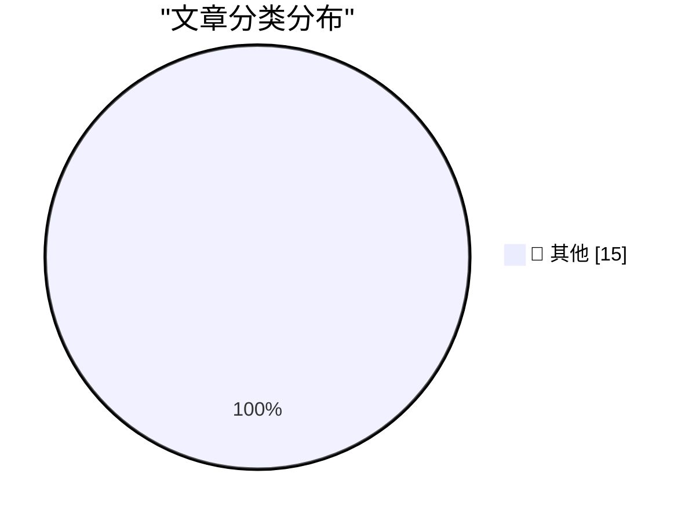

# 📰 AI 博客每日精选 — 2026-09-09

> 来自 Karpathy 推荐的 92 个顶级技术博客，AI 精选 Top 15

## 🏆 今日必读

🥇 **Quoting Terence Tao**

[Quoting Terence Tao](https://simonwillison.net/2026/Sep/9/terence-tao/) — simonwillison.net · 1 小时前 · 📝 其他

> Quoting Terence Tao

🥈 **On the Navier–Stokes Millennium Prize Problem**

[On the Navier–Stokes Millennium Prize Problem](https://simonwillison.net/2026/Sep/8/on-navier-stokes/) — simonwillison.net · 2 小时前 · 📝 其他

> On the Navier–Stokes Millennium Prize Problem

🥉 **Introducing ChatGPT Images 2.5**

[Introducing ChatGPT Images 2.5](https://simonwillison.net/2026/Sep/8/introducing-chatgpt-images-25/) — simonwillison.net · 3 小时前 · 📝 其他

> Introducing ChatGPT Images 2.5

---

## 📊 数据概览

| 扫描源 | 抓取文章 | 时间范围 | 精选 |
|:---:|:---:|:---:|:---:|
| 82/92 | 2499 篇 → 35 篇 | 48h | **15 篇** |

### 分类分布

---

## 📝 其他

### 1. Quoting Terence Tao

[Quoting Terence Tao](https://simonwillison.net/2026/Sep/9/terence-tao/) — **simonwillison.net** · 1 小时前 · ⭐ 15/30

> Quoting Terence Tao

---

### 2. On the Navier–Stokes Millennium Prize Problem

[On the Navier–Stokes Millennium Prize Problem](https://simonwillison.net/2026/Sep/8/on-navier-stokes/) — **simonwillison.net** · 2 小时前 · ⭐ 15/30

> On the Navier–Stokes Millennium Prize Problem

---

### 3. Introducing ChatGPT Images 2.5

[Introducing ChatGPT Images 2.5](https://simonwillison.net/2026/Sep/8/introducing-chatgpt-images-25/) — **simonwillison.net** · 3 小时前 · ⭐ 15/30

> Introducing ChatGPT Images 2.5

---

### 4. llm 0.35

[llm 0.35](https://simonwillison.net/2026/Sep/7/llm/) — **simonwillison.net** · 1 天前 · ⭐ 15/30

> llm 0.35

---

### 5. Creepy crawlies

[Creepy crawlies](https://simonwillison.net/2026/Sep/7/creepy-crawlies/) — **simonwillison.net** · 1 天前 · ⭐ 15/30

> Creepy crawlies

---

### 6. Quoting Jakub Pachocki

[Quoting Jakub Pachocki](https://simonwillison.net/2026/Sep/7/jakub-pachocki/) — **simonwillison.net** · 1 天前 · ⭐ 15/30

> Quoting Jakub Pachocki

---

### 7. Video compressor

[Video compressor](https://simonwillison.net/2026/Sep/7/video-compressor/) — **simonwillison.net** · 1 天前 · ⭐ 15/30

> Video compressor

---

### 8. Mercator ↔ Equal Earth

[Mercator ↔ Equal Earth](https://simonwillison.net/2026/Sep/7/equal-earth/) — **simonwillison.net** · 1 天前 · ⭐ 15/30

> Mercator ↔ Equal Earth

---

### 9. OpenNMC is an open replacement for expensive APC management cards

[OpenNMC is an open replacement for expensive APC management cards](https://www.jeffgeerling.com/blog/2026/opennmc-apc-ups-replacement-card/) — **jeffgeerling.com** · 10 小时前 · ⭐ 15/30

> OpenNMC is an open replacement for expensive APC management cards

---

### 10. Automatically detecting AI text in my browser

[Automatically detecting AI text in my browser](https://seangoedecke.com/deckard/) — **seangoedecke.com** · 1 天前 · ⭐ 15/30

> Automatically detecting AI text in my browser

---

### 11. Microsoft Plugs Nearly 1,000 Security Holes

[Microsoft Plugs Nearly 1,000 Security Holes](https://krebsonsecurity.com/2026/09/microsoft-plugs-nearly-1000-security-holes/) — **krebsonsecurity.com** · 4 小时前 · ⭐ 15/30

> Microsoft Plugs Nearly 1,000 Security Holes

---

### 12. ★ The iPhone Air and iPhone 17 Pro

[★ The iPhone Air and iPhone 17 Pro](https://daringfireball.net/2026/09/the_iphone_air_and_iphone_17_pro) — **daringfireball.net** · 1 小时前 · ⭐ 15/30

> ★ The iPhone Air and iPhone 17 Pro

---

### 13. ‘Modern Day Typographer’

[‘Modern Day Typographer’](https://www.youtube.com/watch?v=0Ck-NPqf2c8) — **daringfireball.net** · 3 小时前 · ⭐ 15/30

> ‘Modern Day Typographer’

---

### 14. ★ SuperDuper 4

[★ SuperDuper 4](https://daringfireball.net/2026/09/superduper_4) — **daringfireball.net** · 11 小时前 · ⭐ 15/30

> ★ SuperDuper 4

---

### 15. [Sponsor] Glyphs 4

[[Sponsor] Glyphs 4](https://glyphsapp.com/) — **daringfireball.net** · 1 天前 · ⭐ 15/30

> [Sponsor] Glyphs 4

---

*生成于 2026-09-09 02:00 | 扫描 82 源 → 获取 2499 篇 → 精选 15 篇*
*基于 [Hacker News Popularity Contest 2025](https://refactoringenglish.com/tools/hn-popularity/) RSS 源列表，由 [Andrej Karpathy](https://x.com/karpathy) 推荐*
*由「懂点儿AI」制作，欢迎关注同名微信公众号获取更多 AI 实用技巧 💡*
