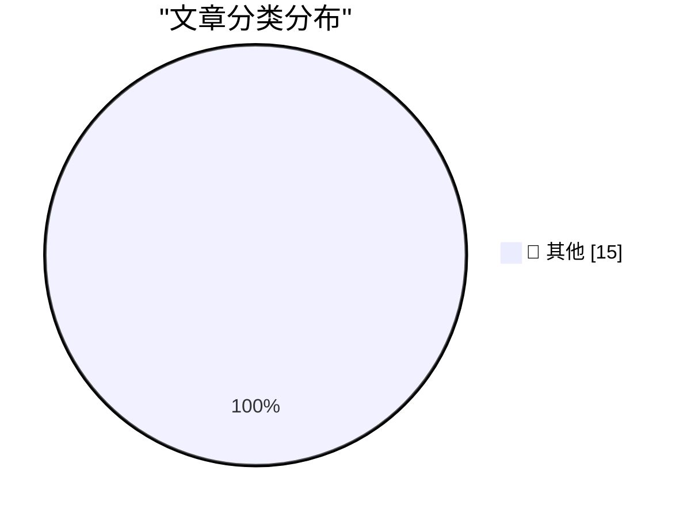

# 📰 AI 博客每日精选 — 2026-09-10

> 来自 Karpathy 推荐的 92 个顶级技术博客，AI 精选 Top 15

## 🏆 今日必读

🥇 **Quoting Calif Research**

[Quoting Calif Research](https://simonwillison.net/2026/Sep/10/calif-research/) — simonwillison.net · 1 小时前 · 📝 其他

> Quoting Calif Research

🥈 **.blend URL Viewer**

[.blend URL Viewer](https://simonwillison.net/2026/Sep/9/blender-viewer/) — simonwillison.net · 1 小时前 · 📝 其他

> .blend URL Viewer

🥉 **Quoting Terence Tao**

[Quoting Terence Tao](https://simonwillison.net/2026/Sep/9/terence-tao/) — simonwillison.net · 1 天前 · 📝 其他

> Quoting Terence Tao

---

## 📊 数据概览

| 扫描源 | 抓取文章 | 时间范围 | 精选 |
|:---:|:---:|:---:|:---:|
| 82/92 | 2499 篇 → 28 篇 | 48h | **15 篇** |

### 分类分布

---

## 📝 其他

### 1. Quoting Calif Research

[Quoting Calif Research](https://simonwillison.net/2026/Sep/10/calif-research/) — **simonwillison.net** · 1 小时前 · ⭐ 15/30

> Quoting Calif Research

---

### 2. .blend URL Viewer

[.blend URL Viewer](https://simonwillison.net/2026/Sep/9/blender-viewer/) — **simonwillison.net** · 1 小时前 · ⭐ 15/30

> .blend URL Viewer

---

### 3. Quoting Terence Tao

[Quoting Terence Tao](https://simonwillison.net/2026/Sep/9/terence-tao/) — **simonwillison.net** · 1 天前 · ⭐ 15/30

> Quoting Terence Tao

---

### 4. On the Navier–Stokes Millennium Prize Problem

[On the Navier–Stokes Millennium Prize Problem](https://simonwillison.net/2026/Sep/8/on-navier-stokes/) — **simonwillison.net** · 1 天前 · ⭐ 15/30

> On the Navier–Stokes Millennium Prize Problem

---

### 5. Introducing ChatGPT Images 2.5

[Introducing ChatGPT Images 2.5](https://simonwillison.net/2026/Sep/8/introducing-chatgpt-images-25/) — **simonwillison.net** · 1 天前 · ⭐ 15/30

> Introducing ChatGPT Images 2.5

---

### 6. OpenNMC is an open replacement for expensive APC management cards

[OpenNMC is an open replacement for expensive APC management cards](https://www.jeffgeerling.com/blog/2026/opennmc-apc-ups-replacement-card/) — **jeffgeerling.com** · 1 天前 · ⭐ 15/30

> OpenNMC is an open replacement for expensive APC management cards

---

### 7. Why we should anthropomorphize AI agents

[Why we should anthropomorphize AI agents](https://seangoedecke.com/why-we-should-anthropomorphize-ai-agents/) — **seangoedecke.com** · 1 天前 · ⭐ 15/30

> Why we should anthropomorphize AI agents

---

### 8. Microsoft Plugs Nearly 1,000 Security Holes

[Microsoft Plugs Nearly 1,000 Security Holes](https://krebsonsecurity.com/2026/09/microsoft-plugs-nearly-1000-security-holes/) — **krebsonsecurity.com** · 1 天前 · ⭐ 15/30

> Microsoft Plugs Nearly 1,000 Security Holes

---

### 9. ★ The iPhone Air and iPhone 17 Pro

[★ The iPhone Air and iPhone 17 Pro](https://daringfireball.net/2026/09/the_iphone_air_and_iphone_17_pro) — **daringfireball.net** · 1 天前 · ⭐ 15/30

> ★ The iPhone Air and iPhone 17 Pro

---

### 10. ‘Modern Day Typographer’

[‘Modern Day Typographer’](https://www.youtube.com/watch?v=0Ck-NPqf2c8) — **daringfireball.net** · 1 天前 · ⭐ 15/30

> ‘Modern Day Typographer’

---

### 11. ★ SuperDuper 4

[★ SuperDuper 4](https://daringfireball.net/2026/09/superduper_4) — **daringfireball.net** · 1 天前 · ⭐ 15/30

> ★ SuperDuper 4

---

### 12. We own the Glass

[We own the Glass](https://idiallo.com/byte-size/) — **idiallo.com** · 5 小时前 · ⭐ 15/30

> We own the Glass

---

### 13. Pluralistic: Anti-vax/anti-trust (09 Sep 2026)

[Pluralistic: Anti-vax/anti-trust (09 Sep 2026)](https://pluralistic.net/2026/09/09/when-it-dont-rain/) — **pluralistic.net** · 15 小时前 · ⭐ 15/30

> Pluralistic: Anti-vax/anti-trust (09 Sep 2026)

---

### 14. ActivityPub - Is it worth defending against replay attacks and message/signature time skew?

[ActivityPub - Is it worth defending against replay attacks and message/signature time skew?](https://shkspr.mobi/blog/2026/09/activitypub-is-it-worth-defending-against-replay-attacks-and-message-signature-time-skew/) — **shkspr.mobi** · 1 天前 · ⭐ 15/30

> ActivityPub - Is it worth defending against replay attacks and message/signature time skew?

---

### 15. A sample use of the winstart.bat file in Windows 95

[A sample use of the winstart.bat file in Windows 95](https://devblogs.microsoft.com/oldnewthing/20260908-00/?p=112679) — **devblogs.microsoft.com/oldnewthing** · 1 天前 · ⭐ 15/30

> A sample use of the winstart.bat file in Windows 95

---

*生成于 2026-09-10 01:56 | 扫描 82 源 → 获取 2499 篇 → 精选 15 篇*
*基于 [Hacker News Popularity Contest 2025](https://refactoringenglish.com/tools/hn-popularity/) RSS 源列表，由 [Andrej Karpathy](https://x.com/karpathy) 推荐*
*由「懂点儿AI」制作，欢迎关注同名微信公众号获取更多 AI 实用技巧 💡*
