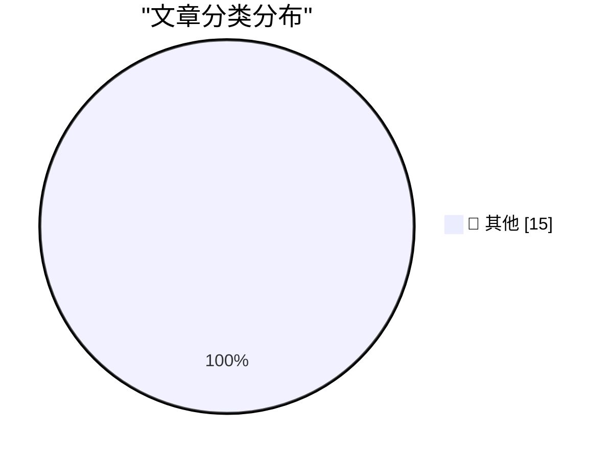

# 📰 AI 博客每日精选 — 2026-09-11

> 来自 Karpathy 推荐的 92 个顶级技术博客，AI 精选 Top 15

## 🏆 今日必读

🥇 **Any Nix package, live in your browser**

[Any Nix package, live in your browser](https://simonwillison.net/2026/Sep/10/trynix/) — simonwillison.net · 2 小时前 · 📝 其他

> Any Nix package, live in your browser

🥈 **Native is now the future of mobile at Shopify**

[Native is now the future of mobile at Shopify](https://simonwillison.net/2026/Sep/10/shopify-react-native/) — simonwillison.net · 4 小时前 · 📝 其他

> Native is now the future of mobile at Shopify

🥉 **Quoting Calif Research**

[Quoting Calif Research](https://simonwillison.net/2026/Sep/10/calif-research/) — simonwillison.net · 1 天前 · 📝 其他

> Quoting Calif Research

---

## 📊 数据概览

| 扫描源 | 抓取文章 | 时间范围 | 精选 |
|:---:|:---:|:---:|:---:|
| 84/92 | 2554 篇 → 24 篇 | 48h | **15 篇** |

### 分类分布

---

## 📝 其他

### 1. Any Nix package, live in your browser

[Any Nix package, live in your browser](https://simonwillison.net/2026/Sep/10/trynix/) — **simonwillison.net** · 2 小时前 · ⭐ 15/30

> Any Nix package, live in your browser

---

### 2. Native is now the future of mobile at Shopify

[Native is now the future of mobile at Shopify](https://simonwillison.net/2026/Sep/10/shopify-react-native/) — **simonwillison.net** · 4 小时前 · ⭐ 15/30

> Native is now the future of mobile at Shopify

---

### 3. Quoting Calif Research

[Quoting Calif Research](https://simonwillison.net/2026/Sep/10/calif-research/) — **simonwillison.net** · 1 天前 · ⭐ 15/30

> Quoting Calif Research

---

### 4. .blend URL Viewer

[.blend URL Viewer](https://simonwillison.net/2026/Sep/9/blender-viewer/) — **simonwillison.net** · 1 天前 · ⭐ 15/30

> .blend URL Viewer

---

### 5. They really do think AI might kill everyone

[They really do think AI might kill everyone](https://seangoedecke.com/they-really-do-think-ai-might-kill-everyone/) — **seangoedecke.com** · 1 天前 · ⭐ 15/30

> They really do think AI might kill everyone

---

### 6. Apple’s OS 27 Updates Will Be Released on Monday, 14 September

[Apple’s OS 27 Updates Will Be Released on Monday, 14 September](https://9to5mac.com/2026/09/09/apple-confirms-macos-27-golden-gate-launch-date-september-14/) — **daringfireball.net** · 5 小时前 · ⭐ 15/30

> Apple’s OS 27 Updates Will Be Released on Monday, 14 September

---

### 7. Joanna Stern on the iPhone Duo

[Joanna Stern on the iPhone Duo](https://youtu.be/VNzl-q0EGfg) — **daringfireball.net** · 8 小时前 · ⭐ 15/30

> Joanna Stern on the iPhone Duo

---

### 8. We own the Glass

[We own the Glass](https://idiallo.com/byte-size/) — **idiallo.com** · 1 天前 · ⭐ 15/30

> We own the Glass

---

### 9. Pluralistic: Anti-vax/anti-trust (09 Sep 2026)

[Pluralistic: Anti-vax/anti-trust (09 Sep 2026)](https://pluralistic.net/2026/09/09/when-it-dont-rain/) — **pluralistic.net** · 1 天前 · ⭐ 15/30

> Pluralistic: Anti-vax/anti-trust (09 Sep 2026)

---

### 10. Put an AV test at the start of your slides

[Put an AV test at the start of your slides](https://shkspr.mobi/blog/2026/09/put-an-av-test-at-the-start-of-your-slides/) — **shkspr.mobi** · 14 小时前 · ⭐ 15/30

> Put an AV test at the start of your slides

---

### 11. What algorithm did Windows XP use to choose your initial user picture?

[What algorithm did Windows XP use to choose your initial user picture?](https://devblogs.microsoft.com/oldnewthing/20260909-00/?p=112683) — **devblogs.microsoft.com/oldnewthing** · 1 天前 · ⭐ 15/30

> What algorithm did Windows XP use to choose your initial user picture?

---

### 12. Bayesian OCR

[Bayesian OCR](https://www.johndcook.com/blog/2026/09/10/bayesian-ocr/) — **johndcook.com** · 13 小时前 · ⭐ 15/30

> Bayesian OCR

---

### 13. A 50-year-old computer-assisted proof

[A 50-year-old computer-assisted proof](https://www.johndcook.com/blog/2026/09/09/four-colors/) — **johndcook.com** · 1 天前 · ⭐ 15/30

> A 50-year-old computer-assisted proof

---

### 14. AI is an intelligence multiplier

[AI is an intelligence multiplier](https://www.johndcook.com/blog/2026/09/09/ai-multiplier/) — **johndcook.com** · 1 天前 · ⭐ 15/30

> AI is an intelligence multiplier

---

### 15. The part of Navier-Stokes no one is talking about

[The part of Navier-Stokes no one is talking about](https://www.johndcook.com/blog/2026/09/09/formal-method-revolution/) — **johndcook.com** · 1 天前 · ⭐ 15/30

> The part of Navier-Stokes no one is talking about

---

*生成于 2026-09-11 01:54 | 扫描 84 源 → 获取 2554 篇 → 精选 15 篇*
*基于 [Hacker News Popularity Contest 2025](https://refactoringenglish.com/tools/hn-popularity/) RSS 源列表，由 [Andrej Karpathy](https://x.com/karpathy) 推荐*
*由「懂点儿AI」制作，欢迎关注同名微信公众号获取更多 AI 实用技巧 💡*
