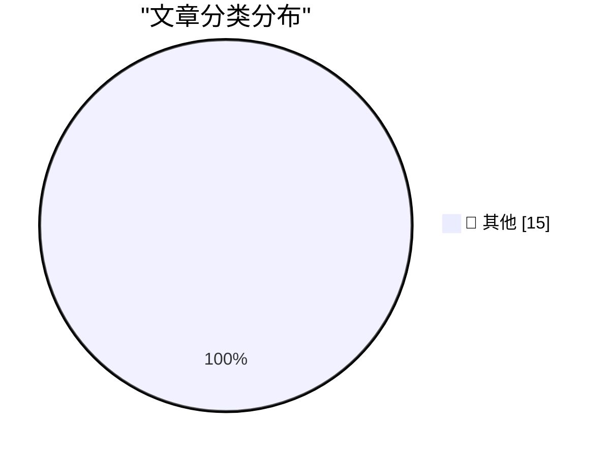

# 📰 AI 博客每日精选 — 2026-09-13

> 来自 Karpathy 推荐的 92 个顶级技术博客，AI 精选 Top 15

## 🏆 今日必读

🥇 **Generating running routes with GPT-6 Astra and ChatGPT Work**

[Generating running routes with GPT-6 Astra and ChatGPT Work](https://simonwillison.net/2026/Sep/12/astra-running-routes/) — simonwillison.net · 1 小时前 · 📝 其他

> Generating running routes with GPT-6 Astra and ChatGPT Work

🥈 **California Brown Pelican**

[California Brown Pelican](https://simonwillison.net/2026/Sep/12/sighting-399708714/) — simonwillison.net · 4 小时前 · 📝 其他

> California Brown Pelican

🥉 **Quoting Paul Ford**

[Quoting Paul Ford](https://simonwillison.net/2026/Sep/12/paul-ford/) — simonwillison.net · 7 小时前 · 📝 其他

> Quoting Paul Ford

---

## 📊 数据概览

| 扫描源 | 抓取文章 | 时间范围 | 精选 |
|:---:|:---:|:---:|:---:|
| 83/92 | 2524 篇 → 43 篇 | 48h | **15 篇** |

### 分类分布

---

## 📝 其他

### 1. Generating running routes with GPT-6 Astra and ChatGPT Work

[Generating running routes with GPT-6 Astra and ChatGPT Work](https://simonwillison.net/2026/Sep/12/astra-running-routes/) — **simonwillison.net** · 1 小时前 · ⭐ 15/30

> Generating running routes with GPT-6 Astra and ChatGPT Work

---

### 2. California Brown Pelican

[California Brown Pelican](https://simonwillison.net/2026/Sep/12/sighting-399708714/) — **simonwillison.net** · 4 小时前 · ⭐ 15/30

> California Brown Pelican

---

### 3. Quoting Paul Ford

[Quoting Paul Ford](https://simonwillison.net/2026/Sep/12/paul-ford/) — **simonwillison.net** · 7 小时前 · ⭐ 15/30

> Quoting Paul Ford

---

### 4. OpenAI agents attacked RubyGems back in May

[OpenAI agents attacked RubyGems back in May](https://simonwillison.net/2026/Sep/12/openai-agents-rubygems/) — **simonwillison.net** · 1 天前 · ⭐ 15/30

> OpenAI agents attacked RubyGems back in May

---

### 5. So you want to use OpenRouter?

[So you want to use OpenRouter?](https://simonwillison.net/2026/Sep/11/so-you-want-to-use-openrouter/) — **simonwillison.net** · 1 天前 · ⭐ 15/30

> So you want to use OpenRouter?

---

### 6. Quoting Boris Cherny

[Quoting Boris Cherny](https://simonwillison.net/2026/Sep/11/boris-cherny/) — **simonwillison.net** · 1 天前 · ⭐ 15/30

> Quoting Boris Cherny

---

### 7. Feeling sad about AI

[Feeling sad about AI](https://simonwillison.net/2026/Sep/11/feeling-sad-about-ai/) — **simonwillison.net** · 1 天前 · ⭐ 15/30

> Feeling sad about AI

---

### 8. Quoting huggingface.co/security.txt

[Quoting huggingface.co/security.txt](https://simonwillison.net/2026/Sep/11/hugging-face-security/) — **simonwillison.net** · 1 天前 · ⭐ 15/30

> Quoting huggingface.co/security.txt

---

### 9. Soft-deprecating re.match()

[Soft-deprecating re.match()](https://simonwillison.net/2026/Sep/11/soft-deprecating-re-match/) — **simonwillison.net** · 1 天前 · ⭐ 15/30

> Soft-deprecating re.match()

---

### 10. Don't sleep on wrapture

[Don't sleep on wrapture](https://simonwillison.net/2026/Sep/11/wrapture/) — **simonwillison.net** · 1 天前 · ⭐ 15/30

> Don't sleep on wrapture

---

### 11. Datasette 1.0a39 and 0.65.4 security releases

[Datasette 1.0a39 and 0.65.4 security releases](https://simonwillison.net/2026/Sep/11/datasette-security/) — **simonwillison.net** · 1 天前 · ⭐ 15/30

> Datasette 1.0a39 and 0.65.4 security releases

---

### 12. datasette-publish-fly 1.4

[datasette-publish-fly 1.4](https://simonwillison.net/2026/Sep/11/datasette-publish-fly/) — **simonwillison.net** · 1 天前 · ⭐ 15/30

> datasette-publish-fly 1.4

---

### 13. AI is breaking our proxies for expertise

[AI is breaking our proxies for expertise](https://seangoedecke.com/ai-is-breaking-our-proxies-for-expertise/) — **seangoedecke.com** · 1 小时前 · ⭐ 15/30

> AI is breaking our proxies for expertise

---

### 14. Don't build tools for AI agents

[Don't build tools for AI agents](https://seangoedecke.com/dont-build-tools-for-ai-agents/) — **seangoedecke.com** · 1 天前 · ⭐ 15/30

> Don't build tools for AI agents

---

### 15. Unread 5.0

[Unread 5.0](https://www.goldenhillsoftware.com/2026/09/unread-50/) — **daringfireball.net** · 6 小时前 · ⭐ 15/30

> Unread 5.0

---

*生成于 2026-09-13 01:53 | 扫描 83 源 → 获取 2524 篇 → 精选 15 篇*
*基于 [Hacker News Popularity Contest 2025](https://refactoringenglish.com/tools/hn-popularity/) RSS 源列表，由 [Andrej Karpathy](https://x.com/karpathy) 推荐*
*由「懂点儿AI」制作，欢迎关注同名微信公众号获取更多 AI 实用技巧 💡*
