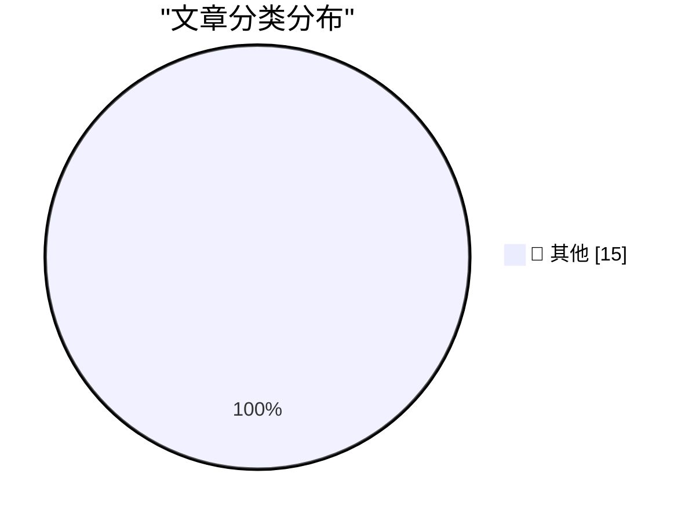

# 📰 AI 博客每日精选 — 2026-09-14

> 来自 Karpathy 推荐的 92 个顶级技术博客，AI 精选 Top 15

## 🏆 今日必读

🥇 **commit-rewriter 0.1**

[commit-rewriter 0.1](https://simonwillison.net/2026/Sep/14/commit-rewriter/) — simonwillison.net · 1 小时前 · 📝 其他

> commit-rewriter 0.1

🥈 **shot-scraper 1.12**

[shot-scraper 1.12](https://simonwillison.net/2026/Sep/13/shot-scraper/) — simonwillison.net · 2 小时前 · 📝 其他

> shot-scraper 1.12

🥉 **Generating running routes with GPT-6 Astra and ChatGPT Work**

[Generating running routes with GPT-6 Astra and ChatGPT Work](https://simonwillison.net/2026/Sep/12/astra-running-routes/) — simonwillison.net · 1 天前 · 📝 其他

> Generating running routes with GPT-6 Astra and ChatGPT Work

---

## 📊 数据概览

| 扫描源 | 抓取文章 | 时间范围 | 精选 |
|:---:|:---:|:---:|:---:|
| 82/92 | 2499 篇 → 26 篇 | 48h | **15 篇** |

### 分类分布

---

## 📝 其他

### 1. commit-rewriter 0.1

[commit-rewriter 0.1](https://simonwillison.net/2026/Sep/14/commit-rewriter/) — **simonwillison.net** · 1 小时前 · ⭐ 15/30

> commit-rewriter 0.1

---

### 2. shot-scraper 1.12

[shot-scraper 1.12](https://simonwillison.net/2026/Sep/13/shot-scraper/) — **simonwillison.net** · 2 小时前 · ⭐ 15/30

> shot-scraper 1.12

---

### 3. Generating running routes with GPT-6 Astra and ChatGPT Work

[Generating running routes with GPT-6 Astra and ChatGPT Work](https://simonwillison.net/2026/Sep/12/astra-running-routes/) — **simonwillison.net** · 1 天前 · ⭐ 15/30

> Generating running routes with GPT-6 Astra and ChatGPT Work

---

### 4. California Brown Pelican

[California Brown Pelican](https://simonwillison.net/2026/Sep/12/sighting-399708714/) — **simonwillison.net** · 1 天前 · ⭐ 15/30

> California Brown Pelican

---

### 5. Quoting Paul Ford

[Quoting Paul Ford](https://simonwillison.net/2026/Sep/12/paul-ford/) — **simonwillison.net** · 1 天前 · ⭐ 15/30

> Quoting Paul Ford

---

### 6. Slow developer experience will bottleneck fast models

[Slow developer experience will bottleneck fast models](https://seangoedecke.com/slow-devex-will-bottleneck-fast-models/) — **seangoedecke.com** · 2 小时前 · ⭐ 15/30

> Slow developer experience will bottleneck fast models

---

### 7. AI is breaking our proxies for expertise

[AI is breaking our proxies for expertise](https://seangoedecke.com/ai-is-breaking-our-proxies-for-expertise/) — **seangoedecke.com** · 1 天前 · ⭐ 15/30

> AI is breaking our proxies for expertise

---

### 8. Glyphs 4

[Glyphs 4](https://glyphsapp.com/) — **daringfireball.net** · 4 小时前 · ⭐ 15/30

> Glyphs 4

---

### 9. Unread 5.0

[Unread 5.0](https://www.goldenhillsoftware.com/2026/09/unread-50/) — **daringfireball.net** · 1 天前 · ⭐ 15/30

> Unread 5.0

---

### 10. Post Peek — Litterbox-Inspired Tweet Viewing Extension for Chrome

[Post Peek — Litterbox-Inspired Tweet Viewing Extension for Chrome](https://github.com/tsvb/post-peek) — **daringfireball.net** · 1 天前 · ⭐ 15/30

> Post Peek — Litterbox-Inspired Tweet Viewing Extension for Chrome

---

### 11. Where Are the AI-Generated Killer Apps?

[Where Are the AI-Generated Killer Apps?](https://www.nytimes.com/2026/09/12/opinion/ai-software-coding-apps.html?unlocked_article_code=1.AlE.C9EE.H2j5a1eHFUbQ&amp;smid=nytcore-ios-share) — **daringfireball.net** · 1 天前 · ⭐ 15/30

> Where Are the AI-Generated Killer Apps?

---

### 12. Yours Truly on Off Protocol With Jim Ray

[Yours Truly on Off Protocol With Jim Ray](https://atproto.com/off-protocol/2026-09-11-make-your-own-thing-john-gruber) — **daringfireball.net** · 1 天前 · ⭐ 15/30

> Yours Truly on Off Protocol With Jim Ray

---

### 13. T-Mobile Is Charging $5/Month for iPhone Handoff

[T-Mobile Is Charging $5/Month for iPhone Handoff](https://www.t-mobile.com/news/devices/iphone-18-pro-iphone-duo-apple-watch-release) — **daringfireball.net** · 1 天前 · ⭐ 15/30

> T-Mobile Is Charging $5/Month for iPhone Handoff

---

### 14. Tristan Buckmaster’s Statement on Getting Scooped by OpenAI on the Navier–Stokes Problem

[Tristan Buckmaster’s Statement on Getting Scooped by OpenAI on the Navier–Stokes Problem](https://cims.nyu.edu/~tristanb/statement.pdf) — **daringfireball.net** · 1 天前 · ⭐ 15/30

> Tristan Buckmaster’s Statement on Getting Scooped by OpenAI on the Navier–Stokes Problem

---

### 15. Gary Marcus on This Week in AI Drama

[Gary Marcus on This Week in AI Drama](https://garymarcus.substack.com/p/two-dire-warnings-one-from-terence) — **daringfireball.net** · 1 天前 · ⭐ 15/30

> Gary Marcus on This Week in AI Drama

---

*生成于 2026-09-14 02:11 | 扫描 82 源 → 获取 2499 篇 → 精选 15 篇*
*基于 [Hacker News Popularity Contest 2025](https://refactoringenglish.com/tools/hn-popularity/) RSS 源列表，由 [Andrej Karpathy](https://x.com/karpathy) 推荐*
*由「懂点儿AI」制作，欢迎关注同名微信公众号获取更多 AI 实用技巧 💡*
