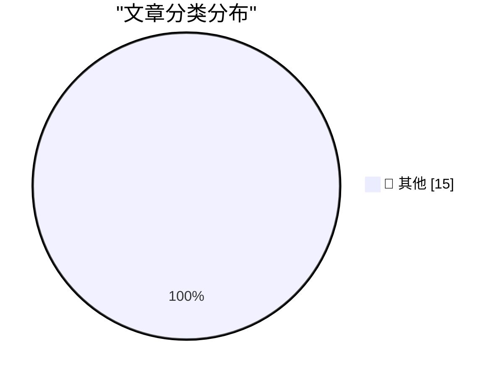

# 📰 AI 博客每日精选 — 2026-09-15

> 来自 Karpathy 推荐的 92 个顶级技术博客，AI 精选 Top 15

## 🏆 今日必读

🥇 **The contagion of fear**

[The contagion of fear](https://simonwillison.net/2026/Sep/14/the-contagion-of-fear/) — simonwillison.net · 4 小时前 · 📝 其他

> The contagion of fear

🥈 **What blog posts influenced your thinking the most?**

[What blog posts influenced your thinking the most?](https://simonwillison.net/2026/Sep/14/influences/) — simonwillison.net · 5 小时前 · 📝 其他

> What blog posts influenced your thinking the most?

🥉 **Quoting Laurie Voss**

[Quoting Laurie Voss](https://simonwillison.net/2026/Sep/14/laurie-voss/) — simonwillison.net · 11 小时前 · 📝 其他

> Quoting Laurie Voss

---

## 📊 数据概览

| 扫描源 | 抓取文章 | 时间范围 | 精选 |
|:---:|:---:|:---:|:---:|
| 84/92 | 2555 篇 → 24 篇 | 48h | **15 篇** |

### 分类分布

---

## 📝 其他

### 1. The contagion of fear

[The contagion of fear](https://simonwillison.net/2026/Sep/14/the-contagion-of-fear/) — **simonwillison.net** · 4 小时前 · ⭐ 15/30

> The contagion of fear

---

### 2. What blog posts influenced your thinking the most?

[What blog posts influenced your thinking the most?](https://simonwillison.net/2026/Sep/14/influences/) — **simonwillison.net** · 5 小时前 · ⭐ 15/30

> What blog posts influenced your thinking the most?

---

### 3. Quoting Laurie Voss

[Quoting Laurie Voss](https://simonwillison.net/2026/Sep/14/laurie-voss/) — **simonwillison.net** · 11 小时前 · ⭐ 15/30

> Quoting Laurie Voss

---

### 4. commit-rewriter 0.1

[commit-rewriter 0.1](https://simonwillison.net/2026/Sep/14/commit-rewriter/) — **simonwillison.net** · 1 天前 · ⭐ 15/30

> commit-rewriter 0.1

---

### 5. shot-scraper 1.12

[shot-scraper 1.12](https://simonwillison.net/2026/Sep/13/shot-scraper/) — **simonwillison.net** · 1 天前 · ⭐ 15/30

> shot-scraper 1.12

---

### 6. Slow developer experience will bottleneck fast models

[Slow developer experience will bottleneck fast models](https://seangoedecke.com/slow-devex-will-bottleneck-fast-models/) — **seangoedecke.com** · 1 天前 · ⭐ 15/30

> Slow developer experience will bottleneck fast models

---

### 7. Apple’s 27.0 OS Updates

[Apple’s 27.0 OS Updates](https://scriptingosx.com/2026/09/apple-27-platform-updates-september-2026/) — **daringfireball.net** · 6 小时前 · ⭐ 15/30

> Apple’s 27.0 OS Updates

---

### 8. Dumpster Fire – Litterbox-Inspired Extension for Firefox

[Dumpster Fire – Litterbox-Inspired Extension for Firefox](https://addons.mozilla.org/en-US/firefox/addon/dumpster-fire/) — **daringfireball.net** · 11 小时前 · ⭐ 15/30

> Dumpster Fire – Litterbox-Inspired Extension for Firefox

---

### 9. XCancel Shuts Down Again

[XCancel Shuts Down Again](https://xcancel.com/) — **daringfireball.net** · 12 小时前 · ⭐ 15/30

> XCancel Shuts Down Again

---

### 10. Glyphs 4

[Glyphs 4](https://glyphsapp.com/) — **daringfireball.net** · 1 天前 · ⭐ 15/30

> Glyphs 4

---

### 11. AI Forces You to Commit to Your Initial Belief

[AI Forces You to Commit to Your Initial Belief](https://idiallo.com/blog/making-changes-mid-sentence) — **idiallo.com** · 1 天前 · ⭐ 15/30

> AI Forces You to Commit to Your Initial Belief

---

### 12. Pluralistic: But do you use keyboard shortcuts? (14 Sep 2026)

[Pluralistic: But do you use keyboard shortcuts? (14 Sep 2026)](https://pluralistic.net/2026/09/14/cult-taylorism/) — **pluralistic.net** · 15 小时前 · ⭐ 15/30

> Pluralistic: But do you use keyboard shortcuts? (14 Sep 2026)

---

### 13. Esoteric HTML - ismap vs CSS

[Esoteric HTML - ismap vs CSS](https://shkspr.mobi/blog/2026/09/esoteric-html-ismap-vs-css/) — **shkspr.mobi** · 14 小时前 · ⭐ 15/30

> Esoteric HTML - ismap vs CSS

---

### 14. The expectations of privacy in driverless cars

[The expectations of privacy in driverless cars](https://shkspr.mobi/blog/2026/09/the-expectations-of-privacy-in-driverless-cars/) — **shkspr.mobi** · 1 天前 · ⭐ 15/30

> The expectations of privacy in driverless cars

---

### 15. Why didn’t Read­Directory­ChangesW provide a way to correlate the two sides of a rename operation?

[Why didn’t Read­Directory­ChangesW provide a way to correlate the two sides of a rename operation?](https://devblogs.microsoft.com/oldnewthing/20260914-00/?p=112696) — **devblogs.microsoft.com/oldnewthing** · 12 小时前 · ⭐ 15/30

> Why didn’t Read­Directory­ChangesW provide a way to correlate the two sides of a rename operation?

---

*生成于 2026-09-15 02:17 | 扫描 84 源 → 获取 2555 篇 → 精选 15 篇*
*基于 [Hacker News Popularity Contest 2025](https://refactoringenglish.com/tools/hn-popularity/) RSS 源列表，由 [Andrej Karpathy](https://x.com/karpathy) 推荐*
*由「懂点儿AI」制作，欢迎关注同名微信公众号获取更多 AI 实用技巧 💡*
