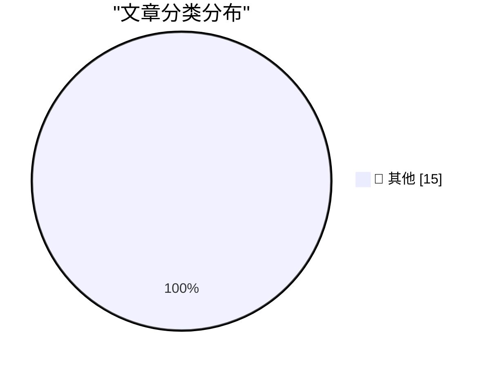

# 📰 AI 博客每日精选 — 2026-09-23

> 来自 Karpathy 推荐的 92 个顶级技术博客，AI 精选 Top 15

## 🏆 今日必读

🥇 **Claude Opus 5.5, GPT-6 Sol, GPT-6 Luna, and a new price war**

[Claude Opus 5.5, GPT-6 Sol, GPT-6 Luna, and a new price war](https://simonwillison.net/2026/Sep/22/opus-and-sol-and-luna/) — simonwillison.net · 2 小时前 · 📝 其他

> Claude Opus 5.5, GPT-6 Sol, GPT-6 Luna, and a new price war

🥈 **llm 0.36**

[llm 0.36](https://simonwillison.net/2026/Sep/22/llm/) — simonwillison.net · 7 小时前 · 📝 其他

> llm 0.36

🥉 **Quoting @therealcornpop**

[Quoting @therealcornpop](https://simonwillison.net/2026/Sep/22/therealcornpop/) — simonwillison.net · 8 小时前 · 📝 其他

> Quoting @therealcornpop

---

## 📊 数据概览

| 扫描源 | 抓取文章 | 时间范围 | 精选 |
|:---:|:---:|:---:|:---:|
| 84/92 | 2558 篇 → 42 篇 | 48h | **15 篇** |

### 分类分布

---

## 📝 其他

### 1. Claude Opus 5.5, GPT-6 Sol, GPT-6 Luna, and a new price war

[Claude Opus 5.5, GPT-6 Sol, GPT-6 Luna, and a new price war](https://simonwillison.net/2026/Sep/22/opus-and-sol-and-luna/) — **simonwillison.net** · 2 小时前 · ⭐ 15/30

> Claude Opus 5.5, GPT-6 Sol, GPT-6 Luna, and a new price war

---

### 2. llm 0.36

[llm 0.36](https://simonwillison.net/2026/Sep/22/llm/) — **simonwillison.net** · 7 小时前 · ⭐ 15/30

> llm 0.36

---

### 3. Quoting @therealcornpop

[Quoting @therealcornpop](https://simonwillison.net/2026/Sep/22/therealcornpop/) — **simonwillison.net** · 8 小时前 · ⭐ 15/30

> Quoting @therealcornpop

---

### 4. llm-anthropic 0.29

[llm-anthropic 0.29](https://simonwillison.net/2026/Sep/22/llm-anthropic/) — **simonwillison.net** · 9 小时前 · ⭐ 15/30

> llm-anthropic 0.29

---

### 5. llm-typesafe 0.1a0

[llm-typesafe 0.1a0](https://simonwillison.net/2026/Sep/22/llm-typesafe/) — **simonwillison.net** · 10 小时前 · ⭐ 15/30

> llm-typesafe 0.1a0

---

### 6. Jev introduces a new shape of LLM - System One, aka Decision Models

[Jev introduces a new shape of LLM - System One, aka Decision Models](https://simonwillison.net/2026/Sep/21/jev/) — **simonwillison.net** · 1 天前 · ⭐ 15/30

> Jev introduces a new shape of LLM - System One, aka Decision Models

---

### 7. Cloudflare Python Workers are now generally available

[Cloudflare Python Workers are now generally available](https://simonwillison.net/2026/Sep/21/cloudflare-python-worker/) — **simonwillison.net** · 1 天前 · ⭐ 15/30

> Cloudflare Python Workers are now generally available

---

### 8. Raspberry Pi locks down Pi 5 RAM upgrades in firmware

[Raspberry Pi locks down Pi 5 RAM upgrades in firmware](https://www.jeffgeerling.com/blog/2026/raspberry-pi-ram-lockdown/) — **jeffgeerling.com** · 1 天前 · ⭐ 15/30

> Raspberry Pi locks down Pi 5 RAM upgrades in firmware

---

### 9. Meta’s Muse Logomark, Designed by Jessica Hische

[Meta’s Muse Logomark, Designed by Jessica Hische](https://thedieline.com/jessica-hische-metas-muse-and-the-ethical-landmines-of-design/) — **daringfireball.net** · 3 小时前 · ⭐ 15/30

> Meta’s Muse Logomark, Designed by Jessica Hische

---

### 10. Meta’s New Muse AI Agent Read Jason Aten’s Messages Database

[Meta’s New Muse AI Agent Read Jason Aten’s Messages Database](https://www.inc.com/jason-aten/metas-new-muse-ai-agent-read-my-private-messages-i-never-asked-it-to/91408202) — **daringfireball.net** · 4 小时前 · ⭐ 15/30

> Meta’s New Muse AI Agent Read Jason Aten’s Messages Database

---

### 11. Why Didn’t Google Build Muse?

[Why Didn’t Google Build Muse?](https://spyglass.org/why-didnt-google-build-muse/) — **daringfireball.net** · 5 小时前 · ⭐ 15/30

> Why Didn’t Google Build Muse?

---

### 12. Amazon Blocks Meta’s Muse AI Assistant

[Amazon Blocks Meta’s Muse AI Assistant](https://www.geekwire.com/2026/amazon-blocks-metas-muse-ai-assistant-in-new-standoff-over-agentic-shopping/) — **daringfireball.net** · 5 小时前 · ⭐ 15/30

> Amazon Blocks Meta’s Muse AI Assistant

---

### 13. Meta’s New Muse AI Agent App Overtakes ChatGPT as Top iPhone App

[Meta’s New Muse AI Agent App Overtakes ChatGPT as Top iPhone App](https://9to5mac.com/2026/09/18/metas-new-muse-ai-agent-app-overtakes-chatgpt-as-top-iphone-app/) — **daringfireball.net** · 6 小时前 · ⭐ 15/30

> Meta’s New Muse AI Agent App Overtakes ChatGPT as Top iPhone App

---

### 14. Xcode 27.2 Now Supports a New JSON Project File Format

[Xcode 27.2 Now Supports a New JSON Project File Format](https://developer.apple.com/documentation/xcode-release-notes/xcode-27_2-release-notes) — **daringfireball.net** · 6 小时前 · ⭐ 15/30

> Xcode 27.2 Now Supports a New JSON Project File Format

---

### 15. Siri AI Class-Action Lawsuit Settlement Website Is Now Live

[Siri AI Class-Action Lawsuit Settlement Website Is Now Live](https://www.macrumors.com/2026/09/20/siri-ai-settlement-website-now-live/) — **daringfireball.net** · 10 小时前 · ⭐ 15/30

> Siri AI Class-Action Lawsuit Settlement Website Is Now Live

---

*生成于 2026-09-23 02:16 | 扫描 84 源 → 获取 2558 篇 → 精选 15 篇*
*基于 [Hacker News Popularity Contest 2025](https://refactoringenglish.com/tools/hn-popularity/) RSS 源列表，由 [Andrej Karpathy](https://x.com/karpathy) 推荐*
*由「懂点儿AI」制作，欢迎关注同名微信公众号获取更多 AI 实用技巧 💡*
