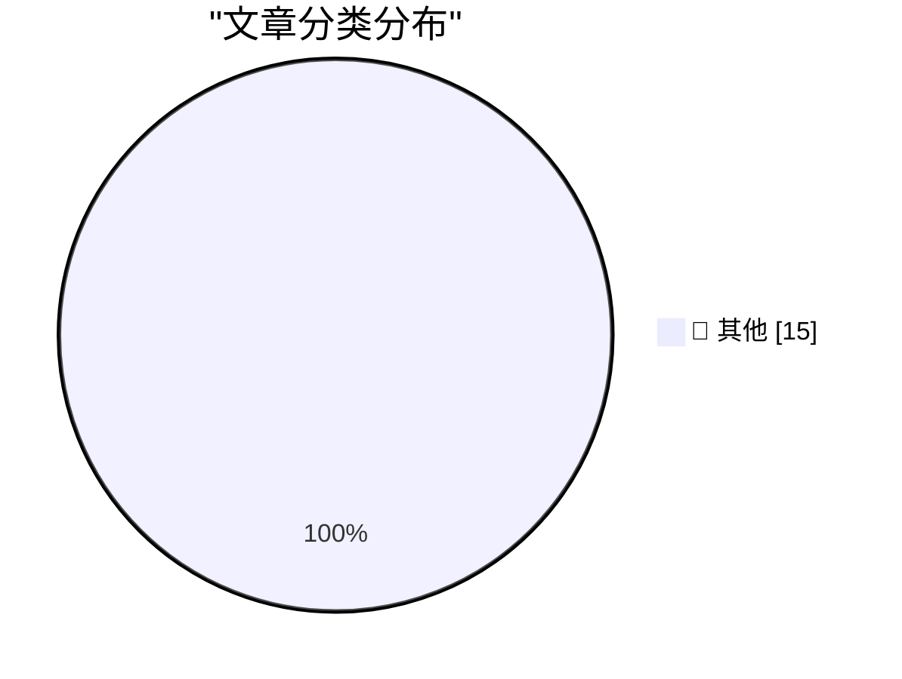

# 📰 AI 博客每日精选 — 2026-09-28

> 来自 Karpathy 推荐的 92 个顶级技术博客，AI 精选 Top 15

## 🏆 今日必读

🥇 **2026 in LLMs (so far)**

[2026 in LLMs (so far)](https://simonwillison.net/2026/Sep/27/2026-in-llms-so-far/) — simonwillison.net · 2 小时前 · 📝 其他

> 2026 in LLMs (so far)

🥈 **S3 Is the Future, S3 Is the Past**

[S3 Is the Future, S3 Is the Past](https://simonwillison.net/2026/Sep/27/hn-49871741/) — simonwillison.net · 3 小时前 · 📝 其他

> S3 Is the Future, S3 Is the Past

🥉 **Bluesky reply bot checker**

[Bluesky reply bot checker](https://simonwillison.net/2026/Sep/27/bluesky-bot-check/) — simonwillison.net · 7 小时前 · 📝 其他

> Bluesky reply bot checker

---

## 📊 数据概览

| 扫描源 | 抓取文章 | 时间范围 | 精选 |
|:---:|:---:|:---:|:---:|
| 84/92 | 2559 篇 → 20 篇 | 48h | **15 篇** |

### 分类分布

---

## 📝 其他

### 1. 2026 in LLMs (so far)

[2026 in LLMs (so far)](https://simonwillison.net/2026/Sep/27/2026-in-llms-so-far/) — **simonwillison.net** · 2 小时前 · ⭐ 15/30

> 2026 in LLMs (so far)

---

### 2. S3 Is the Future, S3 Is the Past

[S3 Is the Future, S3 Is the Past](https://simonwillison.net/2026/Sep/27/hn-49871741/) — **simonwillison.net** · 3 小时前 · ⭐ 15/30

> S3 Is the Future, S3 Is the Past

---

### 3. Bluesky reply bot checker

[Bluesky reply bot checker](https://simonwillison.net/2026/Sep/27/bluesky-bot-check/) — **simonwillison.net** · 7 小时前 · ⭐ 15/30

> Bluesky reply bot checker

---

### 4. Kākāpō Party

[Kākāpō Party](https://simonwillison.net/2026/Sep/26/kakapo-party/) — **simonwillison.net** · 1 天前 · ⭐ 15/30

> Kākāpō Party

---

### 5. Human-AI partnerships are for alignment, not capability

[Human-AI partnerships are for alignment, not capability](https://seangoedecke.com/human-ai-partnerships-are-for-alignment-not-capability/) — **seangoedecke.com** · 1 天前 · ⭐ 15/30

> Human-AI partnerships are for alignment, not capability

---

### 6. Mux: Turn Your Video Into Context

[Mux: Turn Your Video Into Context](https://www.mux.com/?utm_campaign=fireball&amp;utm_source=DF) — **daringfireball.net** · 6 小时前 · ⭐ 15/30

> Mux: Turn Your Video Into Context

---

### 7. Katie Notopoulos on Alexandr Wang’s ‘Faux-Hallmark Pap’

[Katie Notopoulos on Alexandr Wang’s ‘Faux-Hallmark Pap’](https://x.com/katienotopoulos/status/2103993429659386026) — **daringfireball.net** · 6 小时前 · ⭐ 15/30

> Katie Notopoulos on Alexandr Wang’s ‘Faux-Hallmark Pap’

---

### 8. Reelizer Returns

[Reelizer Returns](https://www.reelizer.com/) — **daringfireball.net** · 1 天前 · ⭐ 15/30

> Reelizer Returns

---

### 9. Alexandr Wang: ‘Why I’m Building Muse’

[Alexandr Wang: ‘Why I’m Building Muse’](https://x.com/alexandr_wang/status/2103551714536439951) — **daringfireball.net** · 1 天前 · ⭐ 15/30

> Alexandr Wang: ‘Why I’m Building Muse’

---

### 10. Apple’s Other Recent ‘Duo’

[Apple’s Other Recent ‘Duo’](https://support.apple.com/en-us/111812) — **daringfireball.net** · 1 天前 · ⭐ 15/30

> Apple’s Other Recent ‘Duo’

---

### 11. International Standard Paper Sizes

[International Standard Paper Sizes](https://www.cl.cam.ac.uk/~mgk25/iso-paper.html) — **daringfireball.net** · 1 天前 · ⭐ 15/30

> International Standard Paper Sizes

---

### 12. Microsoft Took the ‘Copilot+ PC’ Brand Out Behind the Shed

[Microsoft Took the ‘Copilot+ PC’ Brand Out Behind the Shed](https://www.windowscentral.com/microsoft/windows-11/the-copilot-pc-brand-is-dead-microsoft-and-pc-makers-quietly-pull-back-on-tarnished-windows-11-ai-pc-branding) — **daringfireball.net** · 1 天前 · ⭐ 15/30

> Microsoft Took the ‘Copilot+ PC’ Brand Out Behind the Shed

---

### 13. The Talk Show: ‘I’m Thinking X, Not X’

[The Talk Show: ‘I’m Thinking X, Not X’](https://daringfireball.net/thetalkshow/2026/09/25/ep-455) — **daringfireball.net** · 1 天前 · ⭐ 15/30

> The Talk Show: ‘I’m Thinking X, Not X’

---

### 14. Gig Review: Public Service Broadcasting's Race For Space at Alexandra Palace ★★★★⯪

[Gig Review: Public Service Broadcasting's Race For Space at Alexandra Palace ★★★★⯪](https://shkspr.mobi/blog/2026/09/gig-review-public-service-broadcastings-race-for-space-at-alexandra-palace/) — **shkspr.mobi** · 14 小时前 · ⭐ 15/30

> Gig Review: Public Service Broadcasting's Race For Space at Alexandra Palace ★★★★⯪

---

### 15. No errors, no warnings, no gods, no masters - HTML Purity is a Fetish

[No errors, no warnings, no gods, no masters - HTML Purity is a Fetish](https://shkspr.mobi/blog/2026/09/no-errors-no-warnings-no-gods-no-masters-html-purity-is-a-fetish/) — **shkspr.mobi** · 1 天前 · ⭐ 15/30

> No errors, no warnings, no gods, no masters - HTML Purity is a Fetish

---

*生成于 2026-09-28 02:25 | 扫描 84 源 → 获取 2559 篇 → 精选 15 篇*
*基于 [Hacker News Popularity Contest 2025](https://refactoringenglish.com/tools/hn-popularity/) RSS 源列表，由 [Andrej Karpathy](https://x.com/karpathy) 推荐*
*由「懂点儿AI」制作，欢迎关注同名微信公众号获取更多 AI 实用技巧 💡*
