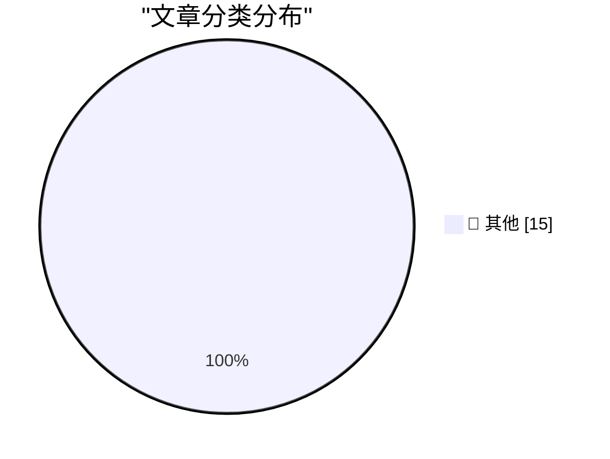

# 📰 AI 博客每日精选 — 2026-09-29

> 来自 Karpathy 推荐的 92 个顶级技术博客，AI 精选 Top 15

## 🏆 今日必读

🥇 **Claude Sonnet 5.5**

[Claude Sonnet 5.5](https://simonwillison.net/2026/Sep/28/claude-sonnet-5-5/) — simonwillison.net · 5 小时前 · 📝 其他

> Claude Sonnet 5.5

🥈 **Quoting @joedaroo**

[Quoting @joedaroo](https://simonwillison.net/2026/Sep/28/joedaroo/) — simonwillison.net · 7 小时前 · 📝 其他

> Quoting @joedaroo

🥉 **Quoting Muse AI Agent**

[Quoting Muse AI Agent](https://simonwillison.net/2026/Sep/28/muse-ai-agent/) — simonwillison.net · 23 小时前 · 📝 其他

> Quoting Muse AI Agent

---

## 📊 数据概览

| 扫描源 | 抓取文章 | 时间范围 | 精选 |
|:---:|:---:|:---:|:---:|
| 84/92 | 2560 篇 → 29 篇 | 48h | **15 篇** |

### 分类分布

---

## 📝 其他

### 1. Claude Sonnet 5.5

[Claude Sonnet 5.5](https://simonwillison.net/2026/Sep/28/claude-sonnet-5-5/) — **simonwillison.net** · 5 小时前 · ⭐ 15/30

> Claude Sonnet 5.5

---

### 2. Quoting @joedaroo

[Quoting @joedaroo](https://simonwillison.net/2026/Sep/28/joedaroo/) — **simonwillison.net** · 7 小时前 · ⭐ 15/30

> Quoting @joedaroo

---

### 3. Quoting Muse AI Agent

[Quoting Muse AI Agent](https://simonwillison.net/2026/Sep/28/muse-ai-agent/) — **simonwillison.net** · 23 小时前 · ⭐ 15/30

> Quoting Muse AI Agent

---

### 4. 2026 in LLMs (so far)

[2026 in LLMs (so far)](https://simonwillison.net/2026/Sep/27/2026-in-llms-so-far/) — **simonwillison.net** · 1 天前 · ⭐ 15/30

> 2026 in LLMs (so far)

---

### 5. S3 Is the Future, S3 Is the Past

[S3 Is the Future, S3 Is the Past](https://simonwillison.net/2026/Sep/27/hn-49871741/) — **simonwillison.net** · 1 天前 · ⭐ 15/30

> S3 Is the Future, S3 Is the Past

---

### 6. Bluesky reply bot checker

[Bluesky reply bot checker](https://simonwillison.net/2026/Sep/27/bluesky-bot-check/) — **simonwillison.net** · 1 天前 · ⭐ 15/30

> Bluesky reply bot checker

---

### 7. Dutch Police Arrest ‘Reformed’ Hacker in Shiny Hunters Investigation

[Dutch Police Arrest ‘Reformed’ Hacker in Shiny Hunters Investigation](https://krebsonsecurity.com/2026/09/dutch-police-arrest-reformed-hacker-in-shiny-hunters-investigation/) — **krebsonsecurity.com** · 11 小时前 · ⭐ 15/30

> Dutch Police Arrest ‘Reformed’ Hacker in Shiny Hunters Investigation

---

### 8. Bastardica

[Bastardica](https://bastardica.mitpit.com/) — **daringfireball.net** · 52 分钟前 · ⭐ 15/30

> Bastardica

---

### 9. ‘When Did Google Get So F-Ing Weird?’

[‘When Did Google Get So F-Ing Weird?’](https://sancho.bearblog.dev/google-weird/) — **daringfireball.net** · 1 小时前 · ⭐ 15/30

> ‘When Did Google Get So F-Ing Weird?’

---

### 10. Joanna Stern Pokes the Pickle

[Joanna Stern Pokes the Pickle](https://www.youtube.com/watch?v=YNqYEMuoQAI) — **daringfireball.net** · 1 小时前 · ⭐ 15/30

> Joanna Stern Pokes the Pickle

---

### 11. ‘Daniel Decodes’ Interview Craig Federighi Regarding the iPhone Duo

[‘Daniel Decodes’ Interview Craig Federighi Regarding the iPhone Duo](https://www.youtube.com/watch?v=y227RF0smAg) — **daringfireball.net** · 1 小时前 · ⭐ 15/30

> ‘Daniel Decodes’ Interview Craig Federighi Regarding the iPhone Duo

---

### 12. Why Stolen Device Protection Makes Passwords Safer

[Why Stolen Device Protection Makes Passwords Safer](https://sixcolors.com/post/2026/09/stolen-device-protection-passwords-glenn/) — **daringfireball.net** · 2 小时前 · ⭐ 15/30

> Why Stolen Device Protection Makes Passwords Safer

---

### 13. Jeremy Stern’s Profile of Mark Zuckerberg for Colossus

[Jeremy Stern’s Profile of Mark Zuckerberg for Colossus](https://colossus.com/article/mark-zuckerberg-profile/) — **daringfireball.net** · 4 小时前 · ⭐ 15/30

> Jeremy Stern’s Profile of Mark Zuckerberg for Colossus

---

### 14. Muse, Instagram, and VLC Lookalike Rip-Offs in the Mac App Store

[Muse, Instagram, and VLC Lookalike Rip-Offs in the Mac App Store](https://lapcatsoftware.com/articles/2026/9/8.html) — **daringfireball.net** · 7 小时前 · ⭐ 15/30

> Muse, Instagram, and VLC Lookalike Rip-Offs in the Mac App Store

---

### 15. ★ Spitballing Predictions for Apple’s October

[★ Spitballing Predictions for Apple’s October](https://daringfireball.net/2026/09/spitballing_predictions_for_apples_october) — **daringfireball.net** · 8 小时前 · ⭐ 15/30

> ★ Spitballing Predictions for Apple’s October

---

*生成于 2026-09-29 03:08 | 扫描 84 源 → 获取 2560 篇 → 精选 15 篇*
*基于 [Hacker News Popularity Contest 2025](https://refactoringenglish.com/tools/hn-popularity/) RSS 源列表，由 [Andrej Karpathy](https://x.com/karpathy) 推荐*
*由「懂点儿AI」制作，欢迎关注同名微信公众号获取更多 AI 实用技巧 💡*
