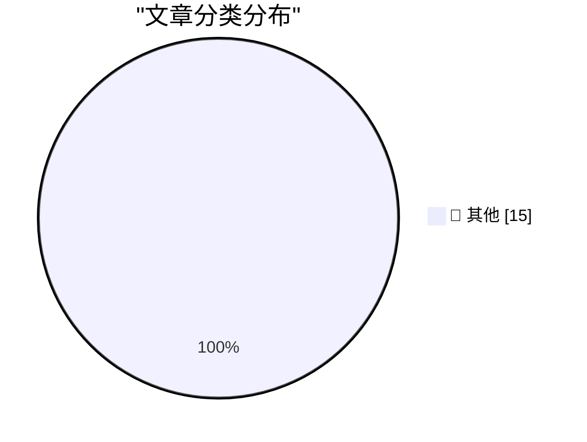

# 📰 AI 博客每日精选 — 2026-10-06

> 来自 Karpathy 推荐的 92 个顶级技术博客，AI 精选 Top 15

## 🏆 今日必读

🥇 **Quoting Felix Rieseberg**

[Quoting Felix Rieseberg](https://simonwillison.net/2026/Oct/5/felix-rieseberg/) — simonwillison.net · 3 小时前 · 📝 其他

> Quoting Felix Rieseberg

🥈 **Qwen3.8 27B addition in words**

[Qwen3.8 27B addition in words](https://simonwillison.net/2026/Oct/4/qwen38-addition-in-words/) — simonwillison.net · 1 天前 · 📝 其他

> Qwen3.8 27B addition in words

🥉 **Steve Jobs, Walking Through a Mockup for Apple Park in 2010**

[Steve Jobs, Walking Through a Mockup for Apple Park in 2010](https://book.stevejobsarchive.com/#photo-37) — daringfireball.net · 53 分钟前 · 📝 其他

> Steve Jobs, Walking Through a Mockup for Apple Park in 2010

---

## 📊 数据概览

| 扫描源 | 抓取文章 | 时间范围 | 精选 |
|:---:|:---:|:---:|:---:|
| 82/92 | 2319 篇 → 19 篇 | 48h | **15 篇** |

### 分类分布

---

## 📝 其他

### 1. Quoting Felix Rieseberg

[Quoting Felix Rieseberg](https://simonwillison.net/2026/Oct/5/felix-rieseberg/) — **simonwillison.net** · 3 小时前 · ⭐ 15/30

> Quoting Felix Rieseberg

---

### 2. Qwen3.8 27B addition in words

[Qwen3.8 27B addition in words](https://simonwillison.net/2026/Oct/4/qwen38-addition-in-words/) — **simonwillison.net** · 1 天前 · ⭐ 15/30

> Qwen3.8 27B addition in words

---

### 3. Steve Jobs, Walking Through a Mockup for Apple Park in 2010

[Steve Jobs, Walking Through a Mockup for Apple Park in 2010](https://book.stevejobsarchive.com/#photo-37) — **daringfireball.net** · 53 分钟前 · ⭐ 15/30

> Steve Jobs, Walking Through a Mockup for Apple Park in 2010

---

### 4. [Sponsor] Sunnny

[[Sponsor] Sunnny](https://sunnny.com/) — **daringfireball.net** · 3 小时前 · ⭐ 15/30

> [Sponsor] Sunnny

---

### 5. OpenAI Announces Their Text Watermarking Plans

[OpenAI Announces Their Text Watermarking Plans](https://openai.com/index/eu-text-provenance/) — **daringfireball.net** · 4 小时前 · ⭐ 15/30

> OpenAI Announces Their Text Watermarking Plans

---

### 6. Ternus and Cook Tweet Brief Remembrances on the 15th Anniversary of Steve Jobs’s Death

[Ternus and Cook Tweet Brief Remembrances on the 15th Anniversary of Steve Jobs’s Death](https://x.com/johnternus/status/2107093462118199562) — **daringfireball.net** · 8 小时前 · ⭐ 15/30

> Ternus and Cook Tweet Brief Remembrances on the 15th Anniversary of Steve Jobs’s Death

---

### 7. Pluralistic: Scrutinized (05 Oct 2026)

[Pluralistic: Scrutinized (05 Oct 2026)](https://pluralistic.net/2026/10/05/pervert-glasses/) — **pluralistic.net** · 8 小时前 · ⭐ 15/30

> Pluralistic: Scrutinized (05 Oct 2026)

---

### 8. [RSS Club] Changes to the RSS and Atom feeds

[[RSS Club] Changes to the RSS and Atom feeds](https://shkspr.mobi/blog/2026/10/rss-club-changes-to-the-rss-and-atom-feeds/) — **shkspr.mobi** · 16 小时前 · ⭐ 15/30

> [RSS Club] Changes to the RSS and Atom feeds

---

### 9. My Pitch for the New Season of Doctor Who

[My Pitch for the New Season of Doctor Who](https://shkspr.mobi/blog/2026/10/my-pitch-for-the-new-season-of-doctor-who/) — **shkspr.mobi** · 1 天前 · ⭐ 15/30

> My Pitch for the New Season of Doctor Who

---

### 10. Miquel’s pentagon theorem

[Miquel’s pentagon theorem](https://www.johndcook.com/blog/2026/10/04/miquels-pentagon-theorem/) — **johndcook.com** · 1 天前 · ⭐ 15/30

> Miquel’s pentagon theorem

---

### 11. Topological models of modal logic

[Topological models of modal logic](https://www.johndcook.com/blog/2026/10/04/topological-models-of-modal-logic/) — **johndcook.com** · 1 天前 · ⭐ 15/30

> Topological models of modal logic

---

### 12. Modal logic and topology

[Modal logic and topology](https://www.johndcook.com/blog/2026/10/04/modal-topology/) — **johndcook.com** · 1 天前 · ⭐ 15/30

> Modal logic and topology

---

### 13. Benchmark In Milliseconds

[Benchmark In Milliseconds](https://matklad.github.io/2026/10/05/benchmark-milliseconds.html) — **matklad.github.io** · 1 天前 · ⭐ 15/30

> Benchmark In Milliseconds

---

### 14. “I’m Embarrassed on Behalf of the Tech Industry”

[“I’m Embarrassed on Behalf of the Tech Industry”](https://blog.jim-nielsen.com/2026/embarrassed-by-tech/) — **blog.jim-nielsen.com** · 1 天前 · ⭐ 15/30

> “I’m Embarrassed on Behalf of the Tech Industry”

---

### 15. The IBM Thinkpad’s 1992 debut

[The IBM Thinkpad’s 1992 debut](https://dfarq.homeip.net/the-ibm-thinkpads-1992-debut/?utm_source=rss&#038;utm_medium=rss&#038;utm_campaign=the-ibm-thinkpads-1992-debut) — **dfarq.homeip.net** · 16 小时前 · ⭐ 15/30

> The IBM Thinkpad’s 1992 debut

---

*生成于 2026-10-06 03:42 | 扫描 82 源 → 获取 2319 篇 → 精选 15 篇*
*基于 [Hacker News Popularity Contest 2025](https://refactoringenglish.com/tools/hn-popularity/) RSS 源列表，由 [Andrej Karpathy](https://x.com/karpathy) 推荐*
*由「懂点儿AI」制作，欢迎关注同名微信公众号获取更多 AI 实用技巧 💡*
