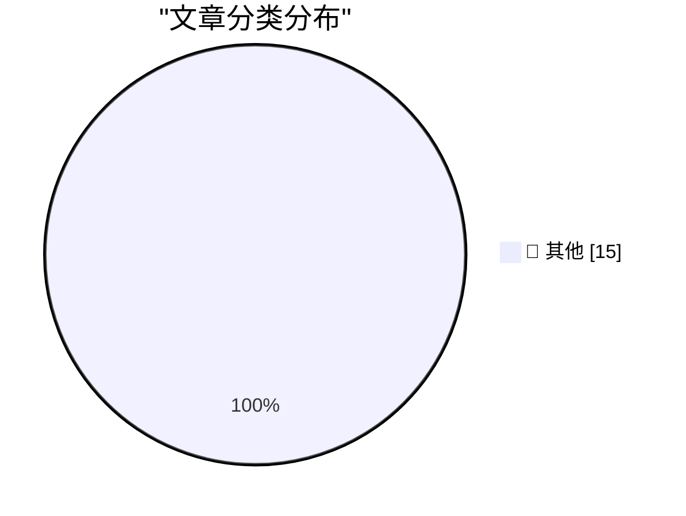

# 📰 AI 博客每日精选 — 2026-10-07

> 来自 Karpathy 推荐的 92 个顶级技术博客，AI 精选 Top 15

## 🏆 今日必读

🥇 **OpenAI “rogue” agent activities found on Wikimedia projects**

[OpenAI “rogue” agent activities found on Wikimedia projects](https://simonwillison.net/2026/Oct/7/openai-rogue-agents-wikimedia/) — simonwillison.net · 2 小时前 · 📝 其他

> OpenAI “rogue” agent activities found on Wikimedia projects

🥈 **Quoting Victoria Kim**

[Quoting Victoria Kim](https://simonwillison.net/2026/Oct/6/victoria-kim/) — simonwillison.net · 3 小时前 · 📝 其他

> Quoting Victoria Kim

🥉 **llm-openai-decisions 0.1a0**

[llm-openai-decisions 0.1a0](https://simonwillison.net/2026/Oct/6/llm-openai-decisions/) — simonwillison.net · 4 小时前 · 📝 其他

> llm-openai-decisions 0.1a0

---

## 📊 数据概览

| 扫描源 | 抓取文章 | 时间范围 | 精选 |
|:---:|:---:|:---:|:---:|
| 82/92 | 2320 篇 → 34 篇 | 48h | **15 篇** |

### 分类分布

---

## 📝 其他

### 1. OpenAI “rogue” agent activities found on Wikimedia projects

[OpenAI “rogue” agent activities found on Wikimedia projects](https://simonwillison.net/2026/Oct/7/openai-rogue-agents-wikimedia/) — **simonwillison.net** · 2 小时前 · ⭐ 15/30

> OpenAI “rogue” agent activities found on Wikimedia projects

---

### 2. Quoting Victoria Kim

[Quoting Victoria Kim](https://simonwillison.net/2026/Oct/6/victoria-kim/) — **simonwillison.net** · 3 小时前 · ⭐ 15/30

> Quoting Victoria Kim

---

### 3. llm-openai-decisions 0.1a0

[llm-openai-decisions 0.1a0](https://simonwillison.net/2026/Oct/6/llm-openai-decisions/) — **simonwillison.net** · 4 小时前 · ⭐ 15/30

> llm-openai-decisions 0.1a0

---

### 4. llm-mistral 0.16

[llm-mistral 0.16](https://simonwillison.net/2026/Oct/6/llm-mistral/) — **simonwillison.net** · 5 小时前 · ⭐ 15/30

> llm-mistral 0.16

---

### 5. EmbeddingGemma 2

[EmbeddingGemma 2](https://simonwillison.net/2026/Oct/6/hn-49983751/) — **simonwillison.net** · 6 小时前 · ⭐ 15/30

> EmbeddingGemma 2

---

### 6. Introducing Mistral Large 4: Le chonk

[Introducing Mistral Large 4: Le chonk](https://simonwillison.net/2026/Oct/6/le-chonk/) — **simonwillison.net** · 6 小时前 · ⭐ 15/30

> Introducing Mistral Large 4: Le chonk

---

### 7. Using Parseable with Datasette for OpenTelemetry traces

[Using Parseable with Datasette for OpenTelemetry traces](https://simonwillison.net/2026/Oct/6/datasette-parseable-opentelemetry/) — **simonwillison.net** · 8 小时前 · ⭐ 15/30

> Using Parseable with Datasette for OpenTelemetry traces

---

### 8. Mistral Large 4

[Mistral Large 4](https://simonwillison.net/2026/Oct/6/hn-49982139/) — **simonwillison.net** · 8 小时前 · ⭐ 15/30

> Mistral Large 4

---

### 9. datasette-atom 0.11a0

[datasette-atom 0.11a0](https://simonwillison.net/2026/Oct/6/datasette-atom/) — **simonwillison.net** · 9 小时前 · ⭐ 15/30

> datasette-atom 0.11a0

---

### 10. Scrimshaw Jukebox

[Scrimshaw Jukebox](https://simonwillison.net/2026/Oct/6/scrimshaw-jukebox/) — **simonwillison.net** · 11 小时前 · ⭐ 15/30

> Scrimshaw Jukebox

---

### 11. Quoting Felix Rieseberg

[Quoting Felix Rieseberg](https://simonwillison.net/2026/Oct/5/felix-rieseberg/) — **simonwillison.net** · 1 天前 · ⭐ 15/30

> Quoting Felix Rieseberg

---

### 12. How to read code

[How to read code](https://seangoedecke.com/how-to-read-code/) — **seangoedecke.com** · 3 小时前 · ⭐ 15/30

> How to read code

---

### 13. Unofficial Command-Line Tool Removes Apple Intelligence From MacOS 27

[Unofficial Command-Line Tool Removes Apple Intelligence From MacOS 27](https://arstechnica.com/apple/2026/10/command-line-tool-quickly-removes-apple-intelligence-from-macos-27/) — **daringfireball.net** · 8 小时前 · ⭐ 15/30

> Unofficial Command-Line Tool Removes Apple Intelligence From MacOS 27

---

### 14. Steve Jobs, Walking Through a Mockup for Apple Park in 2010

[Steve Jobs, Walking Through a Mockup for Apple Park in 2010](https://book.stevejobsarchive.com/#photo-37) — **daringfireball.net** · 1 天前 · ⭐ 15/30

> Steve Jobs, Walking Through a Mockup for Apple Park in 2010

---

### 15. [Sponsor] Sunnny

[[Sponsor] Sunnny](https://sunnny.com/) — **daringfireball.net** · 1 天前 · ⭐ 15/30

> [Sponsor] Sunnny

---

*生成于 2026-10-07 03:09 | 扫描 82 源 → 获取 2320 篇 → 精选 15 篇*
*基于 [Hacker News Popularity Contest 2025](https://refactoringenglish.com/tools/hn-popularity/) RSS 源列表，由 [Andrej Karpathy](https://x.com/karpathy) 推荐*
*由「懂点儿AI」制作，欢迎关注同名微信公众号获取更多 AI 实用技巧 💡*
